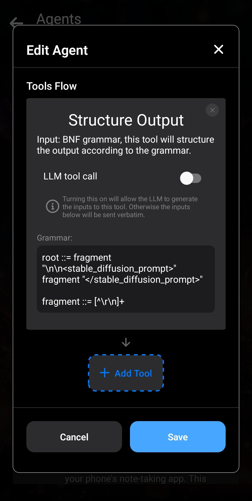

In questo articolo creeremo un Agente per la generazione di immagini. Questo Agente genererà automaticamente un'immagine dopo ogni messaggio, rendendo la conversazione più immersiva.

L'Agente utilizzerà il contesto della conversazione per generare un'immagine.

Ecco l'Agente in azione:

L'idea è fare in modo che l'LLM aggiunga un _prompt Stable Diffusion_ dopo ogni messaggio. Aggiungiamo un'istruzione alla scheda del personaggio per chiedere all'LLM di inserire una breve descrizione della scena tra i tag `<stable_diffusion_prompt></stable_diffusion_prompt>`.

Per prima cosa, crea l'Agente. Questo Agente è molto simile al nostro [Agente di gioco di ruolo](/how-to-create-a-roleplay-agent/):

Qui utilizziamo una grammatica semplice per strutturare l'output in modo che termini con i tag `<stable_diffusion_prompt></stable_diffusion_prompt>`.

Il passaggio successivo consiste nel creare o copiare il tuo personaggio. Devi eseguire due operazioni. Per prima cosa, aggiungi un'istruzione personalizzata nella sezione _Scenario_ che chieda all'LLM di inserire parole chiave per la descrizione della scena nei tag del prompt Stable Diffusion. Puoi personalizzare l'istruzione: prova a chiedere all'LLM di includere le descrizioni dei personaggi per concentrare la generazione sulle immagini del personaggio anziché sulle scene.

Quindi collega l'Agente al personaggio nella scheda _Avanzate_, come in precedenza.

Infine, attiva la generazione di immagini nelle _Impostazioni di inferenza_. Per ulteriori informazioni, leggi [Come attivare la generazione di immagini in Layla](/how-to-enable-image-generation-in-layla/).

Se hai un telefono con CPU Snapdragon, è fortemente consigliato generare le immagini con la NPU. Per maggiori dettagli, leggi [Layla supporta la generazione locale di immagini tramite NPU](https://www.layla-network.ai/post/layla-supports-generating-images-locally-using-the-npu). In questo modo le immagini richiederanno solo pochi secondi dopo ogni messaggio e il flusso della conversazione non verrà interrotto.

Di seguito trovi l'Agente da importare:

[Scarica generate-image-agent.json](/assets/articles/creating-an-image-generation-agent/generate-image-agent.json)
