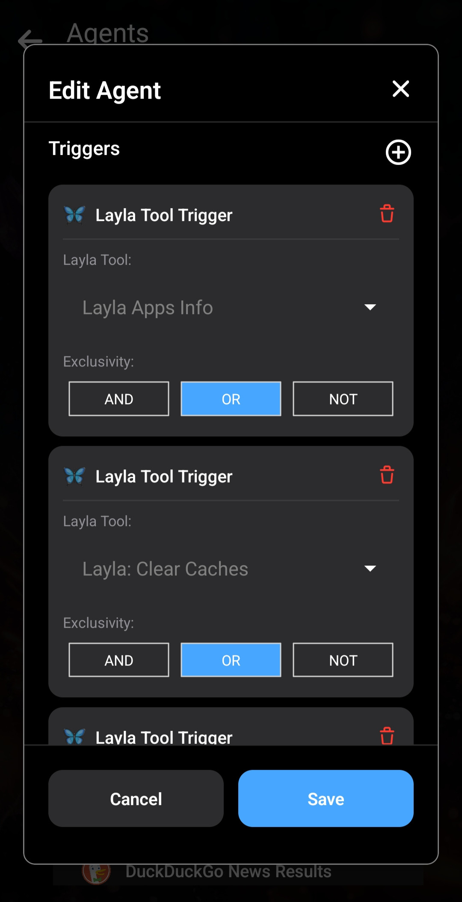
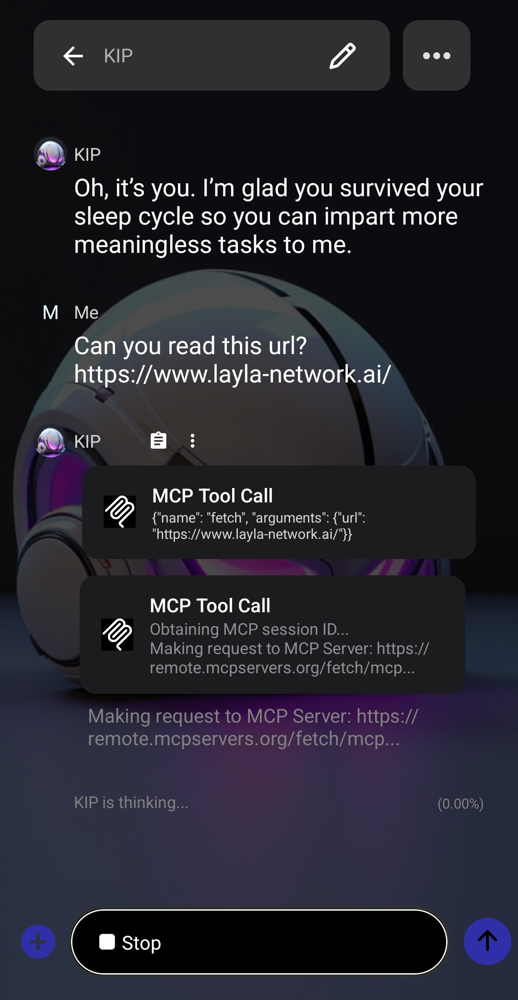

_Nei due articoli precedenti abbiamo [presentato gli Agenti in Layla](/how-to-enable-agents-functions-and-tool-calling-in-layla/) e poi [approfondito il loro funzionamento](/deep-dive-into-layla-agents/)._

In questo articolo esploreremo l’ultimo livello degli Agenti Layla: il supporto MCP completo.

**MCP**

MCP significa Model Context Protocol. Consente agli LLM di interagire con servizi esterni attraverso un protocollo predefinito che combina linguaggio naturale e output strutturati. Per maggiori informazioni, consulta l’[introduzione al Model Context Protocol](https://modelcontextprotocol.io/docs/getting-started/intro).

In generale, MCP inserisce nel prompt di sistema la firma di ogni strumento disponibile per un LLM. L’LLM deve stabilire in modo intelligente quale strumento chiamare durante la conversazione e poi proseguirla usando il risultato della chiamata.

**Agenti Layla e MCP**

Per impostazione predefinita, gli Agenti di Layla vengono attivati combinando parole chiave e tecniche tradizionali di apprendimento automatico, come il rilevamento dell’intento. Il contesto sui dispositivi mobili è limitato e inserire tutti gli strumenti possibili nel prompt di sistema ne consuma gran parte. Inoltre, i modelli più piccoli eseguiti sui dispositivi mobili potrebbero non scegliere sempre lo strumento migliore; in questo caso le tecniche tradizionali offrono un vantaggio.

Layla può anche lasciare che sia l’LLM a scegliere interamente lo strumento. Vediamo come.

L’Agente _Layla: Introspection_ mostra come usare le chiamate di strumenti MCP in Layla. Cerca il nome dello strumento nella mini-app Agenti e modificalo. Si aprirà la finestra di modifica, dove potrai osservarne il funzionamento interno.

Tutti i trigger usano lo speciale “Layla Tool Trigger” citato nell’articolo precedente. Questo trigger indica all’Agente di inserire nel prompt di sistema le firme di tutti gli strumenti possibili. Nell’esempio vengono inserite quelle di _Layla Apps Info_, _Layla: Clear Caches_ e _Layla: Operating Stats_.

La sezione _Tools Flow_ contiene un solo strumento: _Layla Tool Call_, con `{{match$1}}` come input. Lascialo invariato: la chiamata si aspetta questo formato. Non occorre aggiungere altri strumenti, perché l’LLM decide quando chiamare ciascuno di quelli elencati nella sezione Triggers. L’output di ogni strumento viene inserito automaticamente nel contesto dell’LLM, che può concatenare altre chiamate se necessario.

Per cambiare l’elenco, modifica l’Agente _Introspection_, rimuovi i suoi trigger e aggiungine di nuovi. Nel menu a discesa puoi selezionare tutti gli strumenti disponibili in Layla.

_Nota: seleziona gli strumenti con equilibrio. Un numero eccessivo può confondere l’LLM nella scelta di quello da chiamare._

È consigliabile raggruppare gli strumenti usati più spesso in un singolo Agente e associarlo a un nuovo personaggio. In questo modo il personaggio ha un obiettivo chiaro e specifico, riducendo notevolmente le allucinazioni.

**Collegamento a server MCP esterni**

Layla può collegarsi a server MCP esterni, sia quelli offerti da organizzazioni note sia quelli eseguiti sul tuo PC.

La mini-app _MCP Support_ aiuta a rilevare e configurare automaticamente i server MCP esterni.

Il [repository dei server Model Context Protocol](https://github.com/modelcontextprotocol/servers/tree/main) contiene un elenco di server MCP comuni.

Include server di numerose organizzazioni note e il codice per ospitarne uno proprio.

Un server MCP ben realizzato dispone di un endpoint per il rilevamento degli strumenti. Usiamo come esempio il server MCP pubblico _Fetch_, che estrae pagine Web consentendo all’LLM di leggerne il contenuto.

Apri la mini-app _MCP Support_ in Layla e inserisci l’URL del server MCP remoto:

Tocca _Discover Tools_. Layla si collega al server MCP e richiede l’elenco degli strumenti disponibili. In questo caso ne viene restituito soltanto uno, chiamato “fetch”.

Selezionalo in modo che venga evidenziato in verde, quindi tocca _Create Agent_. Verrà creato un nuovo Agente Layla con lo strumento scelto.

La mini-app Agenti si aprirà su un Agente chiamato “New Agent”. Puoi modificarne il nome e la descrizione.

Lascia invariati tutti gli altri parametri, inclusi Triggers e Tool Flow: sono già configurati correttamente.

Per abilitare l’Agente, crea un nuovo personaggio e associalo. Usiamo un nuovo personaggio per evitare conflitti con gli Agenti già presenti in Layla. In alternativa puoi disabilitare l’Agente Web Search esistente.

Apri la scheda _Advanced_ nell’editor dei personaggi.

Tocca _Select Agents_ per aprire la finestra.

Seleziona l’Agente _Fetch_. Comparirà nell’elenco.

Salva quindi il personaggio. In questo esempio useremo un duplicato di _Kip_.

Kip avvierà la chiamata dello strumento MCP quando glielo chiederai:

Dopo la chiamata, _Kip_ risponde mantenendo la propria personalità. Questo è ciò che intendiamo per **personalizzato**: i tuoi personaggi rispondono alle richieste che coinvolgono strumenti usando la personalità configurata.

Ecco il file JSON dell’Agente MCP da scaricare e importare in Layla:

[Scarica fetch.json](/assets/articles/full-mcp-support-in-layla/fetch.json)
