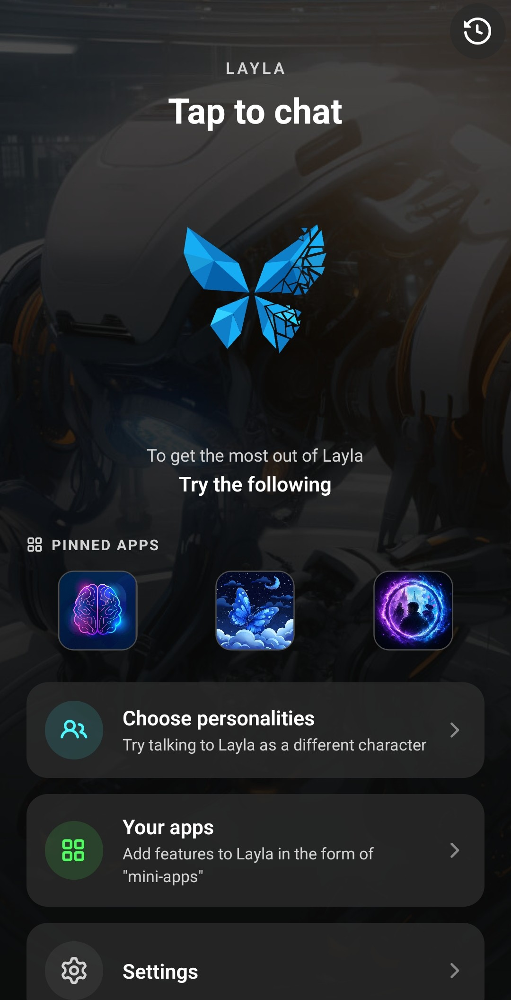

**Layla è un assistente IA per Android o iOS che può usare modelli IA nel cloud oppure eseguire un LLM locale direttamente sul telefono.** Questa guida illustra la configurazione iniziale, la prima chat e la scelta tra IA cloud e offline. Non devi configurare tutto subito e nessuna scelta effettuata durante l’introduzione è definitiva.

## Scegli come usare Layla

Al primo avvio, Layla chiede per cosa desideri usare l’app. Ogni opzione prepara una configurazione iniziale diversa:

- **Basic:** Inizia con un chatbot offline rapido e mirato e un modello locale leggero. Le funzioni aggiuntive restano disattivate: è una buona scelta per cominciare con una semplice chat IA e aggiungere capacità in seguito.
- **Assistant:** Configura Layla come assistente personale IA privato per chat, pianificazione e attività quotidiane. Questa modalità include Agenti sul dispositivo, in grado di usare strumenti e seguire istruzioni in più passaggi anziché limitarsi a generare risposte conversazionali.
- **Friend:** Crea un compagno IA personale per conversazioni informali, riflessioni o semplicemente per avere qualcuno con cui parlare. La configurazione consigliata privilegia memoria, voce e Dreams, rendendo le conversazioni più continue e personali.
- **Roleplay:** Inizia con le funzioni necessarie per creare personaggi e scenari e condurre conversazioni narrative. Puoi partecipare direttamente o lasciare interagire più personaggi IA, mentre la memoria conserva il contesto della scena.
- **Image generation:** Prepara Layla a trasformare i prompt in immagini sul dispositivo. Puoi generare immagini autonome o usarle per creare personaggi, scene e storie originali.
- **Cloud:** Usa modelli IA ospitati quando desideri maggiori capacità senza dipendere dall’hardware del telefono. Le richieste vengono inviate al provider scelto, quindi privacy e connettività differiscono rispetto all’esecuzione di un modello locale.
- **Expert:** Usa il tuo modello GGUF e scegli esattamente quali funzioni, strumenti, prompt e impostazioni avanzate attivare. È pensata per chi usa LLM locali e sa già come configurare l’inferenza.

Scegli l’opzione più vicina a ciò che vuoi provare. Layla configurerà le funzioni e le mini-app consigliate, offrendoti un punto di partenza utile senza chiederti di comprendere ogni impostazione.

La scelta non è vincolante. In seguito potrai attivare o disattivare funzioni, cambiare mini-app e modificare il funzionamento di Layla in qualsiasi momento.

<video controls playsinline src="/assets/articles/getting-started/use-cases.mp4"></video>

## Avvia la prima chat

La schermata successiva dipende dal caso d’uso selezionato. Layla mostra la schermata di benvenuto oppure quella di selezione dei personaggi.

### Dalla schermata di benvenuto

Se vedi la schermata di benvenuto di Layla, tocca la grande farfalla sotto **Tap to chat**. Si aprirà una conversazione con Layla e potrai inviare il primo messaggio.

### Dalla schermata di selezione dei personaggi

Alcuni casi d’uso aprono invece la selezione dei personaggi. Scegli il personaggio o la personalità con cui parlare e avvia la chat.

La chat di base risulterà familiare se hai usato app come Character.AI: scegli con chi parlare, scrivi un messaggio e continua la conversazione. Layla offre molto più controllo, ma puoi ignorare queste opzioni finché non vorrai esplorarle.

## Scegli tra Layla Cloud e un LLM locale

Dopo alcuni messaggi, Layla ti chiederà come continuare. Hai due possibilità:

- **Layla Cloud:** Accedi e continua con un modello cloud. Non devi scaricare alcun modello sul telefono.
- **Run on your phone:** Scegli un modello locale ed eseguilo privatamente sul dispositivo. Dopo la configurazione non servono accesso o connessione a Internet, ma l’IA locale funziona meglio su un telefono con hardware adeguato e spazio libero sufficiente.

Anche questa scelta non è definitiva. Puoi iniziare con un modello cloud per una configurazione più rapida, passare a un LLM locale per un’IA privata offline o alternare i modelli disponibili secondo le tue esigenze.

## Cambia modello in seguito

Puoi tornare in **Inference Settings** in qualsiasi momento per cambiare il modo in cui Layla genera le risposte. Qui puoi gestire modelli GGUF locali, modelli sul dispositivo supportati, modelli cloud, prompt, modelli di visione e impostazioni per la generazione di immagini.

Se un modello locale è lento o non si adatta bene al dispositivo, puoi tornare a un modello cloud. Se in seguito trovi un modello locale adatto, puoi selezionarlo senza ripetere il resto dell’introduzione.

## Esplora funzioni e mini-app con i tuoi tempi

Layla offre molto più della semplice chat IA e al primo avvio può sembrare complessa. Non devi imparare tutto subito. Inizia con chat o personaggi, quindi abilita funzioni e mini-app una alla volta quando ti servono.

Nella schermata **Apps** puoi consultare e gestire mini-app per personaggi, motore di inferenza, Agenti, Layla Cloud e altro. Per una spiegazione dettagliata, consulta [Come abilitare o disabilitare le mini-app in Layla](/how-to-enable-disable-mini-apps-within-layla/).

Il caso d’uso iniziale è solo una configurazione di partenza. Puoi trasformare Layla in un semplice assistente IA, un’app di chat con personaggi, uno strumento di generazione di immagini, un chatbot IA privato eseguito sul telefono o una combinazione adatta a te.

Buona esplorazione di tutto ciò che Layla offre.
