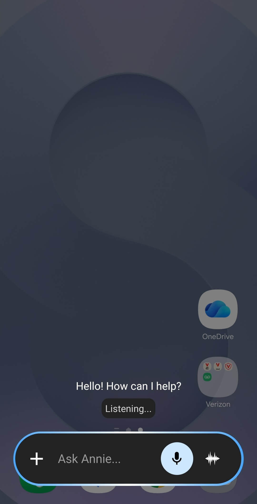

**Il personaggio predefinito è quello che Layla sceglie quando avvii un’interazione senza selezionarne uno.** Può apparire nella schermata iniziale, aprirsi quando Layla viene avviata direttamente in Chat, gestire le Azioni rapide a cui non è assegnato un altro personaggio e diventare il personaggio utilizzato quando Layla è l’assistente del telefono.

Per impostazione predefinita, Layla usa il personaggio integrato Layla. Puoi sostituirlo in qualsiasi momento con un personaggio preimpostato, importato o personalizzato.

## Imposta un personaggio predefinito

L’opzione si trova all’interno di una normale chat con il personaggio che vuoi utilizzare:

1. Apri **Scegli personalità** e seleziona il personaggio.
2. Avvia o riapri una chat con quel personaggio.
3. Tocca i **tre puntini** nell’angolo in alto a destra della chat.
4. Tocca **Imposta come predefinito**.

Nell’esempio seguente, Annie è aperta nella chat ed è stata impostata come personaggio predefinito.

La medaglia accanto a **Imposta come predefinito** diventa dorata quando il personaggio aperto è già quello predefinito. Non esiste un elenco separato di personaggi predefiniti: può essercene solo uno alla volta. Per cambiarlo, apri una chat con un personaggio diverso e ripeti i passaggi.

Se non hai ancora creato un personaggio, consulta [come creare un personaggio IA personalizzato in Layla](/how-do-i-create-custom-characters/) oppure [scaricane uno dal Personalities Hub](/personality-hub-ai-characters/).

## Cosa cambia dopo l’impostazione

Questa impostazione indica a Layla quale personaggio usare quando un’altra parte dell’app ne richiede uno senza specificare una scelta. Per preparare la nuova interazione, Layla usa l’identità, la personalità, l’aspetto e le funzioni di chat configurate per quel personaggio.

L’impostazione non sostituisce il personaggio nelle conversazioni già aperte, non modifica i messaggi salvati e non cambia il personaggio stesso. Inoltre, non unisce le cronologie delle chat. Puoi continuare a scegliere normalmente qualsiasi altro personaggio da **Scegli personalità**.

## La schermata iniziale

Quando **Benvenuto** è la schermata di avvio, il risultato è visibile non appena vi ritorni. Layla mostra il nome e l’immagine principale del personaggio predefinito; toccando la grande immagine si avvia una chat con quel personaggio. Viene usato anche lo sfondo del personaggio, a meno che tu non abbia scelto uno sfondo personalizzato.

Qui la schermata iniziale mostra Annie al posto del personaggio Layla integrato:

Una mini-app predefinita è un’impostazione separata. Se hai scelto una mini-app per sostituire la grande icona della schermata iniziale, toccandola si apre la mini-app invece del personaggio predefinito. Il personaggio resta comunque quello predefinito in tutte le altre aree. Rimuovi la mini-app predefinita dalla mini-app **Wallpaper & UI** se vuoi che l’icona della schermata iniziale apra nuovamente il personaggio.

## Apri Layla direttamente in Chat

Vai a **Impostazioni** > **Impostazioni UI** > **Schermata iniziale** e scegli **Chat** se vuoi che Layla si apra direttamente in una chat con un personaggio. Per quella chat viene usato il personaggio predefinito.

Questa opzione funziona indipendentemente dall’impostazione di **Benvenuto** come schermata di avvio. Con **Benvenuto**, prima vedi il personaggio e lo tocchi per iniziare. Con **Chat**, Layla passa direttamente alla schermata della chat.

## Layla come assistente del telefono

Se Layla è configurata come assistente predefinito del telefono, quando la apri viene usato il personaggio Layla predefinito. Il campo di inserimento diventa **Chiedi a [nome del personaggio]** e la sessione utilizza la personalità e le funzioni configurate per quel personaggio. In questo esempio, la stessa impostazione che ha inserito Annie nella schermata iniziale modifica anche il campo dell’assistente in **Ask Annie...**.

Impostare un personaggio come predefinito dentro Layla non sostituisce automaticamente Google Gemini o un altro assistente di sistema. Questa è un’impostazione separata del telefono. Consulta [come sostituire Google Gemini con Layla come assistente predefinito del telefono](/how-to-replace-google-gemini-with-layla-as-your-phone-s-default-assistant/) per la configurazione su Android.

## Azioni rapide e testo condiviso

Le Azioni rapide possono essere assegnate a un personaggio specifico. Quando un’azione non ha un proprio personaggio, Layla usa quello predefinito. Questo vale anche per le azioni standard che riassumono o spiegano il testo condiviso con Layla, impostano un promemoria o effettuano una ricerca sul Web.

Il personaggio predefinito viene inoltre mostrato per primo quando scegli un personaggio per un’Azione rapida. Assegnare un personaggio diverso a una singola azione sostituisce il valore predefinito solo per quell’azione.

Nelle scorciatoie iOS supportate, anche il testo inviato a Layla senza un’altra scelta di personaggio viene aperto con quello predefinito.

## Integrazioni con la Memoria a lungo termine

Quando un’altra app o un’automazione invia testo all’azione **Ricorda** di Layla, la memoria viene associata al personaggio predefinito. È importante perché la Memoria a lungo termine è organizzata per personaggio: se in seguito cambi il valore predefinito, i ricordi già salvati non vengono spostati.

Questo comportamento è distinto dalla selezione manuale di messaggi in una chat esistente e dall’uso di **Aggiungi alla Memoria a lungo termine**. In quel caso, i messaggi appartengono al personaggio della chat aperta.

## Impostazioni che restano separate

Alcune opzioni dal nome simile non seguono automaticamente il personaggio predefinito:

- **Chat esistenti:** quando riapri una conversazione salvata, viene usato il personaggio di quella conversazione invece di sostituirlo con quello attualmente predefinito.
- **Azioni rapide con un personaggio assegnato:** il personaggio specifico dell’azione ha la precedenza.
- **Mini-app predefinita:** può sostituire ciò che si apre dalla grande icona nella schermata iniziale, ma non il personaggio usato altrove.
- **Modalità Compagno:** questa modalità ha una propria selezione del personaggio. Cambiare il personaggio predefinito non cambia il compagno attivo.
- **Scenari di ruolo e chat di gruppo:** i personaggi vengono scelti nella mini-app Gioco di ruolo e non vengono ereditati dall’impostazione del personaggio predefinito.

## Domande frequenti

### Posso avere più di un personaggio predefinito?

No. Layla salva un solo personaggio predefinito alla volta. Impostarne un altro sostituisce la scelta precedente.

### Come faccio a sapere qual è il personaggio predefinito?

Apri una chat con il personaggio, tocca i tre puntini e guarda **Imposta come predefinito**. La medaglia è dorata per il personaggio attualmente predefinito.

### Cambiare il personaggio predefinito avvia una nuova chat?

No. Toccare **Imposta come predefinito** salva soltanto la preferenza. Una nuova chat inizia quando in seguito apri il personaggio dalla schermata iniziale, avvii Layla in **Chat**, usi un’Azione rapida applicabile oppure apri Layla come assistente del telefono.

### Le cronologie delle chat esistenti cambieranno?

No. Le cronologie e i messaggi esistenti rimangono invariati. Il valore predefinito viene usato quando Layla deve scegliere un personaggio per una nuova interazione.

### Perché si apre una mini-app quando tocco il personaggio nella schermata iniziale?

Probabilmente hai selezionato una mini-app predefinita. Apri **Wallpaper & UI**, trova l’impostazione della mini-app predefinita e scegli **Rimuovi app predefinita**. L’icona della schermata iniziale tornerà a usare il personaggio predefinito.

### Il personaggio predefinito diventa anche il mio personaggio Compagno?

No. Scegli separatamente il personaggio per la modalità Compagno.

L’impostazione del personaggio predefinito è particolarmente utile se usi regolarmente lo stesso personaggio nelle chat, nelle Azioni rapide e nell’interfaccia dell’assistente del telefono. Mantiene coerenti questi punti di accesso senza limitare le personalità che puoi scegliere per le altre conversazioni.
