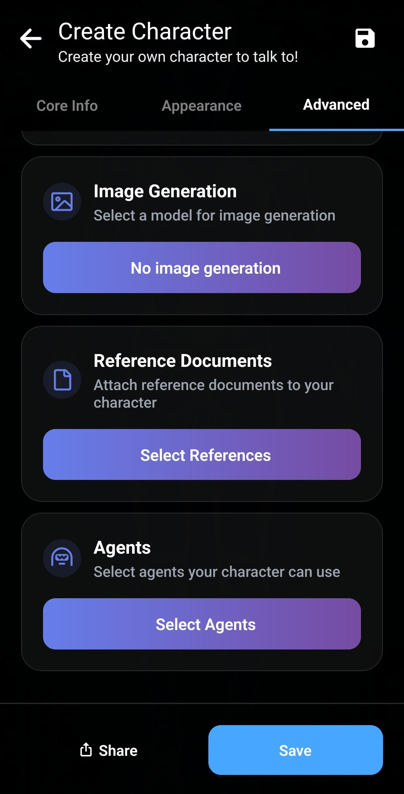
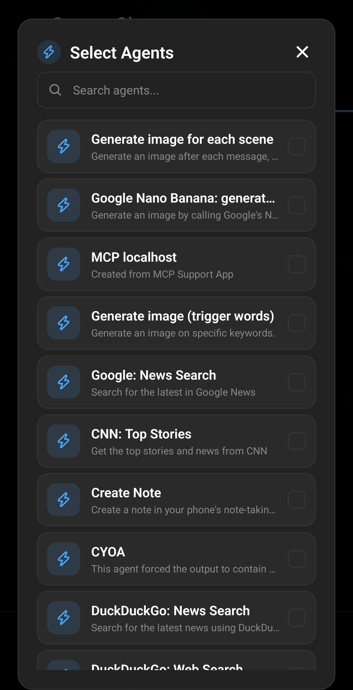

Per iniziare con personaggi creati da altri, consulta [l’importazione dal Personalities Hub](/personality-hub-ai-characters/).

L’editor di Layla permette di creare un personaggio IA personalizzato per conversazioni private sul dispositivo. Puoi definirne identità, modo di parlare, argomenti, aspetto e funzioni opzionali.

Questa guida illustra ogni scheda, dai dati di base a voci, generazione di immagini e condivisione.

## Apri l’editor dei personaggi

Nella selezione dei personaggi, tocca il grande pulsante **+** sotto l’elenco. Puoi anche aprire **Apps** e scegliere la mini-app **Create Character**. Entrambi i percorsi aprono lo stesso editor.

## Aggiungi i dati di base

La scheda **Core Info** contiene le informazioni che determinano identità e comportamento.

Compila i campi così:

- **Character picture:** scegli l’immagine profilo, mostrata in un piccolo cerchio accanto ai messaggi.
- **Character name:** inserisci il nome che Layla deve usare.
- **Description:** spiega chi è il personaggio, includendo storia, ruolo, conoscenze, relazioni e fatti che deve ricordare.
- **Personality:** descrivi comportamento e comunicazione: tratti, valori, abitudini, temperamento, umorismo, vocabolario e stile.
- **Scenario:** definisci la situazione, il luogo, la relazione con l’utente e ciò che accade all’inizio.
- **Impression:** è l’impressione che il personaggio ha di te. La mini-app Dream può generarla dalle chat precedenti, riassumendo la storia condivisa e il suo punto di vista. Puoi modificarla manualmente.
- **Greetings:** scrivi il messaggio iniziale. Con più saluti, Layla ne sceglie uno casuale per ogni nuova chat. Aggiungine uno vuoto se preferisci parlare per primo.
- **Tags:** aggiungi etichette separate da virgole per organizzare i personaggi e facilitarne la ricerca dopo la condivisione.

Puoi usare `{{char}}` e `{{user}}` in descrizione, personalità e scenario. Layla li sostituisce con i nomi attuali durante la preparazione della conversazione.

I campi sono separati solo per comodità. Layla combina descrizione, personalità e scenario in un unico blocco per il prompt di sistema; all’avvio di una chat aggiunge il saluto scelto.

Il **Summary** in basso mostra un’anteprima del testo combinato e Layla ne stima il tempo di caricamento, utile per personaggi molto dettagliati.

## Configura l’aspetto

Apri **Appearance** per controllare le immagini del personaggio e della chat.

L’immagine profilo di **Core Info** è il piccolo cerchio accanto ai messaggi. **Character Background** è l’immagine statica principale; **Chat Background** riempie lo sfondo della conversazione.

Puoi scegliere anche uno sfondo animato:

- **Rive:** sfondo animato 2D.
- **Live2D:** modello di personaggio Live2D.
- **Mini-app:** mini-app Layla personalizzata che fornisce lo sfondo.

Queste opzioni richiedono una configurazione dedicata. Puoi lasciarle vuote per il primo personaggio.

### Aggiungi immagini per le espressioni

Layla può mostrare immagini diverse in base all’emozione della risposta. Assegna immagini ad ammirazione, divertimento, rabbia, fastidio e altre emozioni.

Durante la chat, Layla rileva l’espressione e cambia immagine. Le espressioni senza immagine usano lo sfondo predefinito. Puoi aggiungere file singoli o importare uno ZIP preparato.

## Scegli voce, generazione di immagini, riferimenti e Agenti

La scheda **Advanced** contiene integrazioni opzionali e l’importazione TavernPNG.

### Importa un personaggio TavernPNG

Un TavernPNG è un’immagine con dati della scheda personaggio. L’importazione compila automaticamente campi e immagine compatibili. Consulta [come importare personaggi TavernPNG](/how-to-import-tavernpng-characters-in-layla/).

### Assegna una voce unica

Tocca **Voice** per esplorare le voci del telefono e delle mini-app TTS installate. Cerca per nome o tag e ascolta un’anteprima.

Dopo la selezione puoi avviare una chat vocale. Consulta [come aggiungere voci TTS multilingue](/how-to-add-multilingual-text-to-speech-for-your-characters-in-layla/) o [come avviare una chat vocale](/how-to-start-a-voice-chat-with-your-characters/).

### Consenti al personaggio di generare immagini

Scegli un modello se vuoi che il personaggio invii immagini generate su richiesta. Il selettore mostra le opzioni disponibili sul dispositivo o tramite i servizi configurati.

La funzione è opzionale. Lascia **No Image Generation** se non serve. Per configurarla, leggi [come abilitare la generazione di immagini](/how-to-enable-image-generation-in-layla/).

### Riferimenti e Agenti

I documenti di riferimento forniscono materiale di contesto. Gli Agenti permettono di usare strumenti o flussi configurati. Entrambe le funzioni possono restare vuote all’inizio.

Per approfondire, leggi [come abilitare Agenti, Functions e chiamate di strumenti](/how-to-enable-agents-functions-and-tool-calling-in-layla/).

## Condividi o esporta il personaggio

Tocca **Share** per caricarlo nel Personalities Hub o scaricarlo come TavernPNG.

I personaggi nel Personalities Hub sono caricati anonimamente. Puoi mostrare qualsiasi nome autore e indicare la fonte se provengono da serie, film, anime, libri o altre opere. Lascia vuota la fonte per un originale.

Scegli **Download as TavernPNG** per una scheda portatile da inviare agli amici o importare in un’app compatibile.

## Salva e inizia a chattare

Tocca **Save**. Il nuovo personaggio apparirà nell’elenco; toccalo per iniziare una chat. Puoi tornare all’editor in seguito per modificarlo. Con i modelli offline di Layla, le conversazioni possono restare sul dispositivo.

## Domande frequenti

### Devo compilare tutti i campi?

No. Inizia con nome e testo sufficiente per descrizione, personalità, scenario e saluto. Immagini, espressioni, voce, generazione, riferimenti e Agenti sono opzionali.

### Qual è la differenza tra immagine profilo e sfondo chat?

L’immagine profilo è il piccolo cerchio accanto ai messaggi. Lo sfondo chat è l’immagine principale dietro la conversazione.

### Un personaggio può usare uno sfondo animato?

Sì. Può usare un’animazione Rive, un modello Live2D o una mini-app Layla personalizzata.

### Posso condividere privatamente un personaggio?

Sì. Scaricalo come TavernPNG e invia il file a un amico, oppure condividilo anonimamente nel Personalities Hub.
