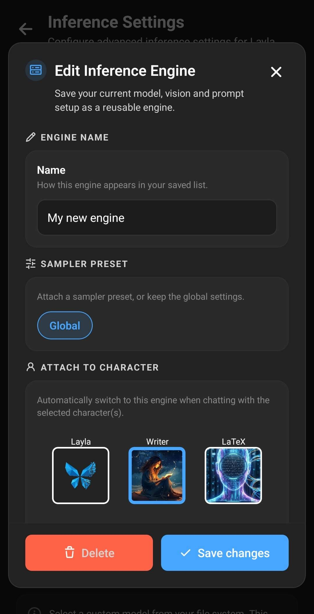
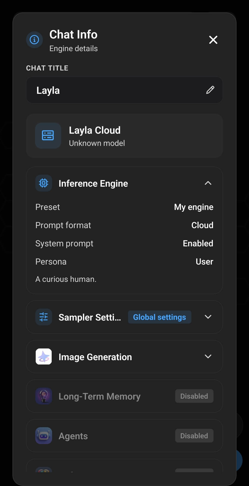

**Un motore di inferenza salvato è una raccolta riutilizzabile di impostazioni che indica a Layla come generare una risposta.** Può combinare un modello o una connessione a un modello con un modello di visione, un modello di prompt, una persona utente e un preset di campionamento. Puoi selezionare personalmente un motore oppure associarlo a uno o più personaggi, in modo che Layla utilizzi la configurazione corretta all’avvio di una chat.

È utile quando una sola configurazione non è adatta a tutte le conversazioni. Un assistente generico, un personaggio per il gioco di ruolo e un personaggio con capacità visive possono richiedere modelli e prompt diversi, anche se funzionano tutti nella stessa app.

## Un motore di inferenza è più di un modello IA

Il modello è la parte che produce il testo. In Layla, un motore di inferenza descrive la configurazione più ampia usata per eseguire o contattare quel modello e prepararne le risposte.

Ad esempio, due motori salvati possono usare lo stesso modello GGUF locale con modelli di prompt, persona o impostazioni di generazione diversi. In alternativa, un motore può usare un modello memorizzato sul telefono, mentre un altro si collega a Layla Server, Layla Cloud, un’API compatibile con OpenAI o un’API Claude.

Considera **I miei modelli** come la raccolta dei modelli e delle connessioni disponibili per Layla. **Motori salvati** trasforma una determinata combinazione di impostazioni in una configurazione con un nome, che potrai riutilizzare in seguito.

Se non hai ancora aggiunto il modello o la connessione che preferisci, consulta [Come aggiungere un modello IA personalizzato a Layla](/it/how-to-add-custom-models-to-layla/).

## Cosa contiene un motore di inferenza salvato

Quando salvi la configurazione corrente come motore, Layla conserva insieme le seguenti scelte:

- **Modello e origine dell’inferenza:** un modello locale, Layla Server, Layla Cloud, un servizio compatibile con OpenAI o un servizio compatibile con Claude.
- **Modello di visione:** il componente visivo selezionato, se il modello linguistico deve comprendere le immagini.
- **Modello di prompt:** il formato usato per disporre le istruzioni del personaggio, il contesto, i messaggi dell’utente e le risposte per il modello.
- **Persona:** l’identità e la descrizione dell’utente presentate al personaggio.
- **Preset di campionamento:** un insieme facoltativo di controlli di generazione salvati, selezionato quando assegni un nome al motore o lo modifichi.
- **Associazioni ai personaggi:** i personaggi che devono usare automaticamente il motore.

Il motore non contiene il file del modello. Salvare un motore, quindi, non crea un’altra copia di un modello GGUF locale. Affinché il motore funzioni, il modello originale o la connessione configurata devono rimanere disponibili.

I modelli per la generazione di immagini vengono configurati separatamente. Anche le voci dei personaggi, gli Agents, i LoreBook, le istruzioni dei personaggi e le cronologie chat restano separati dai motori di inferenza salvati.

## Come creare un motore di inferenza salvato

Apri **Impostazioni di inferenza** dalla pagina **Impostazioni** di Layla oppure apri direttamente la mini-app **Impostazioni di inferenza**.

1. In **I miei modelli**, scegli il modello o la connessione che vuoi utilizzare.
2. Seleziona un modello di prompt adatto al modello.
3. Seleziona un modello di visione se la configurazione deve accettare immagini.
4. Seleziona la persona utente da usare con questa configurazione.
5. In **Motori salvati**, tocca **Salva configurazione corrente come motore personalizzato**.

Layla mostra prima un riepilogo del modello, della visione, del prompt e della persona correnti. Controllalo prima di continuare: queste sono le impostazioni che diventeranno il motore riutilizzabile. Tocca **Crea nuovo motore** per aggiungere una configurazione separata. Se esistono già motori salvati, puoi invece sceglierne uno in **Sostituisci esistente** per aggiornarlo con la configurazione corrente.

La finestra successiva stabilisce come Layla identifica e utilizza il motore:

6. Inserisci un nome chiaro per il motore.
7. Scegli un preset di campionamento salvato oppure lascia selezionato **Globale** per usare le impostazioni generali di generazione di Layla.
8. In **Associa al personaggio**, seleziona tutti i personaggi che devono passare automaticamente a questo motore.
9. Tocca **Salva modifiche**.

Nomi come «Chat generale locale», «Assistente visivo» o «Gioco di ruolo — creativo» rendono l’elenco dei motori più facile da consultare. Il nome è particolarmente importante se a un personaggio sono associati più motori, perché Layla lo mostra nella finestra di selezione.

Per ulteriori informazioni su come abbinare un modello al formato di prompt corretto, consulta [Come configurare modelli di prompt personalizzati in Layla](/it/how-to-set-up-custom-prompt-templates-for-models/).

## Come Layla sceglie un motore per una chat

Quando una chat viene avviata, Layla controlla se al personaggio sono associati motori salvati.

### Nessun motore è associato al personaggio

Layla usa la configurazione generale corrente di **Impostazioni di inferenza**. Questa è la normale configurazione di riserva per i personaggi che non richiedono impostazioni dedicate.

Puoi cambiare la configurazione generale aprendo la scheda del motore corrente in **Motori salvati** e selezionando un altro motore salvato. Layla carica le scelte relative a modello, visione, prompt e persona di quel motore come configurazione corrente.

### Un motore è associato al personaggio

Layla usa automaticamente quel motore. Ha la precedenza sulla configurazione generale, perciò il personaggio può usare regolarmente il modello e il prompt previsti senza che tu debba cambiare le impostazioni prima di ogni chat.

### Più motori sono associati al personaggio

In una normale chat con un personaggio, Layla chiede quale motore usare prima di caricare la conversazione. Un personaggio può così disporre di più configurazioni valide, ad esempio un modello locale veloce per le chat brevi e un modello più grande per sessioni di gioco di ruolo più lunghe.

La finestra di selezione mostra il nome e l’origine del modello per ogni motore. Tocca la configurazione che vuoi usare nella chat; Layla caricherà il motore selezionato.

## Come controllare il motore usato da una chat aperta

Tocca il titolo della chat nella parte superiore di una conversazione aperta per visualizzare **Informazioni chat**. Espandi **Motore di inferenza** per vedere il motore selezionato, il formato del prompt, lo stato del prompt di sistema e la persona. La stessa finestra mostra separatamente le impostazioni del campionatore e le altre funzioni della chat, aiutandoti a distinguere il motore di inferenza dalla generazione di immagini, dalla memoria a lungo termine e dagli Agents.

## Come funzionano i motori associati nel gioco di ruolo di gruppo

Nel gioco di ruolo di gruppo, ogni partecipante può avere un motore diverso associato. Layla controlla il motore collegato al personaggio di turno e cambia la configurazione del modello quando necessario.

In questo modo, un partecipante può usare un modello locale specifico per il gioco di ruolo e un altro può usare un modello o un formato di prompt diverso. Quando più interventi consecutivi usano lo stesso motore, Layla può tenere pronto il modello anziché ricaricarlo. Il passaggio tra modelli locali diversi può richiedere tempo e molta memoria; usare un motore condiviso per più partecipanti è quindi generalmente più fluido sui dispositivi con risorse limitate.

## Usare i preset di campionamento con i motori

Le impostazioni del campionatore influenzano il modo in cui un modello sceglie le parole successive. Possono modificare caratteristiche come prevedibilità, varietà, lunghezza delle risposte e ripetizioni.

Quando modifichi un motore salvato, puoi associargli uno dei preset di campionamento salvati oppure lasciare selezionato **Globale**. Un motore associato a un personaggio e dotato di un preset specifico usa quel preset all’avvio del modello. **Globale** usa invece le impostazioni di generazione correnti delle impostazioni avanzate di Layla.

I preset di campionamento sono utili quando un particolare personaggio o modello richiede un comportamento di generazione diverso. Ad esempio, una configurazione creativa per il gioco di ruolo può usare un preset diverso da un assistente conciso. Non correggono un modello di prompt incompatibile e non fanno entrare in memoria un modello troppo grande: sono parti separate della configurazione.

## Modificare, sostituire ed eliminare i motori

Apri la scheda del motore corrente in **Motori salvati** per visualizzare l’elenco. Ogni scheda mostra il nome del motore, l’origine del modello, il prompt, la persona e i personaggi associati. Vengono visualizzate altre etichette quando un motore include la visione o un preset di campionamento.

Usa i filtri dei personaggi in alto per limitare l’elenco ai motori associati a un personaggio specifico. Tocca la scheda di un motore per rendere corrente quella configurazione, oppure l’icona a forma di matita per modificarla.

Usa il comando di modifica per rinominare un motore, cambiarne il preset di campionamento, aggiornarne le associazioni ai personaggi o eliminarlo. Per aggiornare contemporaneamente tutte le scelte di modello, visione, prompt e persona, prepara prima la nuova combinazione nella pagina principale **Impostazioni di inferenza**. Quindi tocca **Salva configurazione corrente come motore personalizzato** e sostituisci il motore esistente.

L’eliminazione di un motore rimuove la configurazione riutilizzabile e le relative associazioni ai personaggi. Non elimina il modello locale sottostante, il personaggio, la persona, il modello di prompt o la cronologia chat.

## Privacy e uso della rete

Il salvataggio di un motore di inferenza non stabilisce se funziona offline. Questo dipende dall’origine del modello contenuta nel motore.

Un modello locale e un modello di visione locale possono funzionare interamente sul dispositivo. Layla Server usa una connessione al tuo computer, mentre Layla Cloud e le API di terze parti inviano richieste ai servizi configurati. Il passaggio da un motore all’altro può quindi cambiare anche il luogo in cui avviene l’inferenza e le condizioni sulla privacy applicabili.

## Domande frequenti

### Un motore di inferenza salvato è uguale a un modello?

No. Il modello è solo una parte del motore. Il motore salvato ricorda anche le scelte relative a visione, prompt, persona, campionatore e associazioni ai personaggi.

### Salvare un motore duplica il mio modello locale?

No. Il motore fa riferimento al modello già disponibile in Layla. Non crea un’altra copia del file GGUF o LiteRT.

### Posso associare un motore a più personaggi?

Sì. Seleziona tutti i personaggi che devono usarlo mentre crei o modifichi il motore.

### Cosa succede se associo più motori allo stesso personaggio?

Quando apri una normale chat con quel personaggio, Layla chiede quale motore associato vuoi usare.

### Un motore associato sostituisce le impostazioni di inferenza generali?

Sì. Se Layla trova un motore associato al personaggio attivo, quel motore ha la precedenza. Quando non esiste un’associazione corrispondente, Layla usa la configurazione generale selezionata in **Impostazioni di inferenza**.

### Un motore salvato include la generazione di immagini?

No. I modelli e le impostazioni per la generazione di immagini vengono gestiti separatamente dai motori di inferenza dei modelli linguistici.

### Cosa succede se elimino un modello usato da un motore salvato?

Il motore non dispone più di un modello funzionante da caricare. Seleziona un altro modello e sostituisci il motore salvato, oppure ripristina il modello o la connessione mancanti.

I motori di inferenza salvati consentono a Layla di organizzare più configurazioni di modelli senza duplicarne i file. Un motore locale resta una configurazione offline sul dispositivo; i motori remoti restano disponibili quando scegli intenzionalmente di usare un PC o un servizio online.
