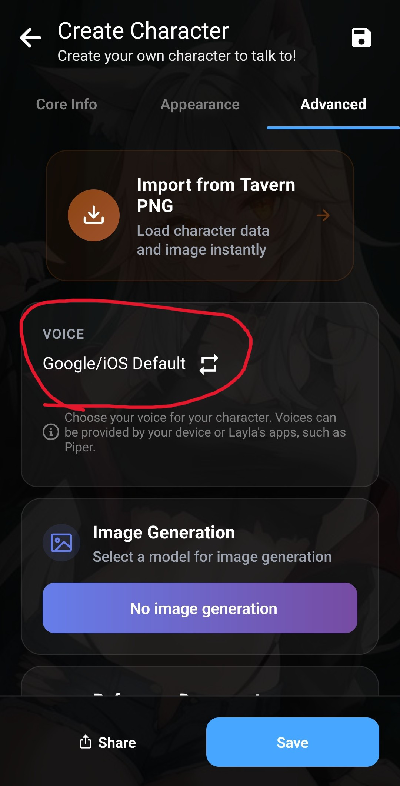

Le mini-app TTS predefinite di Layla funzionano tutte in inglese. Tuttavia, aggiungere la sintesi vocale multilingue in Android è molto semplice.

Layla supporta SherpaTTS, un'app di sintesi vocale locale che si connette a Internet.

**Passaggio 1: scarica SherpaTTS**

Scarica l'app da [F-Droid](https://f-droid.org/en/packages/org.woheller69.ttsengine/).

Scorri fino alla sezione **Versioni** e scarica l'APK più recente.

_F-Droid è un'alternativa a Google Play che pubblica app **gratuite e open source (FOSS)**._

**Passaggio 2: configura SherpaTTS**

Dopo aver scaricato l'app SherpaTTS, aprila per configurarla:

Tocca il segno più per aggiungere un nuovo modello.

Verrà visualizzato un elenco di modelli:

Scarica la lingua desiderata. La lingua è indicata dal codice paese di due lettere. Ad esempio, tedesco = «de» e francese = «fr».

Al termine del download, tocca **Avvia** per caricare il modello.

**Passaggio 3: imposta SherpaTTS come modello TTS predefinito del telefono**

Tocca l'icona delle impostazioni nella schermata principale di SherpaTTS:

Si apriranno le impostazioni di sistema di Android. Tocca l'impostazione **Sintesi vocale predefinita**:

Ora puoi modificare il motore predefinito. Seleziona SherpaTTS:

La voce predefinita utilizzerà ora Sherpa.

**Passaggio 4: configura Layla**

Layla rileva automaticamente questa impostazione e rende disponibili le voci selezionate. _(Riavvia Layla affinché le modifiche abbiano effetto.)_

Apri le impostazioni del personaggio (**Modifica personaggio** → scheda **Avanzate**):

Seleziona le nuove voci nella sezione **Nativa**:

Qui verranno visualizzate tutte le voci installate da Sherpa.

Il personaggio può ora parlare in più lingue.
