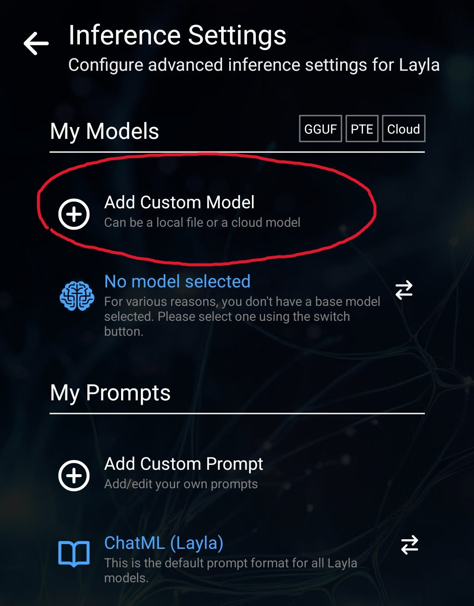
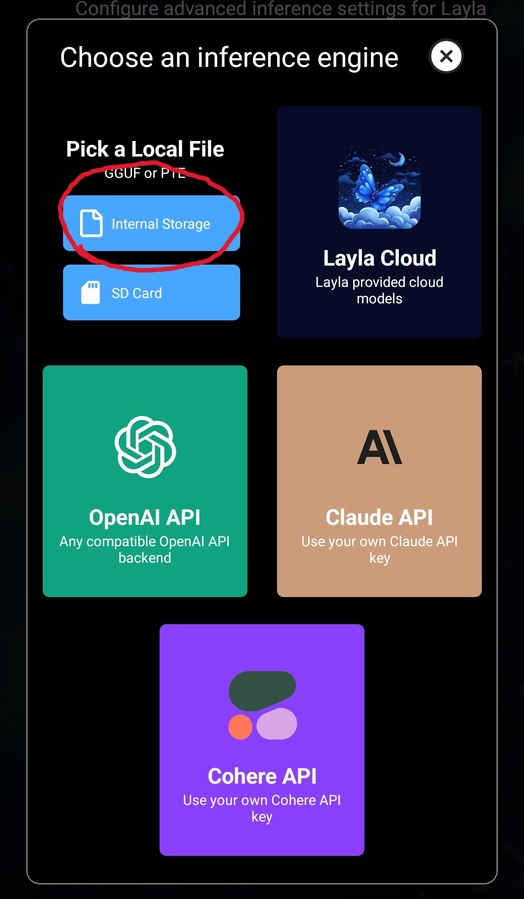
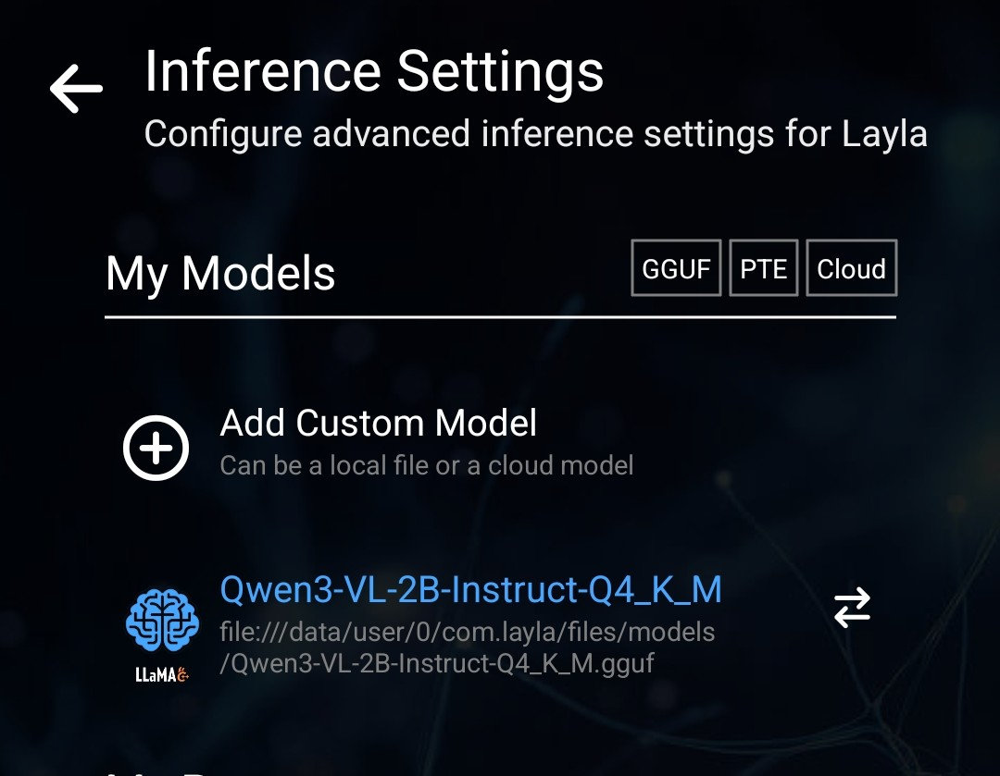

Questo articolo spiega come aggiungere LLM visivi a Layla.

Layla supporta gli LLM visivi, quindi puoi inviare immagini in chat affinché le riconosca e ne discuta.

Prendiamo come esempio la famiglia di modelli Qwen3-VL. Questi modelli includono funzionalità di riconoscimento delle immagini che funzionano bene sui dispositivi mobili.

Ecco come utilizzarli in Layla:

**Passaggio 1: scarica i modelli Qwen3-VL**

Puoi trovarli nel [repository Qwen3-VL-2B-Instruct-GGUF su Hugging Face](https://huggingface.co/unsloth/Qwen3-VL-2B-Instruct-GGUF/tree/main).

È consigliato il modello 2B: è veloce e abbastanza preciso. Se hai un telefono potente, puoi provare i modelli 4B o 8B più grandi.

Nell'elenco dei file della pagina, scegli la quantizzazione **Q4_K_M** e scaricala.

Scorri leggermente verso il basso e cerca il file **mmproj-F16**:

Scarica anche questo file.

**Passaggio 2: configura il modello in Layla**

Torna in Layla e apri **Impostazioni di inferenza**. Nella sezione **LLM**, scegli **Aggiungi modello personalizzato**, quindi **Scegli dalla memoria interna**.

Le impostazioni dovrebbero quindi apparire come segue. Nota il suffisso **Q4_K_M** nel modello selezionato:

Apri quindi la sezione **Visione LLM** e seleziona il file `mmproj`. Le impostazioni dovrebbero apparire così:

Con queste impostazioni puoi inviare immagini in chat e Layla sarà in grado di riconoscerle.
