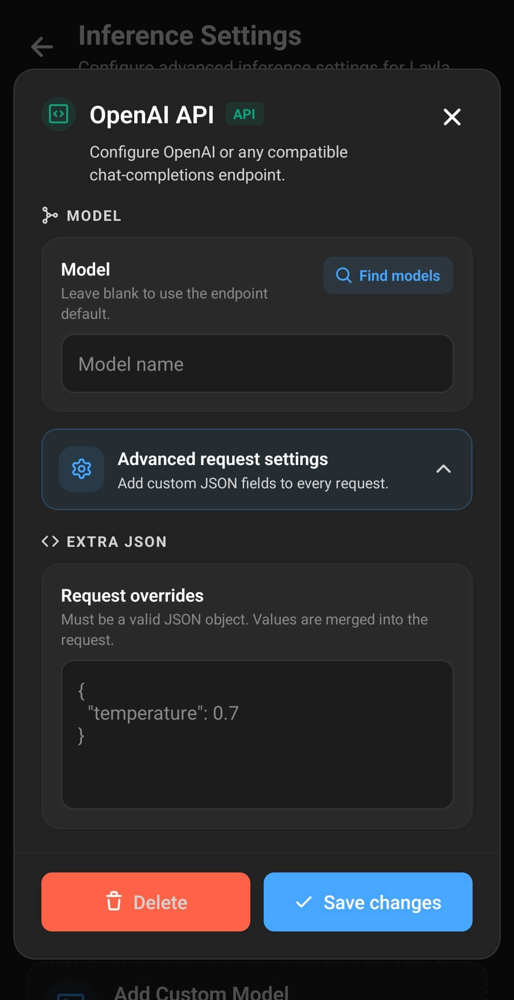

**Layla può collegarsi a qualsiasi servizio che fornisca un endpoint di chat completions compatibile con OpenAI.** Il modello può essere eseguito sul tuo computer tramite un server LLM locale come LM Studio, Ollama o llama.cpp, oppure su un servizio remoto che utilizza lo stesso formato API.

Questa guida spiega prima le impostazioni necessarie per qualsiasi connessione API compatibile con OpenAI, quindi illustra tre configurazioni concrete per l’IA locale. Gli esempi usano un telefono e un PC Windows sulla stessa rete privata, ma le stesse impostazioni di Layla funzionano anche con server compatibili su macOS o Linux, un server domestico o un servizio su Internet.

## Che cos’è un endpoint compatibile con OpenAI?

Un endpoint compatibile con OpenAI è un indirizzo API che accetta richieste nello stesso formato generale dell’API Chat Completions di OpenAI. Non deve necessariamente collegarsi a OpenAI, ChatGPT o a un modello ospitato da OpenAI.

Molti motori di inferenza LLM locali riproducono questo formato API, consentendo a una stessa applicazione di funzionare con server di modelli diversi. Layla invia all’endpoint la conversazione, il nome del modello selezionato e una richiesta di risposta in streaming. Il server esegue il modello linguistico e restituisce la risposta a Layla.

Per funzionare con la connessione **API OpenAI** di Layla, un servizio deve supportare:

- La route Chat Completions compatibile con OpenAI, normalmente `/v1/chat/completions`
- Messaggi di chat e un identificatore del modello
- Risposte in streaming
- Autenticazione tramite token Bearer quando è richiesta una chiave API

LM Studio, Ollama e `llama-server.exe` forniscono tutti la route di chat completions necessaria.

## Cosa serve prima di iniziare

Per un LLM locale eseguito sul tuo PC, prepara quanto segue:

- Layla installata sul dispositivo Android o iOS
- Un computer in grado di eseguire il modello linguistico scelto
- Un modello scaricato tramite il motore di inferenza selezionato oppure un modello GGUF compatibile per llama.cpp
- Telefono e computer collegati alla stessa rete Wi-Fi o locale attendibile
- L’autorizzazione per consentire al server del modello di attraversare il firewall del computer sulle reti private

Le dimensioni del modello influiscono direttamente sull’uso della memoria e sulla velocità delle risposte. Se non hai mai usato l’IA locale, inizia con un modello quantizzato più piccolo consigliato per il tuo computer. Potrai passare a un modello locale più grande dopo aver verificato il corretto funzionamento della connessione.

## Aggiungere una connessione compatibile con OpenAI in Layla

Apri le **Impostazioni** di Layla, vai a **Impostazioni di inferenza**, quindi tocca **Aggiungi modello personalizzato** sotto **I miei modelli**. La finestra successiva separa i modelli eseguiti sul telefono dai servizi collegati. Sotto **Servizi collegati**, scegli **API OpenAI**.

Nonostante il nome, questa opzione non è limitata ai modelli di OpenAI. È il tipo di connessione usato per LM Studio, Ollama, llama.cpp, OpenRouter e qualsiasi altro servizio che accetti il formato chat completions compatibile descritto sopra.

La finestra **API OpenAI** richiede quindi i dati di connessione e il modello. In tutti gli esempi di questa guida si usano gli stessi quattro campi; cambiano solo i valori:

| Impostazione   | Cosa inserire                                                                                                                                                                  |
| -------------- | ------------------------------------------------------------------------------------------------------------------------------------------------------------------------------ |
| **Nome**       | Un’etichetta chiara, ad esempio “LM Studio sul mio PC” oppure “Ollama — Llama 3.2”.                                                                                            |
| **Endpoint**   | L’URL completo di chat completions. Per la maggior parte dei server compatibili termina con `/v1/chat/completions`.                                                            |
| **Chiave API** | La chiave fornita da un provider remoto. Lascia il campo vuoto per un server locale non protetto oppure inserisci il token del server locale se hai attivato l’autenticazione. |
| **Modello**    | L’identificatore esatto previsto dal server. Tocca **Trova modelli** se il server supporta il rilevamento dei modelli.                                                         |

Scegli un nome che renda la connessione facile da riconoscere in seguito. L’endpoint deve essere la route completa: un indirizzo di base che termina soltanto con un numero di porta o `/v1` non è sufficiente. Layla invia ogni richiesta di chat direttamente all’indirizzo inserito in questo campo.

Dopo aver inserito l’endpoint e l’eventuale chiave API, tocca **Trova modelli** se non conosci il nome esatto del modello. Layla richiede allo stesso server l’elenco dei modelli compatibile con OpenAI e consente di selezionare uno degli identificatori restituiti. Se il rilevamento non è disponibile, copia esattamente il nome del modello indicato dal server o dal provider. Lascia il campo vuoto solo se l’endpoint supporta esplicitamente un modello predefinito.

Sotto il campo del modello si trovano le **Impostazioni avanzate della richiesta**. Espandendole compare un’area **JSON aggiuntivo** per personalizzare i valori inviati nella richiesta. La maggior parte degli utenti dovrebbe lasciarla vuota: serve quando un provider richiede espressamente un campo aggiuntivo. L’esempio della temperatura mostrato nell’interfaccia non è necessario per usare LM Studio, Ollama o llama.cpp.

Quando i dati della connessione e il modello sono corretti, tocca **Salva modifiche**. Layla salva la connessione API in **I miei modelli** e la seleziona come origine del modello corrente.

## Perché localhost non funziona dal telefono

Quando un server mostra un indirizzo come `http://localhost:1234`, quell’indirizzo funziona soltanto sul computer che esegue il server. Sul telefono, `localhost` indica il telefono stesso.

Layla necessita quindi dell’indirizzo IPv4 privato del computer, che in genere inizia con `192.168.` oppure `10.`. In Windows, apri **Impostazioni**, seleziona **Rete e Internet**, apri le proprietà della connessione Wi-Fi o Ethernet attiva e cerca **Indirizzo IPv4**. Alcune applicazioni server, tra cui LM Studio, possono mostrare l’indirizzo corretto della rete locale dopo l’attivazione dell’accesso di rete.

Se l’indirizzo del computer è `192.168.1.50`, usa quell’indirizzo e aggiungi la porta e il percorso API completo del server scelto. Non copiare l’indirizzo IP di esempio di questo articolo: usa quello assegnato al tuo computer.

## Riferimento rapido: endpoint OpenAI compatibili locali per Layla

| Motore di inferenza | Endpoint Layla predefinito                    | Chiave API predefinita                           | Campo Modello                                                  |
| ------------------- | --------------------------------------------- | ------------------------------------------------ | -------------------------------------------------------------- |
| LM Studio           | `http://YOUR-PC-IP:1234/v1/chat/completions`  | Vuota, salvo autenticazione attiva               | Usa **Trova modelli** o l’identificatore mostrato da LM Studio |
| Ollama              | `http://YOUR-PC-IP:11434/v1/chat/completions` | Vuota                                            | Il nome del modello Ollama installato, ad esempio `llama3.2`   |
| Server llama.cpp    | `http://YOUR-PC-IP:8080/v1/chat/completions`  | Vuota, salvo avvio del server con una chiave API | Usa **Trova modelli** per selezionare il modello caricato      |

Sostituisci `YOUR-PC-IP` con l’indirizzo IPv4 privato del computer.

## Esempio 1: collegare Layla a LM Studio

[LM Studio](https://lmstudio.ai/download) offre un’interfaccia desktop per cercare, scaricare ed eseguire modelli linguistici locali. La pagina Developer può esporre tali modelli tramite [endpoint compatibili con OpenAI](https://lmstudio.ai/docs/developer/openai-compat). In genere è l’opzione più semplice per chi desidera una configurazione LLM locale con interfaccia grafica.

### Installare un modello in LM Studio

1. Scarica il programma di installazione corrente dalla [pagina di download ufficiale di LM Studio](https://lmstudio.ai/download).
2. Installa e apri LM Studio.
3. Apri la pagina **Discover** e cerca un modello.
4. Scegli un modello e una quantizzazione adatti al computer. Se non sai quale scegliere, i consigli di LM Studio sono un buon punto di partenza.
5. Attendi il completamento del download del modello.

I modelli più piccoli e le quantizzazioni con meno bit usano meno RAM o VRAM. Un modello che non entra comodamente nella memoria disponibile può caricarsi o rispondere lentamente, oppure non avviarsi.

### Avviare il server API locale di LM Studio

1. Apri la pagina **Developer** di LM Studio.
2. Seleziona o carica il modello scaricato.
3. Apri le impostazioni del server.
4. Attiva **Serve on Local Network** affinché Layla possa raggiungere il server dal telefono.
5. Mantieni la porta predefinita `1234`, a meno che non sia già usata da un altro programma.
6. Avvia il server.
7. Se Windows chiede di consentire LM Studio nel firewall, autorizza soltanto le **Reti private**.

Per impostazione predefinita, LM Studio non richiede l’autenticazione. La documentazione consiglia di abilitarla quando il server è in ascolto oltre `localhost`. Se attivi **Require Authentication**, crea un token API in LM Studio e inseriscilo nel campo **Chiave API** di Layla.

### Aggiungere LM Studio a Layla

Nella finestra **API OpenAI** di Layla, inserisci:

- **Nome:** LM Studio sul mio PC
- **Endpoint:** `http://YOUR-PC-IP:1234/v1/chat/completions`
- **Chiave API:** Lascia vuoto, salvo autenticazione attiva in LM Studio
- **Modello:** Tocca **Trova modelli** e seleziona il modello scaricato

Tocca **Salva modifiche**, lascia attivo il server di LM Studio e apri una chat in Layla. La conversazione viene generata dal modello sul computer e restituita a Layla attraverso la rete locale.

Per usare entrambe le app direttamente in Windows, consulta [Come eseguire Layla sul PC con BlueStacks e LM Studio](/it/how-to-run-layla-on-your-pc-with-bluestacks-and-lm-studio/).

## Esempio 2: collegare Layla a Ollama

[Ollama](https://ollama.com/download) è un programma per l’esecuzione di modelli locali disponibile per Windows, macOS e Linux. Include un’[API compatibile con OpenAI](https://docs.ollama.com/api/openai-compatibility) sulla porta `11434` per impostazione predefinita.

I passaggi seguenti usano Ollama per Windows. La documentazione ufficiale di Ollama contiene le istruzioni equivalenti per gli altri sistemi operativi.

### Installare Ollama e scaricare un modello

1. Scarica Ollama dalla [pagina di download ufficiale](https://ollama.com/download).
2. Esegui il programma di installazione e apri Ollama.
3. Apri Windows Terminal o PowerShell.
4. Inserisci **ollama run llama3.2** per scaricare e avviare il modello `llama3.2` usato in questo esempio.
5. Attendi il completamento del download e invia un breve messaggio di prova.
6. Inserisci **/bye** quando vuoi uscire dalla chat nel terminale. Ollama continua a funzionare in background.

Puoi usare un altro modello della libreria Ollama. In tal caso, sostituisci `llama3.2` in tutto l’esempio con il nome Ollama esatto del tuo modello.

### Consentire le connessioni a Ollama dalla rete locale

Per impostazione predefinita, Ollama rimane in ascolto soltanto sull’indirizzo `127.0.0.1` del PC. Modifica l’indirizzo di ascolto prima di collegare Layla:

1. Chiudi Ollama dall’area di notifica della barra delle applicazioni di Windows.
2. Apri le **Impostazioni** di Windows e cerca **variabili di ambiente**.
3. Scegli **Modifica le variabili di ambiente relative all’account**.
4. Crea una variabile utente denominata **OLLAMA_HOST** con valore **0.0.0.0:11434**.
5. Applica la modifica e riavvia Ollama dal menu Start di Windows.
6. Se richiesto, consenti Ollama nel Firewall di Windows sulle reti private.

L’ascolto su `0.0.0.0` permette ai dispositivi della rete locale di raggiungere Ollama. Non devi però esporre la porta `11434` su Internet. Mantienila dietro il router e usala soltanto su una rete attendibile.

### Aggiungere Ollama a Layla

Nella finestra **API OpenAI** di Layla, inserisci:

- **Nome:** Ollama sul mio PC
- **Endpoint:** `http://YOUR-PC-IP:11434/v1/chat/completions`
- **Chiave API:** Lascia vuoto
- **Modello:** `llama3.2`, oppure tocca **Trova modelli** e seleziona un modello Ollama installato

Tocca **Salva modifiche** e avvia una conversazione. Ollama carica il modello selezionato quando riceve la richiesta, quindi la prima risposta può richiedere più tempo delle successive.

Se **Trova modelli** non mostra alcuna scelta, verifica che il download sia terminato e che Ollama sia stato riavviato dopo la modifica di `OLLAMA_HOST`.

## Esempio 3: collegare Layla a llama-server.exe

[`llama-server.exe`](https://github.com/ggml-org/llama.cpp/releases/latest) è il server Windows incluso in llama.cpp. È un’opzione leggera per eseguire un modello GGUF senza un gestore di modelli desktop separato. La [documentazione ufficiale del server llama.cpp](https://github.com/ggml-org/llama.cpp/blob/master/tools/server/README.md) ne descrive l’API compatibile con OpenAI, che usa la porta `8080` per impostazione predefinita.

Questa procedura richiede un comando nel terminale, ma non occorre programmare né compilare il codice sorgente se si usano i file Windows precompilati ufficiali.

### Scaricare llama.cpp e un modello GGUF

1. Apri l’[ultima versione ufficiale di llama.cpp](https://github.com/ggml-org/llama.cpp/releases/latest) su GitHub.
2. In **Assets**, scarica lo ZIP Windows x64 CPU corrente come punto di partenza con la compatibilità più ampia. Le build CUDA, Vulkan, SYCL e HIP possono offrire un’accelerazione migliore sull’hardware supportato.
3. Estrai l’intero ZIP in una nuova cartella. Mantieni tutti i file DLL inclusi accanto a `llama-server.exe`.
4. Scarica un modello chat o instruct in formato GGUF. Per scegliere file e quantizzazione, consulta [Cosa sono i modelli GGUF e le quantizzazioni dei modelli?](/it/what-are-gguf-models-what-are-model-quants/).
5. Sposta il file GGUF nella cartella llama.cpp estratta e, se necessario, assegnagli un nome breve e riconoscibile.

Non scaricare un modello base a meno che tu non sappia esattamente come costruirne i prompt. Per le normali conversazioni in Layla è più adatto un modello chat o instruct.

### Avviare llama-server.exe per Layla

1. Apri la cartella llama.cpp estratta in Esplora file.
2. Fai clic sulla barra degli indirizzi di Esplora file, inserisci **cmd** e premi Invio. Il Prompt dei comandi si aprirà in quella cartella.
3. Inserisci **llama-server.exe -m "your-model.gguf" --host 0.0.0.0 --port 8080**, sostituendo `your-model.gguf` con il nome effettivo del file.
4. Mantieni aperta la finestra del Prompt dei comandi mentre usi Layla.
5. Attendi finché il server non segnala che il modello è caricato e il server HTTP è in ascolto.
6. Se richiesto, consenti il server nel Firewall di Windows sulle reti private.

La parte `--host 0.0.0.0` è necessaria per permettere la connessione di un telefono sulla rete locale. Senza questa opzione, llama.cpp rimane in ascolto soltanto sul PC. Il server include anche un’interfaccia web all’indirizzo del computer sulla porta `8080`, utile per confermarne l’avvio.

### Aggiungere il server llama.cpp a Layla

Nella finestra **API OpenAI** di Layla, inserisci:

- **Nome:** llama.cpp sul mio PC
- **Endpoint:** `http://YOUR-PC-IP:8080/v1/chat/completions`
- **Chiave API:** Lascia vuoto
- **Modello:** Tocca **Trova modelli** e seleziona il modello caricato

Tocca **Salva modifiche** e avvia una chat in Layla. Se chiudi il Prompt dei comandi, il server si arresta e Layla non potrà generare altre risposte finché non lo riavvierai.

Per una maggiore privacy su una rete condivisa, llama.cpp può essere avviato con la protezione tramite chiave API. Se la abiliti, usa la stessa chiave in Layla.

## Collegare Layla a un altro provider API compatibile con OpenAI

La stessa procedura funziona con un’API IA ospitata, un server domestico, una macchina dotata di GPU sulla rete o un altro motore di inferenza locale:

1. Verifica che il servizio supporti chat completions OpenAI compatibili in streaming.
2. Ottieni l’URL completo di chat completions del provider.
3. Ottieni una chiave API se richiesta dal servizio.
4. Trova l’identificatore esatto del modello nel pannello o nella documentazione del provider.
5. In Layla, apri **Impostazioni di inferenza** > **Aggiungi modello personalizzato** > **API OpenAI**.
6. Inserisci nome, endpoint, chiave e modello.
7. Tocca **Trova modelli** se il servizio espone un elenco di modelli compatibile con OpenAI.
8. Salva la connessione e provala in una nuova chat.

Per un endpoint ospitato su Internet, usa esattamente l’URL sicuro `https://` documentato dal provider. Non aggiungere `/v1/chat/completions` se il provider fornisce già una route completa e non rimuovere i segmenti di percorso specifici del servizio.

Puoi salvare più connessioni API in **I miei modelli** e passare dall’una all’altra. Per mantenere insieme connessione, prompt, persona e preset di campionamento, consulta [Come funzionano i motori di inferenza salvati in Layla](/it/how-saved-inference-engines-work-in-layla/).

## Considerazioni sulla privacy e sulla sicurezza

Un’API locale compatibile con OpenAI può mantenere l’inferenza del modello linguistico sull’hardware che controlli. Quando Layla si collega a LM Studio, Ollama o llama.cpp tramite la rete domestica, il contenuto della chat viene inviato dal telefono al PC anziché a un provider commerciale di modelli.

Si tratta di inferenza sulla rete locale, non di inferenza sul dispositivo. Il modello viene eseguito sul computer, che deve essere raggiungibile dal telefono. Dopo aver scaricato le applicazioni e i modelli necessari, il router non deve necessariamente avere una connessione Internet. Alcune funzioni di Layla o strumenti di terze parti possono comunque avere requisiti online propri.

Non esporre un server LLM locale senza autenticazione a una rete Wi-Fi pubblica e non inoltrarne la porta tramite il router Internet. Chiunque riesca a raggiungere un server non protetto potrebbe usare il modello e consumare le risorse del computer. Usa l’autenticazione quando disponibile, consenti l’accesso nel firewall solo sulle reti private attendibili e arresta il server quando non ti serve.

Quando usi un endpoint OpenAI compatibile nel cloud, la conversazione lascia il dispositivo e viene gestita secondo le condizioni sulla privacy e sulla conservazione dei dati del provider. Consultale prima di inviare chat private o informazioni personali.

## Risoluzione dei problemi di una connessione compatibile con OpenAI

### Layla segnala che l’endpoint o il modello non è stato trovato

Un errore `404` indica generalmente un endpoint incompleto o un identificatore del modello non corrispondente. Verifica che l’URL termini con il percorso completo di chat completions richiesto dal server, normalmente `/v1/chat/completions`, quindi usa **Trova modelli** o copia di nuovo il nome esatto del modello.

### Layla non riesce a collegarsi al PC

Verifica quanto segue:

- Il server LLM locale è in esecuzione e il modello ha terminato il caricamento.
- Telefono e PC sono collegati alla stessa rete Wi-Fi o locale.
- L’endpoint usa l’indirizzo IPv4 privato del PC anziché `localhost` o `127.0.0.1`.
- In LM Studio è attivo **Serve on Local Network**, in Ollama è configurato `OLLAMA_HOST` oppure llama.cpp è stato avviato con `--host 0.0.0.0`.
- Il Firewall di Windows consente il server sulle reti private.
- Una VPN, una rete Wi-Fi ospite o la funzione di isolamento client del router non impedisce ai dispositivi di comunicare.

### Layla riceve un errore di autenticazione

Un errore `401` o `403` indica normalmente una chiave API mancante o errata. Copia di nuovo il token senza aggiungere la parola “Bearer”; Layla aggiunge automaticamente il formato di autenticazione Bearer alla richiesta. Se usi un server locale non protetto, disattiva eventuali requisiti di autenticazione abilitati per errore oppure lascia vuoto il campo della chiave.

### L’elenco dei modelli è vuoto

Assicurati che almeno un modello sia scaricato e disponibile per il server. LM Studio deve avere un modello accessibile al suo server, Ollama deve aver scaricato il modello e un server llama.cpp a modello singolo deve aver terminato il caricamento del file GGUF. Puoi anche inserire manualmente l’identificatore esatto del modello.

### Il server funziona sul PC ma non in Layla

Aprire `localhost` sul PC dimostra soltanto che il server funziona localmente. Verifica di nuovo l’indirizzo di ascolto sulla rete, l’indirizzo IP del PC e il firewall. Alcune reti Wi-Fi pubbliche o per ospiti bloccano intenzionalmente la comunicazione tra i dispositivi collegati.

### La connessione ha smesso di funzionare dopo un riavvio

Potrebbe essere necessario riavviare i server di LM Studio e llama.cpp. Ollama funziona normalmente in background, ma deve essere riavviato dopo una modifica delle variabili di ambiente. Il router potrebbe inoltre assegnare un indirizzo IP diverso al PC dopo un riavvio; in tal caso, aggiorna l’endpoint salvato in Layla.

### Le risposte sono lente

La velocità di inferenza dipende da dimensioni e quantizzazione del modello, RAM o VRAM disponibile, CPU, GPU, lunghezza del contesto e qualità della rete. Prova un modello più piccolo o una quantizzazione più compressa, chiudi le applicazioni che usano molta memoria e mantieni il telefono su una rete locale stabile.

## Domande frequenti

### Layla può usare un LLM locale eseguito sul mio PC?

Sì. Esegui il modello tramite un server locale compatibile con OpenAI, come LM Studio, Ollama o llama.cpp, abilita l’accesso dalla rete locale e inserisci in Layla l’endpoint di chat completions del PC.

### Posso collegare Layla a Ollama su Android?

Sì. Ollama funziona sul computer mentre Layla funziona su Android. Configura Ollama per ascoltare sulla rete locale, quindi usa `http://YOUR-PC-IP:11434/v1/chat/completions` come endpoint in Layla.

### Serve una chiave API per un server LLM locale?

Non per impostazione predefinita nei tre esempi dell’articolo. Se attivi l’autenticazione in LM Studio o llama.cpp, inserisci in Layla il token corrispondente. I provider remoti richiedono normalmente una propria chiave API.

### Questa configurazione può funzionare senza Internet?

Sì, quando modello e server sono sul tuo PC e i due dispositivi restano collegati alla stessa rete locale. Per il download iniziale delle applicazioni e dei modelli è necessaria una connessione Internet. Le API cloud richiedono comunque Internet.

### Il modello viene eseguito sul telefono?

Non in queste tre configurazioni. Layla è l’interfaccia di chat e il client API, mentre il modello linguistico viene eseguito sul PC. Per eseguire un modello direttamente sul telefono, importa invece un modello locale compatibile. Consulta [Come aggiungere un modello IA personalizzato a Layla](/it/how-to-add-custom-models-to-layla/).

### Posso usare OpenRouter o un altro provider cloud?

Sì, a condizione che il servizio fornisca un’API di chat completions compatibile e in streaming. Usa l’endpoint completo, la chiave API e l’identificatore del modello documentati dal provider.

Un’API compatibile con OpenAI offre a Layla un formato comune per comunicare con numerosi modelli linguistici locali e ospitati. Con LM Studio, Ollama o llama.cpp su una rete locale attendibile, puoi usare Layla come interfaccia per un assistente IA privato mentre il PC gestisce l’inferenza LLM locale.
