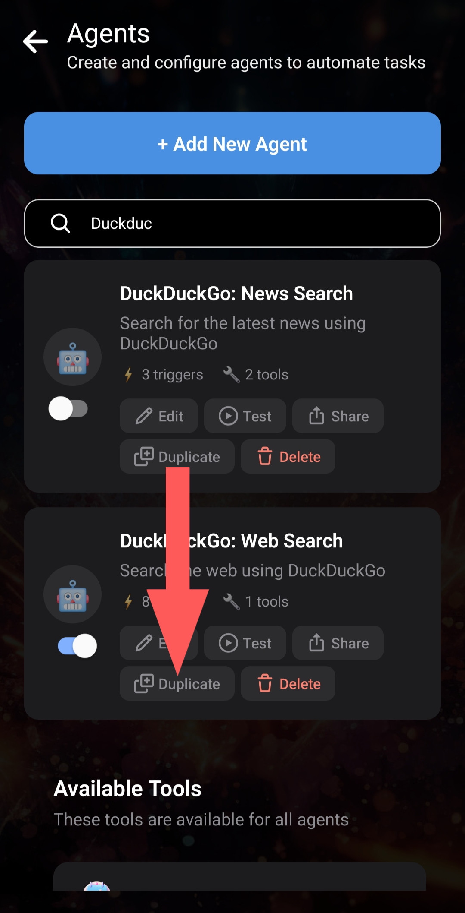
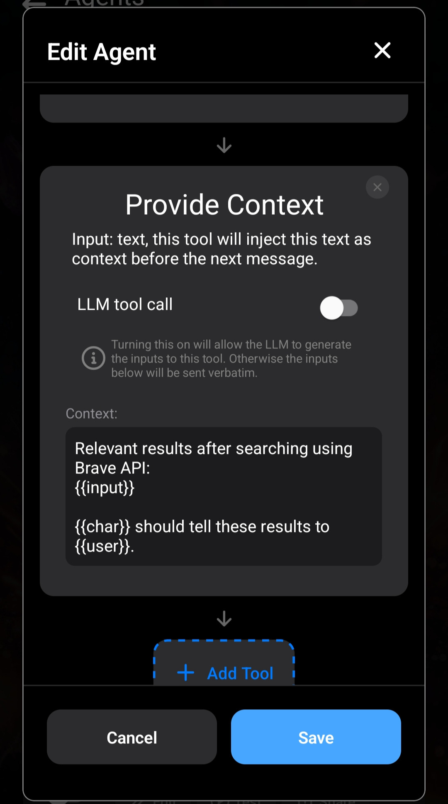

Brave offre un'alternativa alla ricerca Google con maggiore attenzione alla privacy.

Brave fornisce un'API: [Brave Search API](https://brave.com/search/api/).

Se vuoi utilizzare Brave Search invece di DuckDuckGo in Layla, questo articolo mostra come creare un Agente Brave Search con la tua chiave API per sostituire l'Agente DuckDuckGo.

_Questo è un tutorial avanzato. Imparerai diversi metodi per ottenere e analizzare i risultati delle richieste HTTP, che potrai riutilizzare nei tuoi prossimi Agenti._

**Registra una chiave API**

Per prima cosa, registrati su [Brave](https://brave.com/) e ottieni una chiave API seguendo le istruzioni del sito. Da questo punto presupporremo che tu l'abbia ottenuta e salvata.

Consulta la [documentazione dell'API Brave Search](https://api-dashboard.search.brave.com/app/documentation/web-search/get-started), che useremo per creare l'Agente.

**Duplica l'Agente DuckDuckGo in Layla**

Il modo più semplice per iniziare è duplicare l'Agente DuckDuckGo in Layla. Gran parte della configurazione sarà già pronta.



Dopo aver duplicato l'Agente, rimuovi tutti gli strumenti ma conserva gli attivatori. Vogliamo che anche il nuovo Agente venga attivato da una ricerca Web e l'Agente DuckDuckGo predefinito è già configurato a tale scopo.

Aggiungi quattro strumenti in questo ordine:

1. Eval
2. HTTP Request
3. Eval
4. Provide Context

Vediamo cosa fa ogni strumento e come si collegano.

**Eval (1)**


Il primo strumento è semplice: dobbiamo codificare l'input come componente URI prima di inviarlo all'API. Questa è la funzione JavaScript:

```js
encodeURIComponent;
```

Eval elabora l'input dello strumento e restituisce il risultato come output. `{{input}}` rappresenta il testo non elaborato del messaggio di input.

**HTTP Request (2)**

Il secondo strumento è HTTP Request, che chiama l'API Brave Search. Consulta la [documentazione dell'API Brave Search](https://api-dashboard.search.brave.com/app/documentation/web-search/get-started).


Osserva l'URL e le intestazioni. L'intestazione `X-Subscription-Token` contiene la chiave API.

La stringa di query dell'URL contiene `{{input}}`, che viene inviato all'API.

**Eval (3)**

Questa è la chiamata allo strumento più complessa finora.

Lo strumento riceve l'output della precedente chiamata HTTP Request, che secondo la documentazione dell'API Brave dovrebbe essere in formato JSON. Analizza il JSON e lo converte in testo semplice pronto per essere inviato all'LLM.


Lo strumento riceve `{{input}}` come stringa non elaborata e lo assegna alla variabile `i`. Chiama `JSON.parse` e trasforma il risultato in un normale elenco puntato, che diventa l'output dello strumento.

Si tratta di normale JavaScript, comprensibile a chi ha familiarità con la programmazione.

**Provide Context (4)**

L'ultimo passaggio consiste nel fornire l'output all'LLM come contesto.



Lo strumento spiega che i risultati provengono dall'API Brave e indica al personaggio di descriverli.

Con questi quattro strumenti, l'Agente è completo.

È consigliabile disattivare l'Agente DuckDuckGo originale affinché i due non entrino in conflitto.

Ecco il file JSON dell'Agente da importare direttamente:

[Scarica brave-search.json](/assets/articles/how-to-create-a-brave-search-agent/brave-search.json)
