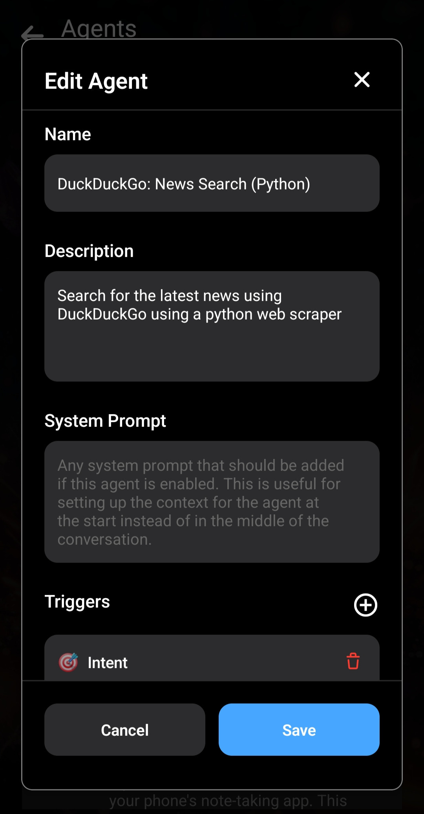
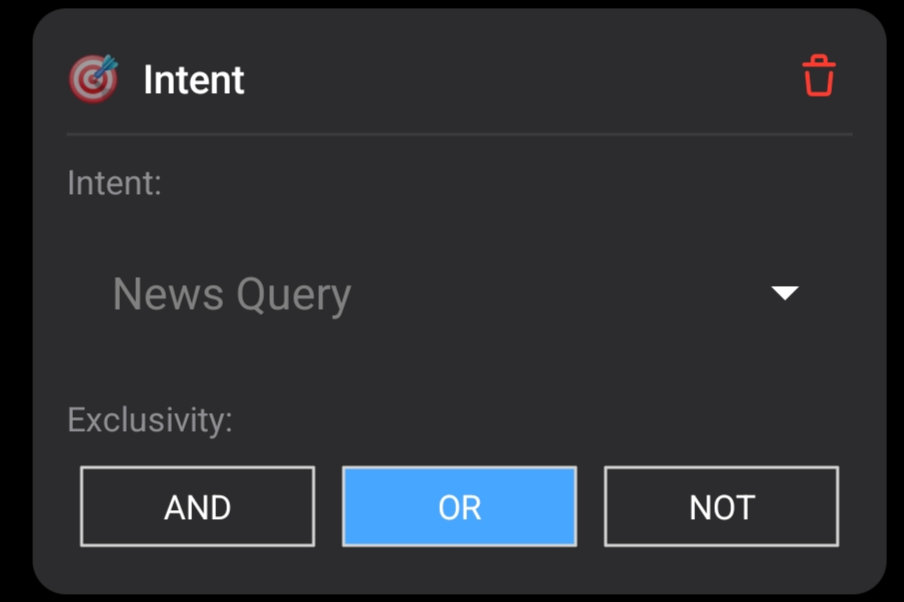
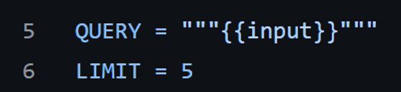
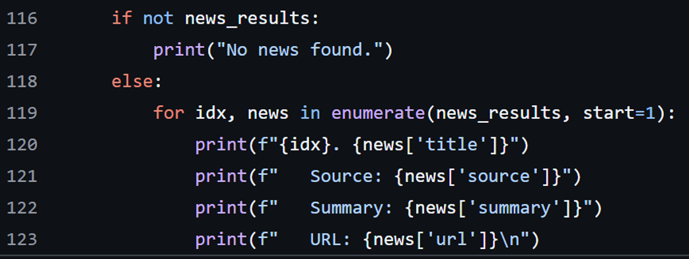
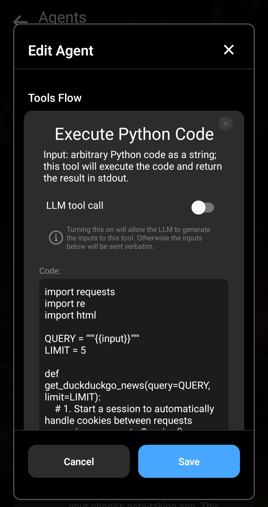

In questo articolo creeremo con la mini-app Agenti di Layla un Agente di ricerca notizie DuckDuckGo eseguito in Python. Assicurati di avere [Python attivo in Layla](/how-to-enable-python-support-in-layla/).

**Passaggio 1: duplica un Agente esistente**

Il modo più semplice per iniziare consiste nel duplicare un Agente esistente e modificare la copia. Cambia il nome e la descrizione.

**Passaggio 2: aggiungi gli attivatori**

Aggiungi alcuni attivatori all'Agente.

Aggiungeremo l'intento **News Search** e la frase fissa **news**. Puoi aggiungere altri attivatori in base al modo in cui vuoi richiamare l'Agente.

**Passaggio 3: aggiungi lo strumento Python**

Aggiungi lo strumento Esegui Python. Questa sezione contiene il codice Python che esegue la logica per interrogare DuckDuckGo. Per comprenderla è utile conoscere Python.

Esamina il [codice Python in questo Gist di GitHub](https://gist.github.com/l3utterfly/bf9f703c09932fd87dbf68f2118e5ab4).

All'inizio del file, nota che è necessaria la libreria _requests_ (`re` e `html` fanno parte di Python):

Apri la mini-app Python e aggiungi il pacchetto `requests`. Consulta [Come attivare il supporto Python in Layla](/how-to-enable-python-support-in-layla/) per la procedura di installazione.

La parte successiva riguarda `QUERY`:

Layla inserisce l'input, proveniente dal tuo messaggio o dall'output dello strumento precedente, nel modello speciale `{{input}}`. Si tratta di una semplice sostituzione di testo; l'input non viene modificato ulteriormente.

Puoi usare questo schema per ricevere diversi tipi di input nello script Python.

Per questo Agente, passeremo l'intera richiesta dell'utente allo script Python.

Lo script esegue quindi una normale richiesta HTTP e analizza la risposta con il parser HTML integrato.

Lo script Python restituisce le informazioni all'LLM tramite semplici istruzioni `print`.

Questo metodo è molto flessibile. Puoi stampare tutto ciò che l'LLM deve ricevere: risultati, istruzioni o entrambi.

Copia e incolla l'intero script Python nell'input dello strumento Python:

L'Agente è pronto.

**Infine: prova l'Agente**

Prova l'Agente. Ricorda di attivarlo per il personaggio predefinito Layla o di collegarlo a un personaggio esistente.

L'Agente inizia a eseguire il codice Python quando viene rilevata la parola chiave **news**, configurata come attivatore nel primo passaggio.

Layla legge l'output del codice Python e lo usa come contesto per rispondere alla domanda.

Ora disponi di un semplice Agente di ricerca notizie DuckDuckGo. Gli articoli futuri presenteranno Agenti più complessi.
