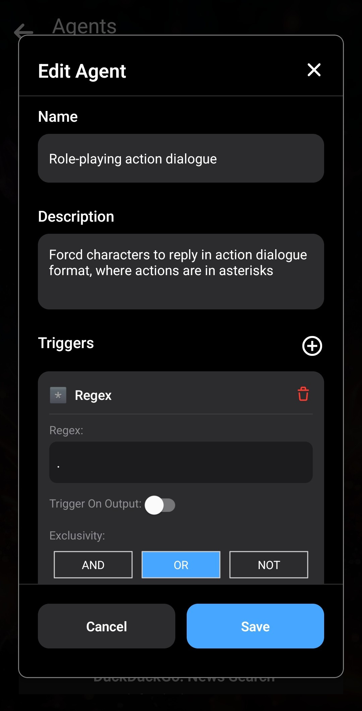

Vediamo come creare un semplice _Agente di gioco di ruolo_ in Layla.

Questo Agente obbligherà il personaggio a rispondere nel formato **azione-dialogo**.

Ad esempio:

> `*saluta e sorride* Ciao!`

Crea un Agente con le impostazioni seguenti:

Vediamo che cosa fa questo Agente:

1. Il nome e la descrizione possono essere qualsiasi cosa; servono ad aiutarti a identificare facilmente l'Agente.

2. Utilizziamo l'_Attivatore regex_. L'espressione regolare `.` (punto) corrisponde a qualsiasi contenuto, quindi l'Agente viene attivato a ogni messaggio. È ciò che vogliamo, perché tutte le risposte devono rispettare il nostro formato.

3. Utilizziamo lo strumento _Output strutturato_. Questo strumento usa la grammatica BNF per strutturare l'output:

   - `root` è sempre necessario e avvia la definizione della grammatica.
   - `::=` è l'operatore di assegnazione, che assegna la grammatica alle variabili.
   - `turn` è una variabile personalizzata, definita nella riga successiva. È composta dal carattere letterale `*`, seguito da `fragment` — un'altra variabile definita dall'utente —, da un altro `*` e infine da un altro frammento.
   - `fragment` rappresenta la nostra azione o il dialogo. È definito come qualsiasi contenuto che non sia un'interruzione di riga.

4. Unendo questi elementi, l'output viene definito come `*fragment*fragment`, dove ogni `fragment` può contenere qualsiasi testo senza interruzioni di riga. È esattamente il formato desiderato.

Di seguito trovi il file dell'Agente da scaricare e importare. Puoi importarlo usando il pulsante _Aggiungi nuovo Agente_.

[Scarica roleplay-action-dialogue.json](/assets/articles/how-to-create-a-roleplay-agent/roleplay-action-dialogue.json)
