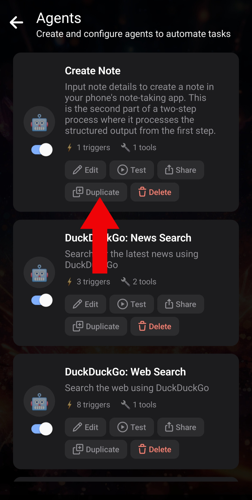
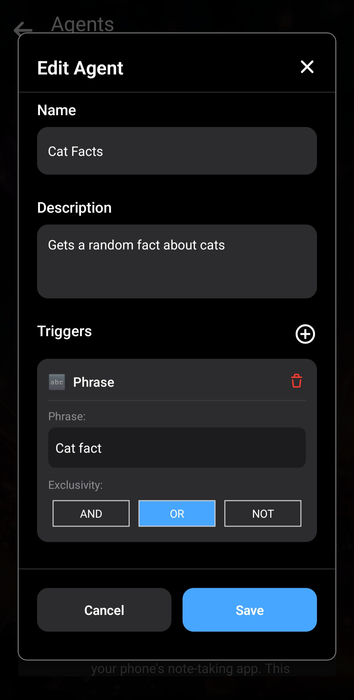
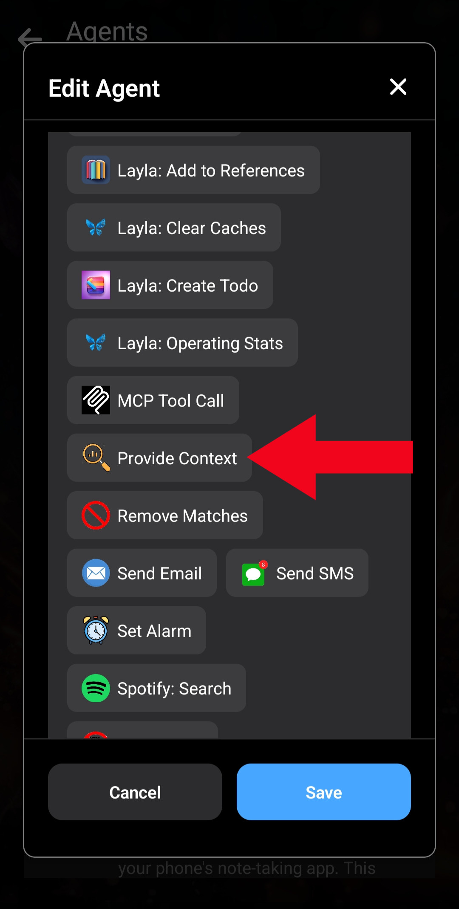

Layla ti permette di creare e personalizzare i tuoi Agenti, così puoi sviluppare funzioni su misura.

Questo articolo mostra prima come creare un Agente di base e spiega il funzionamento degli Agenti in Layla, quindi ne realizza uno leggermente più complesso.

Per un’introduzione generale, leggi [Come abilitare Agenti, Functions e chiamate di strumenti in Layla](/how-to-enable-agents-functions-and-tool-calling-in-layla/).

**Creare un Agente**

Iniziamo subito, senza soffermarci sui dettagli del funzionamento degli Agenti.

Apri la mini-app _Agenti_ in Layla:

Il modo più semplice per creare un Agente è duplicarne uno esistente. _Per ora non preoccuparti del pulsante **Add New Agent**: è destinato agli utenti avanzati._

Dopo aver duplicato un Agente, modifica la nuova copia con il pulsante _Edit_.

_Edit_ apre una finestra con i dettagli dell’Agente. Creeremo un Agente semplice che recupera da un’API pubblica una curiosità casuale sui gatti.

Passaggio 1: apri la finestra Edit Agent.

Passaggio 2: elimina i trigger e gli strumenti esistenti.

Passaggio 3: modifica il nome e la descrizione.

Il nome e la descrizione servono al momento solo come riferimento. _Negli Agenti più complessi sono importanti._

Ora aggiungi un _trigger_. Tocca il segno più accanto a “Triggers” e scegli il trigger “Phrase”. Questo trigger semplice attiva l’Agente quando inserisci una determinata frase nella chat. Per ora puoi ignorare le altre opzioni.

L’Agente verrà attivato ogni volta che invii le parole “**cat fact**”. Sono inclusi messaggi come “send me a **cat fact**” e “what's a cool **cat fact**?”.

La _frase trigger_ è “cat fact”. Non distingue tra maiuscole e minuscole, quindi “cat fact” e “Cat fact” funzionano allo stesso modo. Poiché abbiamo un solo trigger, l’opzione _exclusivity_ non ha importanza: lasciala su _OR_.

Aggiungi quindi uno strumento all’Agente. Useremo _HTTP Request_. L’API pubblica per le curiosità sui gatti è documentata qui: [MeowFacts su GitHub](https://github.com/wh-iterabb-it/meowfacts).

Aggiungi _HTTP Request_ e configuralo come mostrato:

Il campo _URL_ contiene semplicemente l’indirizzo indicato nella documentazione dell’API. La richiesta usa GET. Gli altri due campi possono rimanere vuoti.

Il primo strumento è stato aggiunto.

Questo strumento invia la richiesta GET all’API e ne recupera il risultato. Ora dobbiamo _dire_ a Layla come usarlo. Il modo più semplice è lo strumento _Provide Context_, che riceve un input e lo inserisce nel contesto della conversazione. Layla userà il contesto per formulare la risposta.

Scorri fino in fondo allo strumento e tocca di nuovo _Add Tool_. Questa volta scegli _Provide Context_. Verrà concatenato dopo _HTTP Request_ appena aggiunto.

Indichiamo all’LLM che questa curiosità sui gatti proviene da una ricerca sul Web:

Usiamo il modello speciale `{{input}}`. Verrà sostituito con l’_output_ dello strumento precedente: l’output del precedente diventa l’input di quello attuale. Per ora non preoccuparti di altre opzioni come _LLM tool call_.

L’Agente è completo. Salvalo e torna ad avviare una chat con Layla.

Ora puoi vedere il nuovo Agente in funzione. Invia una richiesta HTTP al tuo URL e inserisce il risultato e le istruzioni nel contesto.

**Conclusione**

Il funzionamento generale degli Agenti in Layla è questo: ciascun Agente viene _attivato_ in determinate condizioni, come frasi, espressioni regolari o condizioni più complesse. Poi chiama in sequenza ogni strumento configurato, concatenando l’output di uno all’input del successivo.

_Provide Context_ è molto importante. Di solito è l’ultimo strumento aggiunto, perché fornisce all’LLM — in questo caso Layla — i risultati dell’esecuzione. Senza di esso, l’Agente viene eseguito silenziosamente e Layla non ne sa nulla. Lo userai quasi sempre quando crei i tuoi Agenti.

**Un Agente leggermente più complesso**

Ecco un esempio di Agente un po’ più complesso che usa il “cervello” del tuo LLM.

Inviamo un’altra semplice _HTTP Request_ a un’API che restituisce l’immagine casuale di un cane: [https://random.dog/woof.json](https://random.dog/woof.json).

Questa volta l’API restituisce l’URL di un’immagine. Chiediamo quindi all’LLM di formattarlo correttamente e visualizzarlo.

Passaggio 1: HTTP Request funziona come prima, ma cambiamo l’URL dell’API. La differenza è nell’istruzione inserita in _Provide Context_. Diciamo all’LLM che il risultato è JSON con un campo `url`, da usare per mostrare l’immagine in formato Markdown.

Passaggio 2: ecco il risultato dell’esecuzione dell’Agente.

Questo Agente più complesso funziona meglio con un modello più grande, da circa 8 miliardi di parametri in su. Potresti comunque vedere artefatti in cui l’LLM non formatta l’immagine in modo del tutto corretto.

Questo esempio mostra le funzioni che puoi realizzare con gli Agenti Layla.

Ora puoi imparare a creare Agenti **davvero utili** nei prossimi articoli:

- [Creare un Agente per il gioco di ruolo](/how-to-create-a-roleplay-agent/)
- [Creare un Agente per la generazione di immagini](/creating-an-image-generation-agent/)
