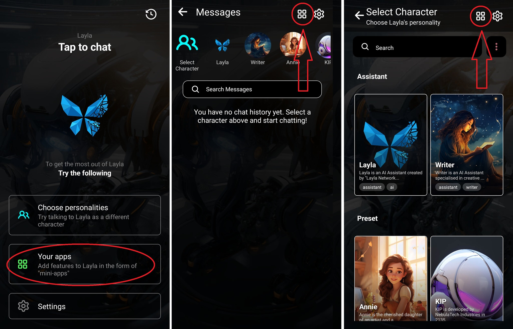

Layla include molte funzionalità che non sono attive per impostazione predefinita. Queste funzionalità sono facoltative, ma rimangono sempre disponibili quando ti servono.

<video controls playsinline src="/assets/articles/how-to-enable-disable-mini-apps-within-layla/browse-mini-apps.mp4"></video>

In Layla, queste funzionalità sono organizzate come **mini-app**. Le mini-app sono simili alle normali app del telefono, ma sono contenute in Layla e progettate per funzionare con le sue funzionalità.

Possono offrire funzioni che spaziano dalla configurazione dei personaggi all'attivazione della generazione di immagini e molto altro.

Per visualizzare l'elenco delle app attualmente installate, tocca il pulsante _Le mie app_ in una delle schermate mostrate di seguito:

Verrà visualizzato l'elenco delle app attualmente attive:

Il segno più o meno nell'angolo in alto a destra consente di sfogliare tutte le funzionalità offerte da Layla.

_Nota: tutte le mini-app richiedono la versione premium di Layla. Puoi acquistare la versione premium tramite Google Play o dalla schermata di acquisto della versione APK diretta. Layla offre un acquisto una tantum per sbloccare tutte le funzionalità; non è richiesto alcun abbonamento mensile._
