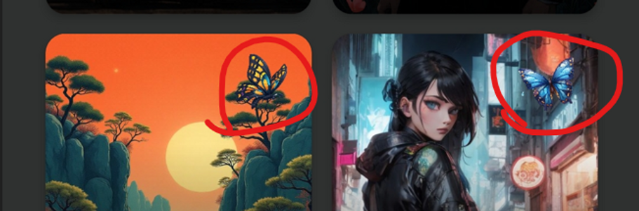

Layla v5 supporta la generazione di immagini con i modelli Stable Diffusion.

In Layla puoi generare immagini in diversi modi:

1. Utilizzando direttamente il dispositivo, senza collegarti a un fornitore esterno
2. Collegando il telefono al PC
3. Utilizzando Layla Cloud

Qualunque metodo tu scelga, devi attivare la mini-app Stable Diffusion in Layla:

**Utilizzare direttamente il dispositivo**

La generazione di immagini viene eseguita dalla CPU del telefono o del tablet. Layla include diversi modelli Stable Diffusion. Puoi scaricarli dalla mini-app Stable Diffusion:

Tocca il pulsante blu di download dal cloud per scaricare il modello. L'operazione può richiedere tempo perché i modelli sono piuttosto grandi. Tocca il riquadro del modello in alto per scegliere un modello diverso.

Dopo aver selezionato un modello e scaricato i suoi file, inserisci il prompt e le altre impostazioni per generare un'immagine.

**Collegare il telefono al PC**

Se disponi di un PC, puoi installare la diffusa [Stable Diffusion WebUI di AUTOMATIC1111](https://github.com/AUTOMATIC1111/stable-diffusion-webui).

La configurazione di Stable Diffusion WebUI di AUTOMATIC1111 non rientra nell'ambito di questo tutorial. Segui il README del repository GitHub o uno dei tutorial disponibili su YouTube.

Dopo averla installata e aver configurato la relativa API, collegala a Layla tramite l'app Impostazioni di inferenza. Scorri fino alle impostazioni di Generazione di immagini:

Tocca _Aggiungi modello personalizzato_. Potrai configurare le impostazioni dell'API:

Puoi trovare l'indirizzo IP del PC tramite il router o con altri metodi.

Una volta configurato, il PC sarà disponibile come modello Stable Diffusion quando generi immagini:

**Utilizzare Layla Cloud**

Alcuni modelli mostrano un simbolo a forma di farfalla nell'angolo in alto a destra. Questi modelli sono forniti da Layla Cloud e richiedono un abbonamento acquistato nell'app Layla Cloud. Tutti gli altri modelli generano immagini localmente sul telefono.

Questi modelli Layla Cloud offrono una generazione di immagini rapida e fluida e richiedono l'abbonamento corrispondente.

**Consentire ai personaggi di inviare immagini durante la chat**

Infine, puoi consentire ai personaggi di generare immagini durante la chat. Questa funzione è disponibile per i personaggi personalizzati.

Configura le impostazioni di generazione delle immagini nella schermata di creazione del personaggio:

Puoi scegliere il modello Stable Diffusion specifico per quel personaggio.
