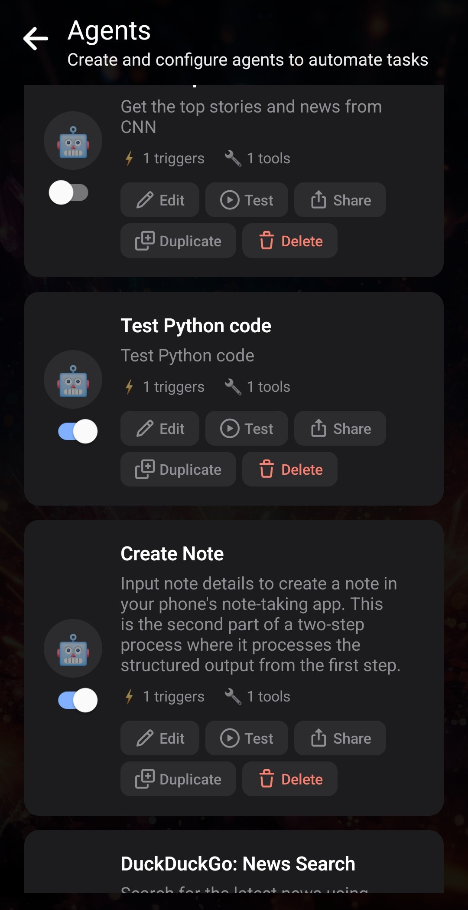
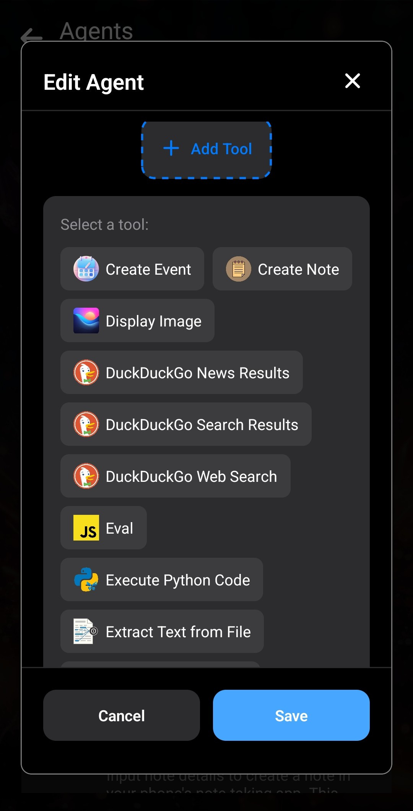

Dall'aggiornamento v6.7.0, gli Agenti Layla possono eseguire Python: [Layla v6.7.0 è stata pubblicata](https://www.layla-network.ai/post/layla-v6-7-0-has-been-published).

Per attivare l'esecuzione di codice Python, dobbiamo installare alcune mini-app. Se necessario, leggi [Come aggiungere funzionalità (mini-app) in Layla](/how-to-add-features-mini-apps-in-layla/).

**Passaggio 1: installa le mini-app _Agenti_ e _Interprete Python_**

Apri le app, tocca il segno più e sfoglia le mini-app. Trova _Agenti_ e _Interprete Python_. Tocca **Scarica** per aggiungerle a Layla.

**Passaggio 2: prova l'_Interprete Python_**

Dopo aver installato le due mini-app, apri l'Interprete Python per provarlo.

Esegui un semplice script «Hello Layla» toccando il pulsante **Esegui** in alto a destra.

Nell'output della console dovrebbe apparire il testo verde «Hello Layla!». Ciò conferma che Python funziona in Layla.

**Passaggio 3 (facoltativo): installa le dipendenze**

Gli script Python diventano molto più utili quando puoi installare librerie e dipendenze. Layla consente di farlo.

Il **Gestore pacchetti** sotto l'output permette di installare pacchetti Python tramite `pip`, come su un PC.

Proviamo a installare `requests`, una libreria diffusa per le richieste di rete che userai spesso.

Digita `requests` nel campo del Gestore pacchetti e tocca **Aggiungi**.

Suggerimento: il campo funziona come una riga di comando. Puoi aggiungere argomenti come `--upgrade` per sostituire i pacchetti installati, fissare una versione con `[nome pacchetto]==[versione]` o installare più pacchetti separandone i nomi con uno spazio.

Al termine, dovrebbe apparire del testo verde con l'avanzamento dell'installazione.

**Passaggio 3: crea un Agente di prova**

Gli script Python sono ancora più utili quando gli Agenti possono eseguirli. Layla supporta questa funzione.

Creeremo un semplice Agente di prova che stampa un testo da inviare all'LLM. Gli articoli futuri presenteranno Agenti più complessi.

Torna alla mini-app Agenti. Il modo più semplice è duplicare un Agente esistente.

Modifica il nome e la descrizione in modo da riconoscerlo.

Modifica il nuovo Agente:

Per ora useremo soltanto la frase **Python**. Ogni volta che menzioni «Python» nei messaggi a Layla, questo Agente verrà attivato. Gli Agenti più complessi richiederanno attivatori più elaborati.

Aggiungi lo strumento **Esegui codice Python**:

Nello strumento di codice Python puoi modificare lo script da eseguire e aggiungere le dipendenze necessarie. Per la prova basta una semplice istruzione `print`:

Poiché il codice `print` non richiede dipendenze, lascia vuota questa sezione.

L'Agente è pronto.

Torna indietro e avvia una chat con Layla. Verifica nell'elenco degli Agenti che l'interruttore dell'Agente sia attivo.

Quando menzioni «Python», il codice viene eseguito e l'output viene inviato all'LLM.

