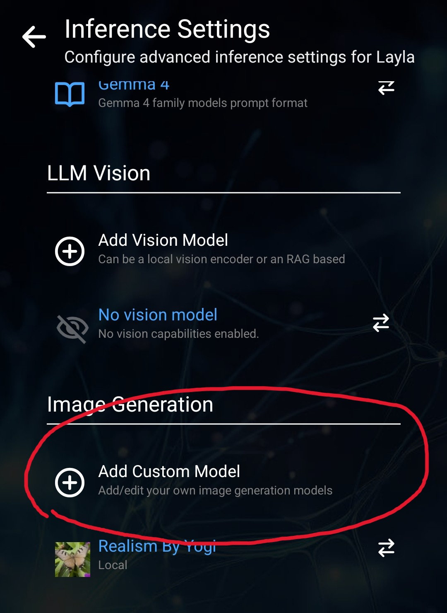

Layla supporta i modelli Safetensor per la generazione di immagini. La maggior parte dei file Safetensor per la generazione di immagini è disponibile su [Civitai](https://civitai.com/).

Questo tutorial illustra come importare file Safetensor da Civitai in Layla.

**Passaggio 1: apri [Civitai](https://civitai.com/)**

Apri la sezione **Modelli**. Nei filtri nell'angolo in alto a destra, seleziona **Checkpoint** sotto **Tipo di modello**. Sotto **Formato file**, seleziona **SafeTensor** e sotto **Modello di base**, seleziona **SD 1.5**.

Verrà visualizzato un elenco di tutti i modelli di immagini supportati da Layla.

**Passaggio 2: scarica il file Safetensor**

Scarica il file Safetensor dalla pagina di download. _Assicurati che le dimensioni del file siano di circa 2 GB: ciò indica che il file è formattato correttamente._

**Passaggio 3: importa il file in Layla**

Apri **Impostazioni** → **Impostazioni di inferenza**.

Scorri verso il basso fino alle impostazioni di **Generazione di immagini** e tocca **Aggiungi modello personalizzato**.

Seleziona il file Safetensor appena scaricato. Layla inizierà a importarlo.

**Passaggio 4: genera un'immagine**

Dopo aver importato il modello di immagini, apri la mini-app Local Dream e usala per generare un'immagine.

