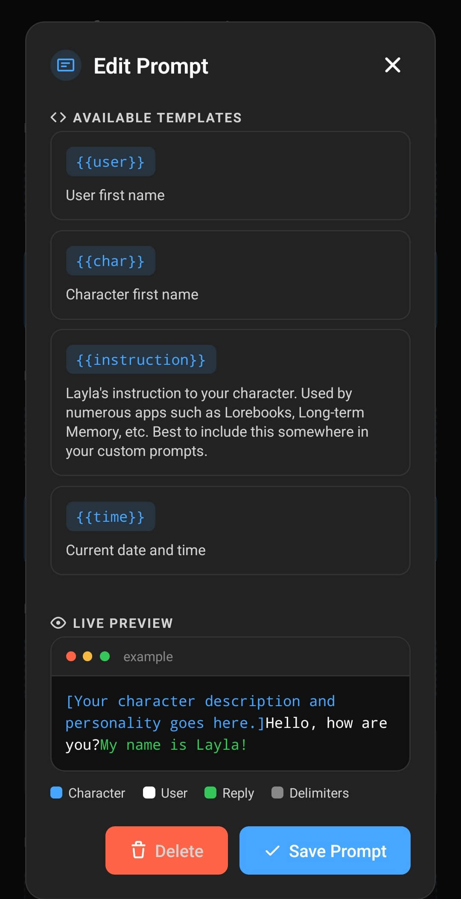

Un template di prompt personalizzato indica a Layla come organizzare la descrizione del personaggio, le istruzioni, la cronologia della conversazione, i messaggi dell’utente e le risposte del modello prima di inviarli a un modello IA. Non modifica il modello stesso: traduce una conversazione di Layla nella struttura esatta appresa dal modello durante l’addestramento.

I modelli inclusi in Layla dispongono già di impostazioni di prompt adatte. In genere devi modificarle quando aggiungi un modello personalizzato o quando vuoi cambiare deliberatamente il modo in cui Layla impartisce istruzioni al modello. Se non hai ancora importato un modello, inizia da [Come aggiungere un modello IA personalizzato a Layla](/it/how-to-add-custom-models-to-layla/).

## Perché il template di prompt deve corrispondere al modello

Ogni modello di chat si aspetta un particolare formato di prompt. Ad esempio, un modello può utilizzare ChatML, Llama, Gemma, Mistral o un altro formato specifico della propria famiglia. Questi formati usano marcatori diversi per identificare il messaggio di sistema, l’utente, l’assistente e la fine di ogni turno.

Il formato corretto dipende dal modello o dal fine-tune, non semplicemente dal tipo di file GGUF. Due modelli GGUF possono richiedere template diversi e persino modelli basati sulla stessa architettura possono essere stati addestrati con formati di chat differenti.

Quando selezioni un modello locale, Layla può scegliere un preset di prompt probabile in base al nome del file. Consideralo un punto di partenza. Cerca termini come **formato del prompt**, **chat template** o **instruct template** nella scheda del modello o nella pagina di download, quindi verifica che il preset selezionato in Layla corrisponda.

Un template errato può far sì che il modello:

- ignori la descrizione del personaggio o le istruzioni di sistema;
- mostri marcatori speciali nella risposta;
- continui a scrivere come utente invece di fermarsi;
- confonda i messaggi dell’utente e dell’assistente;
- produca risposte brevi, ripetitive o strutturate male.

Per ulteriori informazioni su modelli, quantizzazioni e schede dei modelli, consulta [Cos’è GGUF? Guida in linguaggio semplice ai modelli GGUF](/it/what-are-gguf-models-what-are-model-quants/).

## Aprire I miei prompt e controllare il formato selezionato

Apri **Impostazioni di inferenza** dalla pagina **Impostazioni** di Layla oppure apri direttamente la mini-app **Impostazioni di inferenza**. Il modello selezionato compare in **I miei modelli**, mentre il formato di prompt attivo appare subito sotto, in **I miei prompt**.

Nell’esempio seguente è selezionato un modello Gemma 4 e **Gemma 4** è il prompt attivo. La scheda **Aggiungi prompt personalizzato** crea un nuovo formato, mentre il pulsante di cambio sul prompt attivo apre l’elenco dei formati disponibili.

Tocca il pulsante di cambio sul prompt attivo per aprire **Seleziona prompt**. I formati integrati, tra cui ChatML, Llama 3, Phi, OpenELM e Gemma, appaiono insieme ai prompt personalizzati salvati. Il formato attivo è evidenziato in blu.

Se la documentazione del modello indica uno di questi formati, toccalo per usare il preset senza creare nulla. Crea un prompt personalizzato quando il modello richiede una variante non presente nell’elenco oppure quando vuoi aggiungere istruzioni personali mantenendo il formato richiesto dal modello.

## Creare un prompt personalizzato

Tocca **Aggiungi prompt personalizzato** in **I miei prompt** per aprire l’editor. Nella parte superiore trovi una riga orizzontale scorrevole di **Preset**. Toccando un preset, Layla copia quel formato nei campi sottostanti. È un punto di partenza più sicuro rispetto all’inserimento manuale di ogni delimitatore.

1. In **Preset**, scegli il formato più vicino a quello richiesto dal modello.
2. Inserisci un **Nome del prompt** e una **Descrizione del prompt** chiari. Queste etichette aiutano a distinguere formati personalizzati simili in **Seleziona prompt**.
3. Scorri le sezioni **Prompt di sistema** e **Formattazione**, quindi regola i campi descritti nella sezione successiva. Mantieni tutti i marcatori speciali, le interruzioni di riga e gli spazi richiesti dal modello.
4. Continua fino a **Template disponibili** e **Anteprima dal vivo** per controllare come viene assemblato il formato completo.
5. Tocca **Salva prompt**. Il prompt salvato diventa immediatamente attivo per le impostazioni di inferenza correnti e resta disponibile per essere riutilizzato.

## Configurare i campi di sistema e di formattazione

Sotto **Inizio prompt di sistema** e **Fine prompt di sistema**, l’editor mostra il controllo rosso **Disabilita prompt di sistema**, seguito da **Frase di arresto**, **Prefisso di input**, **Suffisso di input** e **Prefisso di contesto**. Lascia disattivato **Disabilita prompt di sistema** durante la configurazione di un normale modello di chat.

Layla utilizza questi campi per assemblare la conversazione in sezioni. In forma semplificata, inizia con le informazioni del personaggio nel blocco di sistema, quindi aggiunge il saluto, la cronologia della conversazione, il contesto fornito dalle app, l’ultimo messaggio dell’utente e il marcatore che indica al modello di iniziare la risposta.

| Impostazione                 | Funzione                                                                                                                                                                                      |
| ---------------------------- | --------------------------------------------------------------------------------------------------------------------------------------------------------------------------------------------- |
| **Inizio prompt di sistema** | Apre la sezione di sistema subito prima della descrizione, della personalità, dello scenario e delle altre informazioni di sistema del personaggio in Layla.                                  |
| **Fine prompt di sistema**   | Chiude la sezione di sistema prima dell’inizio della conversazione. È anche il punto in cui la maggior parte dei preset include `{{instruction}}`.                                            |
| **Frase di arresto**         | Segna la fine del turno dell’assistente. Layla la usa per interrompere la generazione e separare i messaggi completati. Viene anche chiamata anti-prompt o prompt inverso.                    |
| **Prefisso di input**        | Compare prima di ogni messaggio dell’utente e identifica l’inizio di un turno utente.                                                                                                         |
| **Suffisso di input**        | Compare dopo un messaggio dell’utente. In genere chiude il turno utente e apre quello dell’assistente, in modo che il modello sappia di dover rispondere.                                     |
| **Prefisso di contesto**     | Introduce il contesto aggiuntivo inserito dalle funzioni di Layla, come informazioni richiamate o risultati degli Agent, in modo che il modello possa distinguerlo dal messaggio dell’utente. |

I campi di inizio e fine racchiudono i contenuti forniti da Layla. Non incollare al loro interno l’intera descrizione del personaggio. I dettagli del personaggio appartengono all’editor dei personaggi; i campi del prompt definiscono come tali dettagli vengono presentati al modello. Consulta [Come si creano personaggi personalizzati?](/it/how-do-i-create-custom-characters/) per la configurazione dei personaggi.

La **Frase di arresto** e il **Suffisso di input** sono correlati, ma non intercambiabili. La frase di arresto indica a Layla dove termina una risposta dell’assistente. Il suffisso di input indica al modello che l’utente ha finito e che deve iniziare una risposta dell’assistente. In alcuni formati condividono parte dello stesso delimitatore, ma ciascun campo deve comunque rispettare il template documentato del modello.

### Quando disabilitare il prompt di sistema

**Disabilita prompt di sistema** impedisce a Layla di inviare la descrizione del personaggio e gli altri contenuti del prompt di sistema. È un’opzione avanzata di compatibilità, non un metodo generale per accorciare un prompt.

Attivala solo quando il modello o il servizio non supporta un prompt di sistema oppure quando la documentazione richiede esplicitamente di collocare le istruzioni altrove. La disattivazione del prompt di sistema può rimuovere l’identità del personaggio e interferire con le app che dipendono da istruzioni a livello di sistema.

Per i modelli cloud e API, inizia con il prompt **Cloud** di Layla, a meno che il fornitore non documenti un requisito diverso. I servizi cloud gestiscono normalmente la formattazione dei ruoli sul server, quindi in genere non vanno aggiunti delimitatori per modelli locali a una connessione API.

## Usare i segnaposto e controllare l’Anteprima dal vivo

Continua a scorrere fino a **Template disponibili**. Questa parte dell’editor elenca i segnaposto che Layla può sostituire durante l’esecuzione. Subito sotto, **Anteprima dal vivo** combina esempi di personaggio, utente, risposta e delimitatori per mostrare se ogni parte del prompt compare nell’ordine previsto.

L’anteprima usa il blu per le informazioni del personaggio, il bianco per il messaggio dell’utente, il verde per la risposta e il grigio per i delimitatori del modello. Usala per individuare un marcatore di ruolo mancante o un prefisso o suffisso posizionato male. Mostra come Layla assembla le sezioni, ma devi comunque verificare il formato richiesto nella scheda del modello.

### Come funziona `{{instruction}}`

Prima dell’inferenza, `{{instruction}}` viene sostituito con l’istruzione adatta all’attività corrente. Durante una normale chat con un personaggio, questa istruzione identifica la persona utente e il personaggio selezionati e indica al modello di impersonare il personaggio. Altre funzioni di Layla possono fornire istruzioni specifiche per l’attività. Memoria a lungo termine, Dreams, Lorebooks e altre app possono utilizzare queste istruzioni durante la preparazione del prompt.

Puoi gestire `{{instruction}}` in tre modi:

- **Mantenere invariata l’istruzione di Layla:** lascia `{{instruction}}` nel template. È l’opzione più sicura e mantiene la compatibilità con le funzioni che forniscono le proprie istruzioni.
- **Aggiungere indicazioni all’istruzione di Layla:** inserisci le tue indicazioni in linguaggio naturale prima o dopo `{{instruction}}`. Layla inserirà sia l’istruzione specifica per l’attività sia le tue regole aggiuntive.
- **Sostituirla completamente:** rimuovi `{{instruction}}` e scrivi al suo posto la tua istruzione. Layla userà il tuo testo, ma non includerà più le istruzioni specifiche delle funzioni che normalmente occupano questo segnaposto.

Ad esempio, puoi aggiungere una breve regola di stile dopo `{{instruction}}` mantenendo le istruzioni di Layla per il personaggio e le app. Se rimuovi completamente il segnaposto, prova tutte le funzioni che utilizzi, non soltanto le chat normali.

Non confondere `{{instruction}}` con il testo digitato dall’utente. Layla lo risolve durante la costruzione del prompt e non lo mostra come messaggio di chat separato.

### Altri segnaposto disponibili

La stessa area **Template disponibili** elenca altri tre segnaposto:

- `{{user}}` diventa il nome della persona selezionata.
- `{{char}}` diventa il nome del personaggio.
- `{{time}}` diventa la data e l’ora correnti del dispositivo.

I segnaposto non sono token di controllo del modello. Layla sostituisce i segnaposto con informazioni correnti, mentre i token di controllo sono i marcatori speciali esatti richiesti dal formato di chat del modello. I nomi dei segnaposto non fanno distinzione tra maiuscole e minuscole, ma i token di controllo del modello possono farla.

L’uso di `{{user}}` e `{{char}}` può essere utile con i fine-tune orientati al gioco di ruolo addestrati con nomi dei parlanti. Per i modelli instruct generici, ruoli fissi come “user” e “assistant” possono corrispondere meglio al formato di addestramento. Segui la scheda del modello invece di cambiare i nomi dei ruoli in base alle preferenze personali.

## Provare il template di prompt

Dopo aver salvato il prompt, avvia una nuova chat ed esegui alcuni semplici controlli:

1. Chiedi al personaggio di identificarsi. Questo verifica se le informazioni di sistema e del personaggio sono state comprese.
2. Invia due o tre messaggi e conferma che il modello mantenga separati i ruoli dell’utente e dell’assistente.
3. Controlla che le risposte terminino normalmente e non contengano token di controllo grezzi.
4. Attiva le funzioni di Layla che usi regolarmente, in particolare memoria, Lorebooks, Dreams, gioco di ruolo o Agent.

Se il modello si comporta in modo errato, confronta ogni campo con il template pubblicato per quello specifico modello. Presta particolare attenzione alle interruzioni di riga attorno ai token di controllo: differenze di formattazione invisibili possono modificare il modo in cui il modello legge il prompt.

## Problemi comuni

### Il modello parla al posto mio

La frase di arresto, il prefisso di input o il suffisso di input probabilmente non corrisponde al modello. Seleziona nuovamente il preset corretto e confrontalo con la scheda del modello.

### La risposta contiene marcatori come nomi dei ruoli o token tra parentesi angolari

Il modello riceve un formato che non riconosce oppure la frase di arresto è incompleta. Controlla l’esatto chat template usato dal fine-tune.

### La personalità del personaggio viene ignorata

Verifica che **Disabilita prompt di sistema** sia disattivato e che i marcatori di inizio e fine del prompt di sistema siano corretti. Assicurati anche che il modello supporti le istruzioni di sistema.

### Memoria, Lorebooks o un’altra app non influenzano più le risposte

Ripristina `{{instruction}}` oppure aggiungilo accanto alla tua istruzione personalizzata. Assicurati inoltre che il prefisso di contesto sia adatto al modello selezionato.

### Un prompt funziona con un modello ma non con un altro

È normale quando i modelli usano template di chat diversi. Salva un prompt separato e riconoscibile per ogni formato e cambia prompt quando cambi modello.
