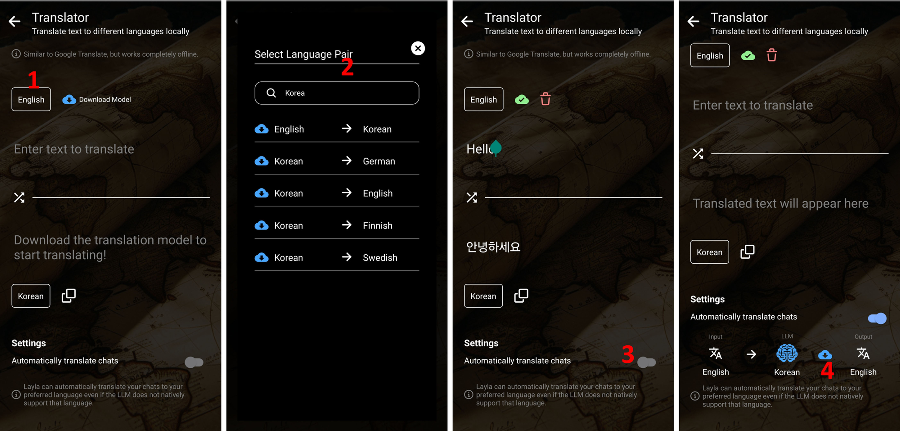

Layla include una mini-app chiamata **Traduttore offline**.

Utilizza un piccolo modello linguistico che traduce il testo tra diverse lingue completamente in locale sul telefono, senza alcuna connessione Internet.

È abbastanza veloce da tradurre le conversazioni in tempo reale. Ciò significa che, anche se utilizzi un LLM in inglese come IA principale per le chat, puoi tradurre facilmente i messaggi in entrata e in uscita in altre lingue.

**Come attivare l'app Traduttore offline**

1. Apri _Mini-app_.
2. Tocca `+` per aggiungere una mini-app.
3. Cerca _Traduttore offline_ nell'elenco delle app.
4. Attivala.

**Come usare il Traduttore offline**

1. Tocca il nome della lingua in alto per cambiare lingua.
2. Cerca la coppia di lingue desiderata.
3. La funzione di traduzione è simile a Google Traduttore e alle altre app di traduzione. Attiva _Traduci automaticamente la chat_ in basso.
4. Normalmente, il tuo modello IA, ovvero l'LLM, utilizza l'inglese. Configura il traduttore affinché traduca automaticamente il tuo messaggio, ad esempio dall'italiano all'inglese per l'IA, quindi traduca automaticamente la risposta dell'IA nella tua lingua. _Assicurati di aver scaricato il modello di traduzione toccando l'icona di download dal cloud._

Il risultato sarà una chat tradotta automaticamente.

<video controls playsinline src="/assets/articles/how-to-use-the-offline-translator-in-layla-to-make-all-your-chats-multi-lingual/translated-chat.mp4"></video>
