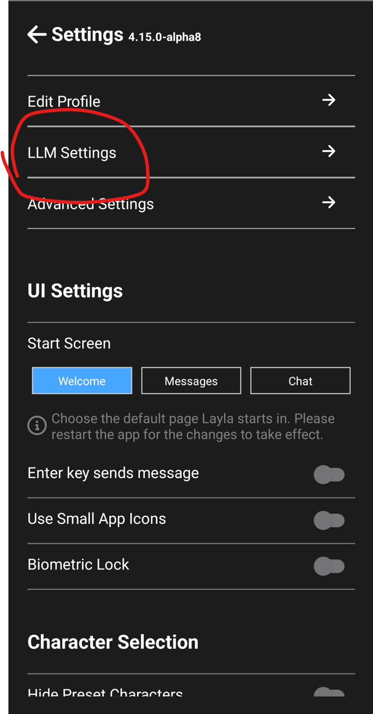

Se hai esplorato modelli IA locali su Hugging Face, avrai probabilmente notato ovunque file che terminano con `.gguf`. Che cos’è un modello GGUF e perché quasi tutte le app di IA offline, inclusa Layla, usano questo formato?

Questa guida spiega cosa significa GGUF e come funziona, quindi mostra come caricare qualsiasi modello GGUF personalizzato in Layla. Potrai eseguire modelli IA senza censura, per il gioco di ruolo o specializzati direttamente sul telefono Android, senza Internet, abbonamenti o servizi cloud.

## Che cos’è GGUF?

**GGUF è un formato di file per eseguire modelli linguistici di grandi dimensioni su hardware di consumo come portatili, computer desktop e telefoni.** Un singolo file `.gguf` contiene tutto ciò che serve per eseguire un modello IA — pesi, tokenizer, modello di prompt e metadati — in un binario portatile caricabile da un motore di inferenza compatibile.

GGUF è stato introdotto nell’agosto 2023 dal progetto [llama.cpp](https://github.com/ggerganov/llama.cpp), lo stesso motore di inferenza open source su cui si basa Layla. Prima, il progetto usava il formato GGML, che richiedeva modifiche al codice per aggiungere nuove architetture. GGUF lo ha sostituito con metadati strutturati, diventando lo standard di fatto per distribuire LLM eseguiti in locale.

Se hai usato Ollama, LM Studio, GPT4All, Jan, koboldcpp o Layla, hai usato GGUF anche senza saperlo.

## Che cosa significa GGUF?

GGUF significa **GGML Universal File**. GGML è il nome della libreria tensoriale sottostante, derivato dal suo creatore Georgi Gerganov. Online compare talvolta “GPT-Generated Unified Format”, ma il progetto llama.cpp usa “GGML Universal File”.

## Perché i modelli GGUF sono importanti per l’IA offline su dispositivi mobili

La funzione principale di GGUF è la **quantizzazione**, una tecnica che riduce i pesi del modello da numeri a 16 o 32 bit a 8, 4 o perfino 2 bit. Il file diventa molto più piccolo senza distruggere le capacità del modello, permettendo di eseguire su un telefono un modello da 7 o 8 miliardi di parametri.

In pratica, GGUF consente di:

- Eseguire un assistente IA capace interamente **offline**, senza Internet.
- Mantenere le conversazioni **private**, perché nulla lascia il dispositivo.
- Evitare abbonamenti e limiti di utilizzo.
- Scegliere **qualsiasi modello della comunità**, compresi quelli affinati per stili specifici o senza filtri sui contenuti.

## Cosa puoi fare con i modelli GGUF personalizzati in Layla

I modelli preconfigurati che Layla scarica al primo avvio sono buoni assistenti generici. Layla permette anche di caricare **qualsiasi modello GGUF desideri**.

La comunità open source ha affinato migliaia di modelli GGUF per molti utilizzi:

- **Modelli di chat senza censura o filtri**, che rispondono senza le limitazioni dei chatbot tradizionali
- **Modelli per gioco di ruolo e scrittura creativa** come Stheno, MythoMax e Mahou, pensati per lunghe conversazioni immersive
- **Modelli di programmazione** specializzati nei linguaggi di codice
- **Modelli di ragionamento e matematica** per risolvere problemi
- **Modelli specifici per un settore** come medicina, diritto, apprendimento linguistico e altro

Puoi trovare modelli GGUF testati con Layla sulla [pagina Hugging Face di l3utterfly](https://huggingface.co/l3utterfly).

## Come caricare un modello GGUF personalizzato in Layla

Ecco la procedura completa, usando come esempio il noto modello di gioco di ruolo Stheno-Mahou.

### Passaggio 1 — Scegli un modello su Hugging Face

Useremo [Stheno-Mahou](https://huggingface.co/l3utterfly/llama-3-Stheno-Mahou-8B-gguf), un apprezzato fine-tuning di Llama 3 orientato al gioco di ruolo.

### Passaggio 2 — Apri la scheda Files and versions

Qui Hugging Face elenca tutte le varianti scaricabili del modello.

### Passaggio 3 — Scegli la quantizzazione adatta al telefono

Ogni nome di file include un codice Q, come Q2_K, Q4_K_M, Q6_K o Q8_0. Indica il **livello di quantizzazione**, cioè quanto è stato compresso il modello.

La regola è semplice:

- **Numero Q più alto = file più grande = risposte migliori, ma servono più RAM e un telefono più veloce.**
- **Numero Q più basso = file più piccolo = maggiore velocità su hardware debole, ma risposte leggermente peggiori.**

Per la maggior parte dei telefoni, **Q4_K_M** è un buon punto di partenza. Se è rapido e reattivo, prova Q6 o Q8 per una qualità migliore. Se è lento, passa a Q3 o Q2.

Potresti anche vedere Q4_0_4_4, Q4_0_4_8 e Q4_0_8_8. Sono quantizzazioni speciali ottimizzate per telefoni ARM recenti con accelerazione hardware **i8mm** e possono essere sensibilmente più veloci sui dispositivi compatibili. Consulta la guida al [supporto hardware i8mm di Layla](https://www.layla-network.ai/post/layla-supports-i8mm-hardware-for-running-llm-models) per verificare il telefono.

### Passaggio 4 — Scarica il file

Tocca la freccia di download accanto alla quantizzazione scelta. Il file `.gguf` verrà salvato nella cartella Download del telefono o nella posizione usata dal browser.

### Passaggio 5 — Aggiungi il modello in Layla

Apri Layla e vai in **Inference Settings** → **Add a custom model** → **Local file**. Usa il selettore per trovare il file `.gguf` scaricato.

Nel selettore, scegli il modello appena scaricato.

### Passaggio 6 — Imposta il formato di prompt corretto

Questo passaggio viene spesso dimenticato. Ogni famiglia di modelli richiede un formato specifico: Llama 3 ne usa uno, Mistral un altro, ChatML un terzo. La pagina Hugging Face del modello indica il formato previsto. Impostalo nelle opzioni di Layla. Il tuo modello GGUF personalizzato sarà quindi in esecuzione completamente offline sul telefono.

## Domande frequenti su GGUF

### Che cos’è un file GGUF?

Un file `.gguf` è un singolo binario che raggruppa pesi, tokenizer e configurazione di un modello IA. llama.cpp e molti altri strumenti IA locali usano questo formato per caricare ed eseguire modelli linguistici.

### Che cosa significa GGUF nei modelli IA?

Quando un modello è indicato come GGUF su Hugging Face, è stato convertito nel formato ed è pronto per l’esecuzione locale su hardware di consumo tramite Layla, llama.cpp, Ollama o LM Studio, senza server GPU o API cloud.

### GGUF è migliore di safetensors o PyTorch?

Hanno scopi diversi. PyTorch e safetensors sono formati per addestramento e ricerca: precisione completa, grandi dimensioni e orientamento alle GPU. GGUF è un formato di **inferenza**: quantizzato, compatto e ottimizzato per CPU, telefoni e GPU modeste. Per _usare_ un modello anziché _addestrarlo_, GGUF è più adatto.

### Posso eseguire modelli GGUF su Android?

Sì. È esattamente ciò che fa Layla. Layla integra llama.cpp su Android e consente di caricare un modello GGUF dal dispositivo o scaricarlo da Hugging Face.

### Quale quantizzazione GGUF devo scaricare?

Inizia con **Q4_K_M**, un buon equilibrio tra dimensioni, velocità e qualità. Passa a Q6 o Q8 se il telefono le gestisce, oppure a Q3 o Q2 in caso contrario.

### Dove posso trovare modelli GGUF?

La raccolta più ampia è su [Hugging Face](https://huggingface.co). Cerca il nome di un modello seguito da “GGUF” per trovare le versioni quantizzate. Per modelli testati con Layla, visita [huggingface.co/l3utterfly](https://huggingface.co/l3utterfly).
