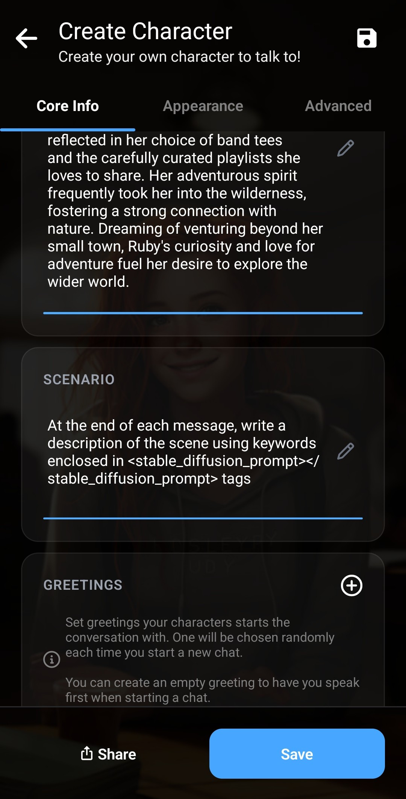

この記事では、画像生成Agentを作成する方法を説明します。このAgentは各メッセージの後に画像を自動生成し、チャットをより没入感のあるものにします。

Agentは会話のコンテキストを使用して画像を生成します。

Agentの動作は次のとおりです。

各メッセージの後にLLMが*Stable Diffusionプロンプト*を追加するようにします。キャラクターカードに指示を追加し、シーンの短い説明を`<stable_diffusion_prompt></stable_diffusion_prompt>`タグ内に追加するようLLMに求めます。

最初にAgentを作成します。このAgentは[ロールプレイAgent](/how-to-create-a-roleplay-agent/)とよく似ています。

ここでは簡単な文法を使用し、出力の末尾が`<stable_diffusion_prompt></stable_diffusion_prompt>`タグになるように構成します。

次に、自分のキャラクターを作成またはコピーします。ここでは2つの操作が必要です。まず、*シナリオ*セクションにカスタム指示を追加し、Stable Diffusionプロンプトタグ内にシーンを説明するキーワードを入れるようLLMに伝えます。指示は自由に調整できます。たとえば、シーンではなくキャラクターの画像を中心に生成するため、キャラクターの説明も含めるようLLMに指示できます。

その後、前と同じように*詳細*タブでAgentをキャラクターに関連付けます。

最後に、*推論設定*で画像生成を有効にします。詳しくは、[Laylaで画像生成を有効にする方法](/how-to-enable-image-generation-in-layla/)をご覧ください。

Snapdragon CPUを搭載したスマートフォンでは、NPUによる画像生成を強く推奨します。詳しくは、[LaylaはNPUを使用したローカル画像生成に対応しています](https://www.layla-network.ai/post/layla-supports-generating-images-locally-using-the-npu)をご覧ください。各メッセージの後、数秒で画像を生成できるため、会話の流れを妨げません。

インポート用のAgentはこちらです。

[generate-image-agent.jsonをダウンロード](/assets/articles/creating-an-image-generation-agent/generate-image-agent.json)
