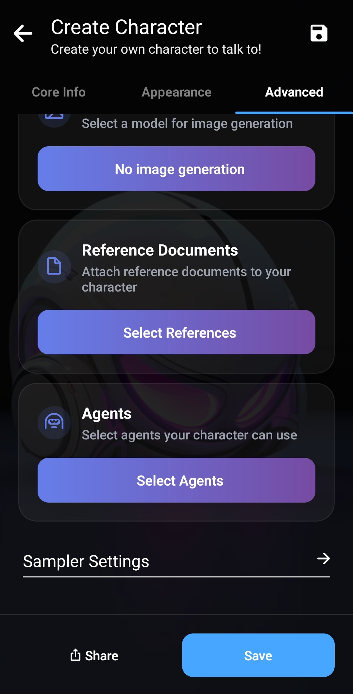

_前の2つの記事では、[LaylaのAgentsを紹介](/how-to-enable-agents-functions-and-tool-calling-in-layla/)し、続いて[その仕組みを詳しく解説](/deep-dive-into-layla-agents/)しました。_

この記事では、Layla Agentsの最後の層である完全なMCP対応について説明します。

**MCP**

MCPはModel Context Protocolの略です。自然言語と構造化された出力を組み合わせた所定のプロトコルを通じて、LLMが外部サービスとやり取りできるようにします。詳しくは[Model Context Protocolの概要](https://modelcontextprotocol.io/docs/getting-started/intro)をご覧ください。

一般にMCPでは、LLMが利用できる各ツールのシグネチャをシステムプロンプトに含めます。LLMは会話中に呼び出すべきツールを判断し、その結果を使って会話を続けます。

**Layla AgentsとMCP**

LaylaのAgentsは標準では、キーワードと、意図検出など従来の機械学習手法を組み合わせて起動されます。モバイルではコンテキストが限られ、すべてのツールをシステムプロンプトに含めると貴重な領域を大量に消費するためです。また、モバイルで動く小型モデルは最適なツールを常に選べるとは限らないため、従来の手法に利点があります。

一方でLaylaは、呼び出すツールの選択を完全にLLMに任せることもできます。仕組みを見ていきましょう。

_Layla: Introspection_ Agentは、LaylaでMCPツール呼び出しを利用する例です。Agentsミニアプリでツール名を検索し、編集してください。編集ポップアップが開き、内部の仕組みを確認できます。

すべてのトリガーが前の記事で紹介した特別な「Layla Tool Trigger」を使用しています。このトリガーは、使用可能なすべてのツールのシグネチャをシステムプロンプトに含めるようAgentに指示します。この例では、_Layla Apps Info_、_Layla: Clear Caches_、_Layla: Operating Stats_のシグネチャが含まれます。

_Tools Flow_セクションには、入力が `{{match$1}}` の _Layla Tool Call_ が1つあります。ツール呼び出しはこの形式を前提としているため変更しないでください。他のツールを追加する必要はありません。LLMがTriggersセクションにある各ツールを呼び出すタイミングを判断します。各ツールの出力は自動的にLLMのコンテキストへ追加され、必要なら別のツール呼び出しを続けることもできます。

ツール一覧を変更するには、_Introspection_ Agentを編集して既存のトリガーを削除し、新しいものを追加します。ドロップダウンからLaylaで利用できるすべてのツールを選択できます。

_注：ツールの選択にはバランスが必要です。多すぎると、LLMが呼び出すツールを判断できず混乱する可能性があります。_

よく使うツールを1つのAgentにまとめ、そのAgentを新しく作成したキャラクターに関連付ける方法を推奨します。キャラクターに明確で具体的な目的を与えられるため、ハルシネーションを大幅に減らせます。

**外部MCPサーバーへの接続**

Laylaは、著名な組織が提供するものでも自分のPCで動かすものでも、外部MCPサーバーに接続できます。

_MCP Support_ミニアプリを使うと、外部MCPサーバーを自動的に検出して設定できます。

一般的なMCPサーバーの一覧は、[Model Context Protocolサーバーのリポジトリ](https://github.com/modelcontextprotocol/servers/tree/main)で確認できます。

多くの著名な組織のMCPサーバーに加え、独自サーバーをホストするためのコードも含まれています。

適切に実装されたMCPサーバーには、ツール検出用のエンドポイントがあります。ここでは公開されている _Fetch_ MCPサーバーを例にします。このサーバーはWebページを取得し、その内容をLLMが読めるようにします。

Laylaで _MCP Support_ ミニアプリを開き、リモートMCPサーバーのURLを入力します。

_Discover Tools_をタップします。MCPサーバーへの接続が始まり、利用可能なツールの一覧が問い合わせられます。この例では「fetch」というツールが1つだけ返されます。

ツールを選択して緑色にした後、_Create Agent_をタップします。選択したツールを持つ新しいLayla Agentが作成されます。

Agentsミニアプリに移動し、「New Agent」という新しいAgentが表示されます。名前と説明は自由に編集できます。

TriggersやTool Flowなど、その他のパラメーターは変更しないでください。正しく設定済みです。

新しいキャラクターを作成し、このAgentを関連付けると有効にできます。Laylaにある既存のAgentとの競合を避けるため、ここでは新しいキャラクターを作成します。代わりに既存のWeb Search Agentを無効にしても構いません。

キャラクター作成画面の _Advanced_ タブを開きます。

_Select Agents_をタップしてポップアップを開きます。

_Fetch_ Agentを選択します。一覧に追加されます。

キャラクターを保存します。この例では _Kip_ の複製を使用します。

指示を受けると、KipがMCPツール呼び出しを開始します。

MCPツール呼び出しの後、_Kip_ は自身の個性を保ったまま依頼に答えます。これが**パーソナライズ**です。ツール呼び出しを含む依頼にも、設定された個性でキャラクターが応答します。

ダウンロードしてLaylaにインポートできるMCP AgentのJSONはこちらです。

[fetch.jsonをダウンロード](/assets/articles/full-mcp-support-in-layla/fetch.json)
