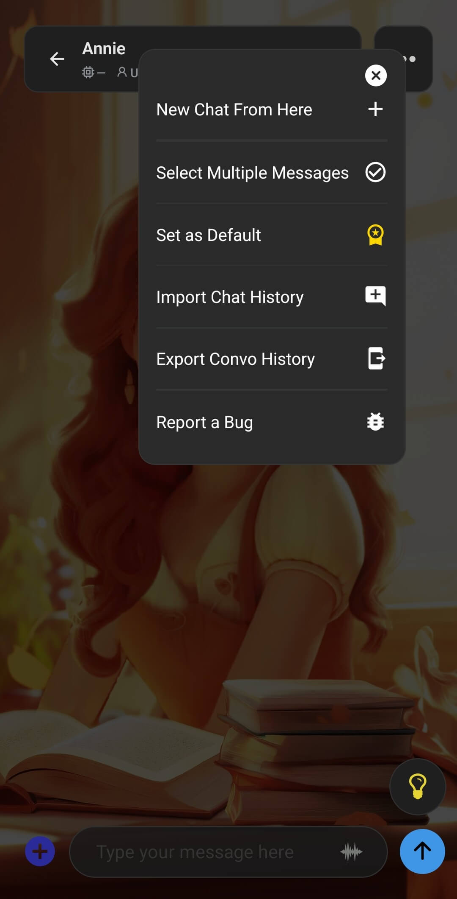

**デフォルトキャラクターとは、自分でキャラクターを選ばずに操作を始めたとき、Laylaが自動的に選ぶキャラクターです。** ホーム画面への表示、Laylaを直接チャットで起動したときの会話、キャラクターが指定されていないクイックアクション、Laylaをスマートフォンのアシスタントとして使う場合に適用されます。

初期状態では、内蔵キャラクターのLaylaが使用されます。プリセット、インポートしたキャラクター、または自作のキャラクターへいつでも変更できます。

## デフォルトキャラクターを設定する

使用したいキャラクターとの通常のチャットから設定します。

1. **パーソナリティを選択**を開き、キャラクターを選びます。
2. そのキャラクターとのチャットを開始するか、既存のチャットを開きます。
3. チャット右上の**3点メニュー**をタップします。
4. **デフォルトに設定**をタップします。

次の例では、Annieとのチャットを開き、デフォルトキャラクターに設定しています。

開いているキャラクターがすでにデフォルトの場合、**デフォルトに設定**の横にあるメダルアイコンが金色になります。デフォルトキャラクター専用の一覧はなく、一度に設定できるのは1人だけです。変更するには、別のキャラクターとのチャットを開いて同じ手順を繰り返します。

まだキャラクターを作成していない場合は、[LaylaでカスタムAIキャラクターを作成する方法](/how-do-i-create-custom-characters/)を参照するか、[Personalities Hubからキャラクターをダウンロード](/personality-hub-ai-characters/)してください。

## 設定後に変わること

デフォルトキャラクターを設定すると、アプリの別の機能がキャラクターを必要としているものの、特定のキャラクターを指定していない場合に、誰を使うかをLaylaが判断できます。新しい操作を準備するとき、そのキャラクターの設定済みの人物像、性格、外見、チャット機能が使用されます。

すでに開いている会話のキャラクターが置き換えられたり、保存済みメッセージやキャラクター自体が変更されたりすることはありません。チャット履歴が統合されることもありません。**パーソナリティを選択**から、引き続き別のキャラクターを自由に選べます。

## ホーム画面

起動画面に**ホーム**を選んでいる場合、戻るとすぐに設定結果を確認できます。Laylaはデフォルトキャラクターの名前とメイン画像を表示し、大きなキャラクター画像をタップするとそのキャラクターとのチャットが始まります。カスタム壁紙を選んでいない場合は、キャラクターの背景も使用されます。

次の画面では、内蔵のLaylaキャラクターに代わってAnnieがホーム画面に表示されています。

デフォルトのミニアプリは別の設定です。ホーム画面の大きなアイコンを置き換えるミニアプリを選んでいる場合、そのアイコンをタップするとデフォルトキャラクターではなくミニアプリが開きます。それ以外の場所では、引き続き設定したキャラクターがデフォルトとして使われます。ホーム画面のアイコンからキャラクターを開くように戻すには、**Wallpaper & UI**ミニアプリでデフォルトのミニアプリを解除してください。

## Laylaを直接チャットで開く

Laylaを起動したときにキャラクターとのチャットを直接開くには、**設定** > **UI設定** > **起動画面**で**チャット**を選択します。このチャットにはデフォルトキャラクターが使用されます。

これは、起動画面を**ホーム**にする設定とは独立しています。**ホーム**では最初にキャラクターが表示され、タップすると会話が始まります。**チャット**では、Laylaが直接チャット画面を開きます。

## スマートフォンのアシスタントとして使う

Laylaをスマートフォンのデフォルトアシスタントとして設定している場合、アシスタントを開くとLaylaのデフォルトキャラクターが使用されます。入力欄は**[キャラクター名]に質問...**に変わり、そのセッションではキャラクターの性格と設定済みの機能が使用されます。この例では、ホーム画面にAnnieを表示したものと同じ設定により、アシスタントの入力欄も**Ask Annie...**に変わっています。

Layla内でキャラクターをデフォルトに設定するだけでは、Google Geminiなどのシステムアシスタントは置き換わりません。これはスマートフォン側の別の設定です。Androidでの設定方法は、[スマートフォンのデフォルトアシスタントをGoogle GeminiからLaylaに変更する方法](/how-to-replace-google-gemini-with-layla-as-your-phone-s-default-assistant/)を参照してください。

## クイックアクションと共有テキスト

クイックアクションには特定のキャラクターを割り当てられます。固有のキャラクターが指定されていないアクションでは、Laylaがデフォルトキャラクターを使用します。Laylaへ共有したテキストを要約または説明する、リマインダーを設定する、Web検索を行うといった標準アクションも対象です。

クイックアクションのキャラクターを選ぶ画面でも、デフォルトキャラクターが先頭に表示されます。個別のアクションに別のキャラクターを割り当てた場合、そのアクションに限ってデフォルトより優先されます。

対応するiOSショートカットでも、別のキャラクターを指定せずにLaylaへ送ったテキストはデフォルトキャラクターで開きます。

## 長期記憶との連携

別のアプリや自動化機能からLaylaの**記憶する**アクションへテキストを送ると、その記憶はデフォルトキャラクターに関連付けられます。長期記憶はキャラクターごとに整理されるため、この点は重要です。後からデフォルトを変更しても、すでに保存された記憶は移動しません。

これは、開いているチャットでメッセージを手動選択し、**長期記憶に追加**を選ぶ操作とは別です。その場合、メッセージは開いているチャットのキャラクターに属します。

## 個別に設定される項目

似た名前の機能でも、次の項目にはデフォルトキャラクターが自動適用されません。

- **既存のチャット：** 保存済みの会話を開き直すと、その会話のキャラクターが使用されます。現在のデフォルトキャラクターに置き換わることはありません。
- **キャラクター指定済みのクイックアクション：** アクションに割り当てられたキャラクターが優先されます。
- **デフォルトのミニアプリ：** ホーム画面の大きなアイコンから開く対象は置き換えられますが、他の場所で使用されるキャラクターは変わりません。
- **コンパニオンモード：** 独自のキャラクター選択があります。デフォルトキャラクターを変更しても、使用中のコンパニオンは切り替わりません。
- **ロールプレイシナリオとグループチャット：** キャラクターはロールプレイミニアプリ内で選択され、デフォルトキャラクター設定からは引き継がれません。

## よくある質問

### 複数のデフォルトキャラクターを設定できますか？

いいえ。Laylaが保存できるデフォルトキャラクターは一度に1人です。別のキャラクターをデフォルトに設定すると、以前の選択が置き換わります。

### どのキャラクターがデフォルトか確認するには？

そのキャラクターとのチャットを開き、3点メニューから**デフォルトに設定**を確認します。現在のデフォルトキャラクターではメダルが金色になっています。

### デフォルトを変更すると新しいチャットが始まりますか？

いいえ。**デフォルトに設定**をタップしても、設定が保存されるだけです。新しいチャットが始まるのは、その後ホーム画面からキャラクターを開く、Laylaを**チャット**で起動する、対象のクイックアクションを使用する、またはLaylaをスマートフォンのアシスタントとして開いたときです。

### 既存のチャット履歴は変わりますか？

いいえ。既存の履歴とメッセージは変更されません。Laylaが新しい操作に使うキャラクターを選ぶ必要がある場合に、デフォルト設定が使用されます。

### ホーム画面でキャラクターをタップするとミニアプリが開くのはなぜですか？

デフォルトのミニアプリを選択している可能性があります。**Wallpaper & UI**を開き、デフォルトのミニアプリ設定から**デフォルトアプリを削除**を選択してください。ホーム画面のアイコンが再びデフォルトキャラクターを使用するようになります。

### デフォルトキャラクターはコンパニオンのキャラクターにもなりますか？

いいえ。コンパニオンモードのキャラクターは別に選択してください。

デフォルトキャラクター設定は、チャット、クイックアクション、スマートフォンのアシスタント画面で同じキャラクターをよく使う場合に便利です。それぞれの入口で一貫したキャラクターを使用しながら、ほかの会話では別のパーソナリティを自由に選べます。
