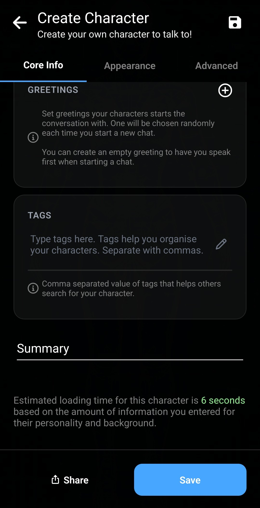
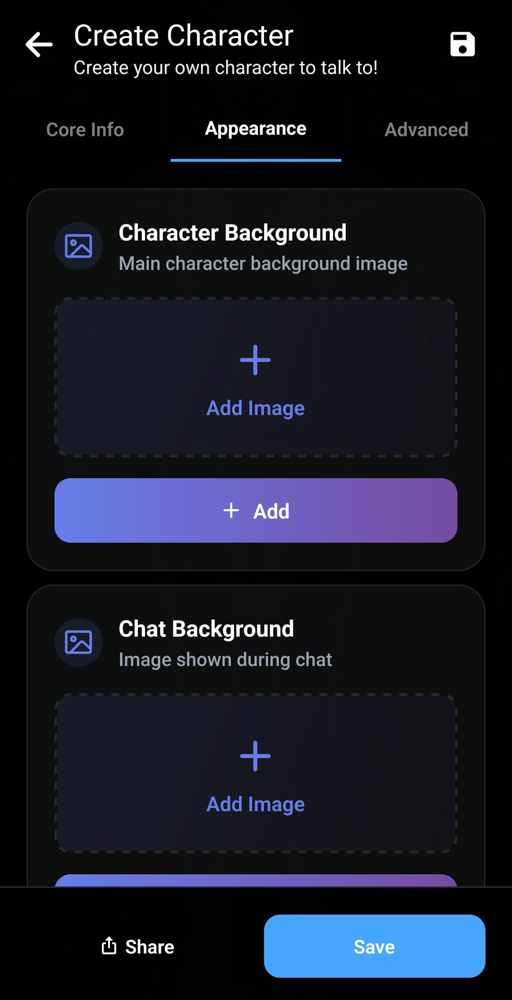
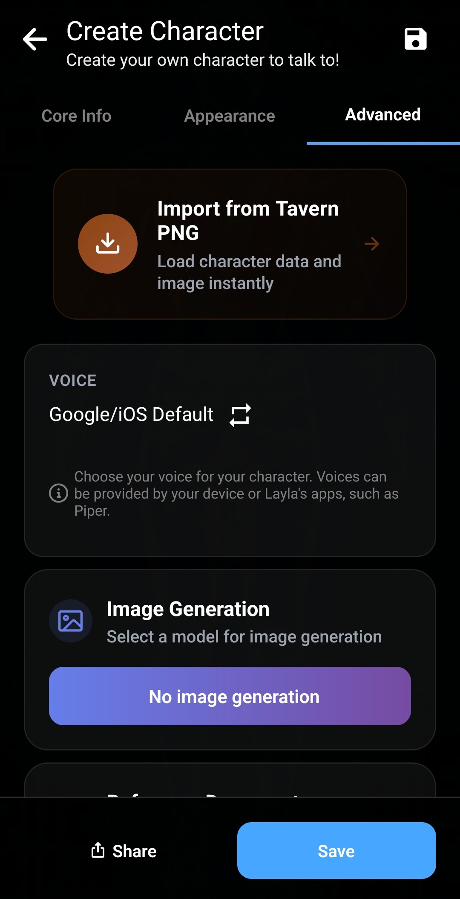
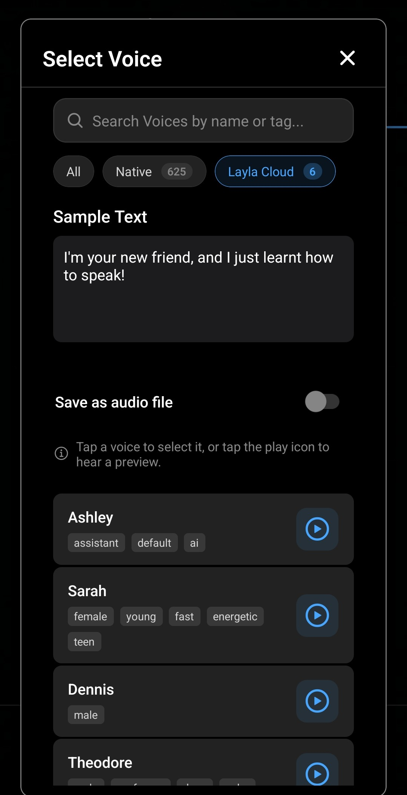
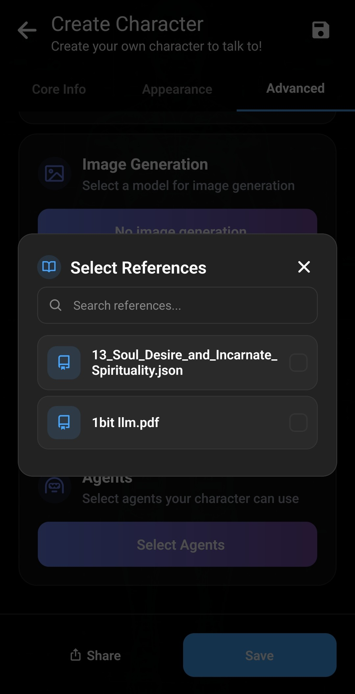

他の人が作ったキャラクターから始める場合は、[Personalities Hubからキャラクターをインポートする方法](/personality-hub-ai-characters/)をご覧ください。

Laylaのキャラクター作成機能では、端末上のプライベートな会話に使うカスタムAIキャラクターを作れます。人物像、話し方、会話の内容、外見、利用できる追加機能を設定できます。

このガイドでは、基本情報から音声、画像生成、共有まで、各タブを説明します。

## キャラクター作成画面を開く

キャラクター選択画面で、一覧の下にある大きな **+** をタップします。または **Apps** から **Create Character** ミニアプリを選びます。どちらも同じ編集画面を開きます。

## 基本情報を追加する

**Core Info** タブには、キャラクターのアイデンティティと動作を決める情報があります。

各入力項目は次の通りです。

- **Character picture：** キャラクターを識別するプロフィール画像。チャットではメッセージ横の小さな円として表示されます。
- **Character name：** Laylaが使うキャラクター名。
- **Description：** 人物像、背景、役割、知識、関係など、本人が覚えるべき情報。
- **Personality：** 性格、価値観、習慣、感情、ユーモア、語彙、話し方などの行動と会話スタイル。
- **Scenario：** 会話の状況。場所、ユーザーとの関係、開始時の出来事など。
- **Impression：** キャラクターがあなたに持つ印象。Dreamミニアプリは以前のチャットから、共有した履歴とキャラクターの見方を要約して生成できます。手動編集も可能です。
- **Greetings：** 新しい会話の冒頭メッセージ。複数追加すると新しいチャットごとにランダムで選ばれます。自分から話したい場合は空の挨拶を追加します。
- **Tags：** キャラクターを整理するカンマ区切りのラベル。共有時には他の人が見つける手掛かりになります。

説明、性格、シナリオでは `{{char}}` と `{{user}}` を使用できます。会話準備時に現在のキャラクター名とユーザー名へ置き換えられます。

項目は書きやすいよう分けられていますが、AIの別々の部分へ送る独立した指示ではありません。Laylaは説明、性格、シナリオを1つの長いシステムプロンプトにまとめ、新しいチャットには選択した挨拶を追加します。

下部の **Summary** で統合された内容を確認でき、詳細なキャラクターでは読み込み時間の推定も役立ちます。

## 外見を設定する

**Appearance** タブでキャラクターとチャットの画像を設定します。

**Core Info**のプロフィール画像はメッセージ横の小さな円です。**Character Background** は静止したメイン画像、**Chat Background** は会話全体の背景です。

アニメーション背景も選べます。

- **Rive：** 2Dアニメーション背景。
- **Live2D：** Live2Dキャラクターモデル。
- **Mini-app：** 背景を提供するカスタムLaylaミニアプリ。

これらは個別の設定が必要です。最初のキャラクターでは空欄でも構いません。

### 表情ごとの画像を追加する

Laylaは返信の感情に応じて画像を切り替えられます。表情設定を開き、称賛、楽しさ、怒り、不快感などに画像を割り当てます。

会話中に表情を検出して表示画像を変更します。専用画像がない表情では標準背景を使います。個別追加または準備済みZIPのインポートが可能です。

## 音声、画像生成、参照資料、Agentsを選ぶ

**Advanced** タブには追加連携機能とTavernPNGインポートがあります。

### TavernPNGキャラクターをインポートする

TavernPNGはキャラクターカードのデータを含む画像です。インポートすると対応する項目と画像が自動入力されます。[TavernPNGのインポート方法](/how-to-import-tavernpng-characters-in-layla/)をご覧ください。

### 固有の音声を設定する

**Voice**をタップし、スマートフォンとインストール済みTTSミニアプリの音声を参照します。名前やタグで検索し、試聴して選択できます。

選択後は音声チャットでその声を聞けます。[多言語TTS音声の追加](/how-to-add-multilingual-text-to-speech-for-your-characters-in-layla/)または[キャラクターとの音声チャット](/how-to-start-a-voice-chat-with-your-characters/)も参照してください。

### キャラクターに画像を生成させる

チャット中の依頼に応じて画像を送らせる場合、画像生成モデルを選びます。端末内または設定済みサービスで利用できる選択肢が表示されます。

不要なら **No Image Generation** のままにします。設定方法は[Laylaで画像生成を有効にする方法](/how-to-enable-image-generation-in-layla/)をご覧ください。

### 参照資料とAgents

参照文書は選択した背景資料へのアクセスを与え、Agentsは設定済みのツールやワークフローを使えるようにします。最初は空欄でも構いません。

Agentsについては、[Agents、Functions、ツール呼び出しを有効にする方法](/how-to-enable-agents-functions-and-tool-calling-in-layla/)から始めてください。

## キャラクターを共有またはエクスポートする

**Share**をタップし、Personalities HubへアップロードするかTavernPNGとしてダウンロードします。

Personalities Hubへの共有は匿名です。表示する作成者名は自由に選べ、テレビ、映画、アニメ、本などを出典とする場合はその情報を追加できます。オリジナルの場合は空欄にします。

**Download as TavernPNG**を選ぶと、友人への送信や対応アプリへのインポートに使える携帯可能なカードを作れます。

## 保存してチャットを始める

完了したら **Save** をタップします。新しいキャラクターが選択画面に表示され、タップするとチャットを始められます。後から編集画面で調整できます。LaylaのオフラインAIモデルを使うと会話は端末上でローカル実行できます。

## よくある質問

### すべての項目を入力する必要がありますか？

いいえ。名前と、人物像を確立できる説明、性格、シナリオ、挨拶から始めます。画像、表情、音声、画像生成、参照資料、Agentsは任意です。

### プロフィール画像とチャット背景の違いは？

プロフィール画像はメッセージ横の小さな円、チャット背景は会話の背後にあるメイン画像です。

### アニメーション背景を使えますか？

はい。Rive、Live2D、またはカスタムLaylaミニアプリを使えます。

### キャラクターを非公開で共有できますか？

はい。TavernPNGとしてダウンロードし、友人に直接送ってください。Personalities Hubへ匿名共有することもできます。
