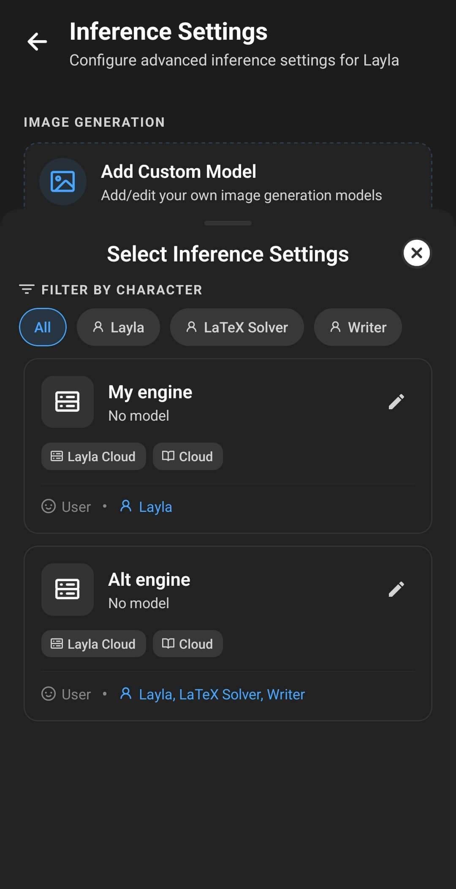

**保存済み推論エンジンとは、Laylaが返信を生成する方法を指定する、再利用可能な設定のまとまりです。** モデルまたはモデルへの接続に、ビジョンモデル、プロンプトテンプレート、ユーザーペルソナ、サンプラープリセットを組み合わせられます。自分でエンジンを選ぶほか、1人または複数のキャラクターに割り当てて、チャット開始時に適切な構成を自動的に使うこともできます。

1つの構成がすべての会話に適しているとは限りません。一般的なアシスタント、ロールプレイ用キャラクター、画像を認識するキャラクターでは、同じアプリ内で動作していても異なるモデルやプロンプトが必要になる場合があります。

## 推論エンジンはAIモデルだけではありません

モデルはテキストを生成する部分です。Laylaの推論エンジンは、そのモデルを実行または呼び出し、返信を準備するための、より広い構成を表します。

たとえば、2つの保存済みエンジンで同じローカルGGUFモデルを使いながら、プロンプトテンプレート、ペルソナ、生成設定を変えることができます。また、一方ではスマートフォン上のモデルを使い、もう一方ではLayla Server、Layla Cloud、OpenAI互換API、Claude APIに接続することもできます。

**マイモデル**は、Laylaで利用できるモデルと接続の一覧です。**保存済みエンジン**では、特定の設定の組み合わせに名前を付け、後から再利用できる構成として保存します。

使用するモデルや接続をまだ追加していない場合は、[LaylaにカスタムAIモデルを追加する方法](/ja/how-to-add-custom-models-to-layla/)を参照してください。

## 保存済み推論エンジンに含まれるもの

現在の構成をエンジンとして保存すると、Laylaは次の選択内容をまとめて保持します。

- **モデルと推論元：** ローカルモデル、Layla Server、Layla Cloud、OpenAI互換サービス、Claude互換サービス。
- **ビジョンモデル：** 言語モデルで画像を認識する場合に使う、選択済みの画像認識コンポーネント。
- **プロンプトテンプレート：** キャラクターへの指示、コンテキスト、ユーザーメッセージ、返信をモデル向けに並べる形式。
- **ペルソナ：** キャラクターに提示するユーザーの人物像と説明。
- **サンプラープリセット：** エンジンの命名または編集時に選択できる、保存済みの生成制御設定。
- **キャラクターへの割り当て：** このエンジンを自動的に使うキャラクター。

エンジンにモデルファイルそのものは含まれません。そのため、エンジンを保存してもローカルGGUFモデルのコピーは作成されません。エンジンを動作させるには、元のモデルまたは設定済みの接続が引き続き利用できる必要があります。

画像生成モデルは別に設定します。キャラクターの音声、Agents、LoreBook、キャラクターへの指示、チャット履歴も、保存済み推論エンジンには含まれません。

## 保存済み推論エンジンを作成する方法

Laylaの**設定**ページから**推論設定**を開くか、**推論設定**ミニアプリを直接開きます。

1. **マイモデル**で、使用するモデルまたは接続を選択します。
2. そのモデルに適したプロンプトテンプレートを選択します。
3. 構成で画像を扱う場合は、ビジョンモデルを選択します。
4. この構成で使用するユーザーペルソナを選択します。
5. **保存済みエンジン**で**現在の設定をカスタムエンジンとして保存**をタップします。

最初に、現在のモデル、ビジョン、プロンプト、ペルソナの概要が表示されます。続行する前に内容を確認してください。ここに表示された設定が、再利用可能なエンジンとして保存されます。別の構成として追加するには、**新しいエンジンを作成**をタップします。すでに保存済みのエンジンがある場合は、**既存のエンジンを置き換える**から1つを選び、現在の構成で更新することもできます。

次の画面では、Laylaでのエンジンの識別方法と使用方法を設定します。

6. 分かりやすいエンジン名を入力します。
7. 保存済みのサンプラープリセットを選ぶか、Laylaの全体的な生成設定を使う場合は**グローバル**のままにします。
8. **キャラクターに割り当てる**で、このエンジンへ自動的に切り替えるキャラクターをすべて選択します。
9. **変更を保存**をタップします。

「ローカル一般チャット」「ビジョンアシスタント」「ロールプレイ — 創作向け」のような名前を付けると、エンジン一覧を確認しやすくなります。1人のキャラクターに複数のエンジンを割り当てる場合は、Laylaが選択画面にエンジン名を表示するため、特に分かりやすい名前が重要です。

モデルに適したプロンプト形式については、[Laylaでモデル用のカスタムプロンプトテンプレートを設定する方法](/ja/how-to-set-up-custom-prompt-templates-for-models/)を参照してください。

## Laylaがチャット用のエンジンを選ぶ方法

チャットの開始時に、Laylaはキャラクターに保存済みエンジンが割り当てられているか確認します。

### キャラクターにエンジンが割り当てられていない場合

Laylaは**推論設定**で現在選択されている全体構成を使います。専用の構成を必要としないキャラクターでは、これが通常の代替設定になります。

全体構成を変更するには、**保存済みエンジン**で現在のエンジンカードを開き、別の保存済みエンジンを選択します。選択したエンジンのモデル、ビジョン、プロンプト、ペルソナが現在の構成として読み込まれます。

### キャラクターに1つのエンジンが割り当てられている場合

Laylaはそのエンジンを自動的に使います。全体構成よりも優先されるため、チャットのたびに手動で設定を切り替えなくても、キャラクターに合ったモデルとプロンプトを一貫して使用できます。

### キャラクターに複数のエンジンが割り当てられている場合

通常のキャラクターチャットでは、会話を読み込む前に使用するエンジンを選択するよう求められます。そのため、短いチャットには高速なローカルモデル、長いロールプレイには大きなモデルというように、1人のキャラクターに複数の有効な構成を用意できます。

選択画面には、各エンジンの名前とモデル元が表示されます。そのチャットで使用する構成をタップすると、Laylaが選択したエンジンを読み込みます。

## 開いているチャットで使用中のエンジンを確認する方法

開いている会話の上部にあるチャットタイトルをタップして、**チャット情報**を表示します。**推論エンジン**を展開すると、選択中のエンジン、プロンプト形式、システムプロンプトの状態、ペルソナを確認できます。同じ画面にサンプラー設定やその他のチャット機能が別々に表示されるため、推論エンジンと画像生成、長期記憶、Agentsとの違いも確認できます。

## グループロールプレイでの割り当て済みエンジンの動作

グループロールプレイでは、参加者ごとに別のエンジンを割り当てることができます。Laylaは発言するキャラクターに関連付けられたエンジンを確認し、必要に応じてモデル構成を切り替えます。

たとえば、1人の参加者にはロールプレイ向けのローカルモデルを使い、別の参加者には異なるモデルやプロンプト形式を使えます。連続する発言者が同じエンジンを使う場合、Laylaはモデルを読み込み直さず、そのまま準備状態に保つことができます。異なるローカルモデル間の切り替えには時間がかかり、多くのメモリを必要とする場合があります。端末のリソースが限られている場合は、複数の参加者で同じエンジンを共有する方が通常はスムーズです。

## エンジンでサンプラープリセットを使用する

サンプラー設定は、モデルが次の単語を選ぶ方法に影響します。予測しやすさ、表現の幅、返信の長さ、繰り返しなどが変わる場合があります。

保存済みエンジンの編集時に、保存済みのサンプラープリセットを1つ割り当てるか、**グローバル**のままにできます。キャラクターに割り当てられ、専用プリセットが設定されたエンジンでは、モデルの開始時にそのプリセットを使います。**グローバル**では、Laylaの詳細設定にある現在の生成設定を使います。

サンプラープリセットは、特定のキャラクターやモデルで異なる生成傾向が必要な場合に役立ちます。たとえば、創作向けロールプレイ構成と簡潔なアシスタントで別のプリセットを使えます。ただし、互換性のないプロンプトテンプレートを修正したり、大きすぎるモデルをメモリに収めたりするものではありません。これらは構成の別の要素です。

## エンジンの編集、置き換え、削除

**保存済みエンジン**で現在のエンジンカードを開くと、保存済みの一覧が表示されます。各カードにはエンジン名、モデル元、プロンプト、ペルソナ、割り当て済みキャラクターが表示されます。ビジョンまたはサンプラープリセットを含むエンジンには、追加のラベルも表示されます。

上部のキャラクターフィルターを使うと、特定のキャラクターに割り当てられたエンジンだけを表示できます。エンジンカードをタップすると、その構成が現在の設定になります。鉛筆アイコンをタップすると編集できます。

編集画面では、エンジン名の変更、サンプラープリセットの変更、キャラクターへの割り当ての更新、エンジンの削除ができます。モデル、ビジョン、プロンプト、ペルソナをまとめて更新するには、まず**推論設定**のメインページで新しい組み合わせを準備します。その後、**現在の設定をカスタムエンジンとして保存**をタップし、既存のエンジンを置き換えます。

エンジンを削除すると、再利用可能な構成とキャラクターへの割り当てが削除されます。元のローカルモデル、キャラクター、ペルソナ、プロンプトテンプレート、チャット履歴は削除されません。

## プライバシーとネットワークの使用

推論エンジンを保存しただけでは、オフラインで動作するかどうかは決まりません。エンジン内のモデル元によって決まります。

ローカルモデルとローカルのビジョンモデルは、端末上だけで実行できます。Layla Serverは自分のコンピューターへの接続を使います。Layla Cloudと外部APIは、設定されたサービスにリクエストを送信します。そのため、エンジンを切り替えると、推論が行われる場所や適用されるプライバシー条件も変わる場合があります。

## よくある質問

### 保存済み推論エンジンとモデルは同じものですか？

いいえ。モデルはエンジンの一部です。保存済みエンジンには、関連するビジョン、プロンプト、ペルソナ、サンプラー、キャラクターへの割り当ても記録されます。

### エンジンを保存するとローカルモデルが複製されますか？

いいえ。エンジンはLaylaですでに利用できるモデルを参照します。GGUFまたはLiteRTファイルのコピーは作成しません。

### 1つのエンジンを複数のキャラクターに割り当てられますか？

はい。エンジンの作成または編集時に、そのエンジンを使うキャラクターをすべて選択してください。

### 同じキャラクターに複数のエンジンを割り当てるとどうなりますか？

そのキャラクターとの通常のチャットを開くと、使用する割り当て済みエンジンを選ぶようLaylaから求められます。

### 割り当て済みエンジンは全体の推論設定より優先されますか？

はい。現在のキャラクターに割り当てられたエンジンが見つかると、そのエンジンが優先されます。一致する割り当てがない場合は、**推論設定**で選択されている全体構成を使います。

### 保存済みエンジンに画像生成も含まれますか？

いいえ。画像生成モデルとその設定は、言語モデルの推論エンジンとは別に管理されます。

### 保存済みエンジンで使っているモデルを削除するとどうなりますか？

エンジンが動作するモデルを読み込めなくなります。別のモデルを選んで保存済みエンジンを置き換えるか、削除したモデルまたは接続を復元してください。

保存済み推論エンジンを使うと、モデルファイルを複製せずに複数のモデル構成を整理できます。ローカルエンジンは端末上のオフライン構成として動作し、PCやオンラインサービスを意図的に使う場合はリモートエンジンを利用できます。
