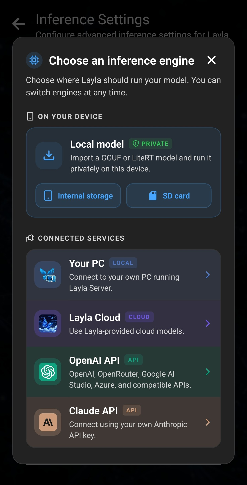
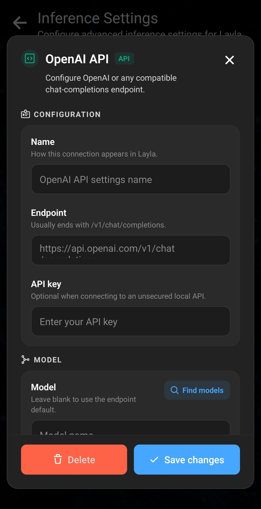

Laylaでは、Android端末上でカスタムAIモデルをローカル実行したり、PCやクラウドでホストされているモデルに接続したりできます。このガイドでは、ローカルのGGUFモデルとLiteRTモデル、Layla Server、Layla Cloud、OpenAI互換API、Claude APIを含む各選択肢について説明します。

プライベートなオフラインAI環境が必要な場合は、互換性のあるローカルモデルをインポートして端末上で直接実行します。その他の選択肢では、PCまたはオンラインサービスへの接続が必要です。

## 1. 推論設定を開く

Laylaの**設定**ページから**推論設定**を開きます。**推論設定**ミニアプリを直接開くこともできます。

**マイモデル**セクションで**カスタムモデルを追加**をタップします。

## 2. モデルを実行する場所を選ぶ

複数の推論エンジンを選べるウィンドウが開きます。ローカルモデルのインポート、PC上のLayla Serverへの接続、Layla Cloudの利用、APIプロバイダーの設定ができます。

### ローカルモデル：内部ストレージまたはSDカード

**内部ストレージ**または**SDカード**を選び、互換性のあるGGUFモデルまたはLiteRTモデルをインポートしてAndroid端末上でローカル実行します。

**内部ストレージ**では、モデルがLaylaのプライベートストレージにコピーされます。元のファイルはそのまま残るため、後で元のコピーを削除しない限り、モデルがストレージ容量を二重に使用します。モデルをコピーするとLaylaから最も確実にアクセスでき、通常は最高のパフォーマンスと安定性が得られます。この方法を推奨します。

**SDカード**では、モデルをLaylaにコピーせず、既存のフォルダー内のファイルを参照します。ストレージ容量を節約できますが、アクセスの安定性が低くなる場合があります。追加後は元のモデルファイルを移動、名前変更、削除しないでください。Laylaが同じ場所に引き続きアクセスできる必要があります。

### Layla Serverを実行するPC

**お使いのPC**を選ぶと、Layla Serverを通じてコンピューター上で実行中のモデルにLaylaを接続できます。設定ウィンドウには、接続方法を説明する短いチュートリアルがあります。Layla Serverの設定手順全体については、別の記事で解説する予定です。

### Layla Cloud

**Layla Cloud**を選ぶと、Layla Cloudで提供されているモデルを利用できます。これらのモデルはスマートフォン上でローカル実行されず、オンラインで実行されます。

### OpenAI互換API

**OpenAI API**を選ぶと、OpenAI互換のチャット補完APIを提供する任意のサービスに接続できます。ChatGPTを支えるAPIプロバイダーであるOpenAIのほか、OpenRouter、Google AI Studio、Azureなどの互換プロバイダーに対応します。

接続名、プロバイダーから提供されたエンドポイント、必要な場合はAPIキーを入力します。モデル名を入力することも、プロバイダーがモデル検索に対応していれば**モデルを検索**を使用することもできます。

エンドポイントには、プロバイダーのドメインやAPIのベースURLだけではなく、チャット補完の完全なURLを指定する必要があります。多くの場合は `/v1/chat/completions` で終わりますが、プロバイダーの資料に記載された正確なパスを使用してください。パスの一部が欠けていたり入力ミスがあったりすると、Laylaが接続できない原因になります。

### Claude API

**Claude API**を選ぶと、AnthropicのAPI形式を使用するサービスに接続できます。設定方法はOpenAI互換接続と同様です。求められる接続情報、APIキー、モデル、プロバイダーから提供された完全なAPIエンドポイントを入力します。

Claude APIとOpenAI互換APIではリクエスト形式が異なるため、プロバイダーに合う選択肢を使用してください。OpenAI APIの場合と同様に、ドメインだけを入力したりパスが不完全だったりすると、接続できないことがあります。

## 3. カスタムモデルとのチャットを始める

モデルまたは接続の設定を保存し、Laylaに戻って任意のキャラクターとのチャットを始めます。Laylaは**推論設定**で選択されているモデル構成を使用します。

**マイモデル**にはいつでも戻ることができます。別のローカルLLMの追加、APIプロバイダーの変更、オフラインモデル、Layla Server、クラウドモデルの切り替えが可能です。

## よくある質問

### 自分のGGUFモデルをLaylaに追加できますか？

はい。**推論設定**で**カスタムモデルを追加**をタップし、**内部ストレージ**または**SDカード**を選んで、端末上の互換性のあるGGUFモデルを指定します。

### ローカルモデルはインターネット接続なしで動作しますか？

はい。モデルをインポートすると、ローカル推論はAndroid端末上で実行され、オフラインでも利用できます。Layla Server、Layla Cloud、外部APIへの接続には、それぞれネットワーク要件があります。

### モデルは内部ストレージにインポートするべきですか？それともSDカードを使うべきですか？

最高のパフォーマンスと安定性を得るには内部ストレージを推奨します。SDカードは2つ目のコピーを作らずに済みますが、モデルを元の場所で利用できる状態に保つ必要があります。

### LaylaがAPIモデルに接続できないのはなぜですか？

まずエンドポイントを確認してください。プロバイダーが求める完全なAPIパスでなければなりません。OpenAI互換サービスでは多くの場合 `/v1/chat/completions` で終わり、入力ミスがないことも必要です。APIキーとモデル名がそのプロバイダーで有効かどうかも確認してください。
