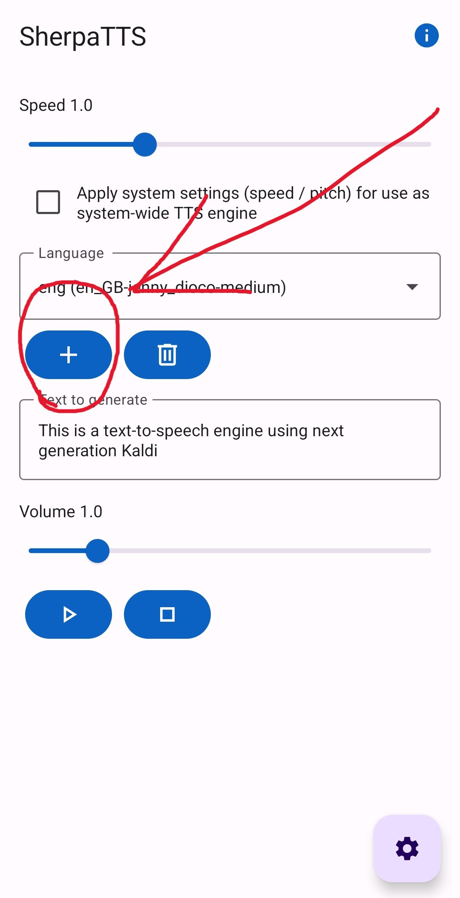
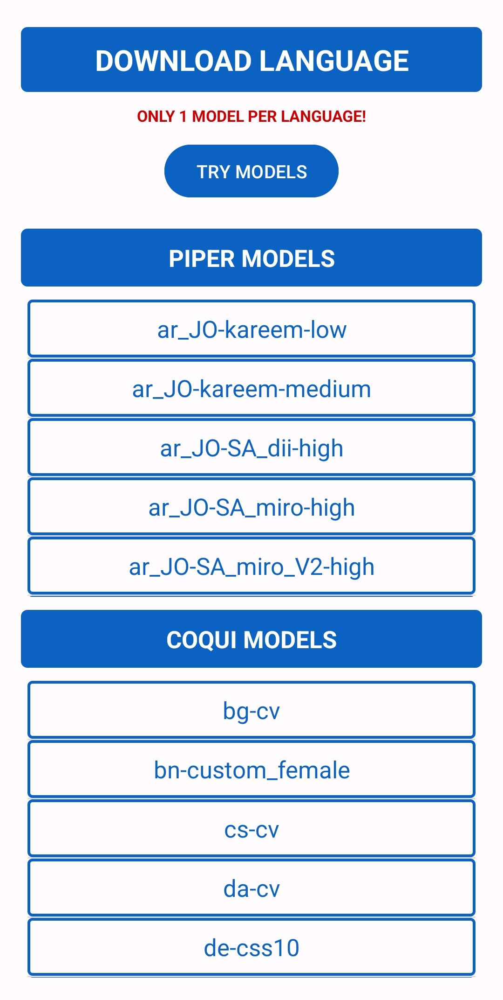
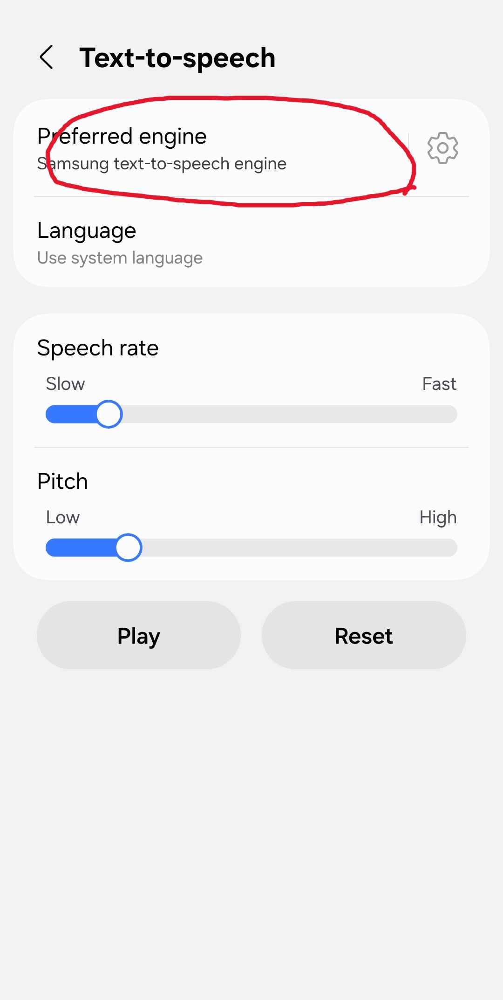
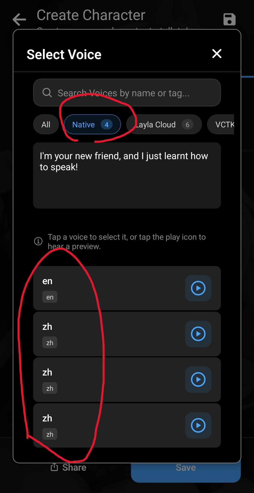

LaylaのデフォルトのTTSミニアプリは、すべて英語で動作します。ただし、Androidでは多言語のテキスト読み上げを簡単に追加できます。

Laylaは、インターネットに接続するローカルのテキスト読み上げアプリSherpaTTSに対応しています。

**手順1：SherpaTTSをダウンロードする**

[F-Droid](https://f-droid.org/en/packages/org.woheller69.ttsengine/)からアプリをダウンロードします。

**バージョン**セクションまで下にスクロールし、最新のAPKをダウンロードします。

_F-Droidは、**フリーかつオープンソース（FOSS）__のアプリを公開するGoogle Playの代替サービスです。_

**手順2：SherpaTTSを設定する**

SherpaTTSアプリをダウンロードしたら、アプリを開いて設定します。

プラス記号をタップして新しいモデルを追加します。

モデルの一覧が表示されます。

使用する言語をダウンロードします。言語は2文字の国コードで表示されます。たとえば、ドイツ語は「de」、フランス語は「fr」です。

ダウンロード後に**開始**をタップすると、モデルが読み込まれます。

**手順3：SherpaTTSをスマートフォンのデフォルトTTSモデルに設定する**

SherpaTTSのメイン画面で設定アイコンをタップします。

Androidのシステム設定が開きます。**デフォルトのテキスト読み上げ**設定をタップします。

デフォルトのエンジンをSherpaTTSに変更します。

これでデフォルトの音声にSherpaが使用されます。

**手順4：Laylaを設定する**

Laylaはこの設定を自動的に読み取り、選択した音声を使用可能にします。_（変更を反映するにはLaylaを再起動してください。）_

キャラクターの設定（**キャラクターを編集** → **詳細**タブ）を開きます。

**ネイティブ**セクションで新しい音声を選択します。

Sherpaからインストールした音声がすべてここに表示されます。

これでキャラクターが複数の言語で話せるようになります。
