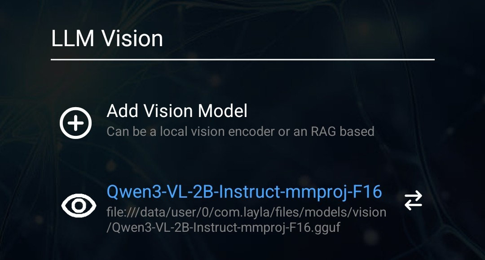

この記事では、LaylaにVision LLMを追加する方法を説明します。

LaylaはVision LLMに対応しているため、チャットで画像を送信して、画像の内容を認識させたり、それについて会話したりできます。

Qwen3-VLモデルファミリーを例に説明します。これらのモデルには、モバイルでも適切に動作する画像認識機能があります。

Laylaで使用する手順は次のとおりです。

**手順1：Qwen3-VLモデルをダウンロードする**

[Hugging FaceのQwen3-VL-2B-Instruct-GGUFリポジトリ](https://huggingface.co/unsloth/Qwen3-VL-2B-Instruct-GGUF/tree/main)から入手できます。

2Bモデルを推奨します。高速に動作し、精度も十分です。性能の高いスマートフォンを使用している場合は、より大きな4Bまたは8Bモデルも試せます。

ページのファイル一覧から**Q4_K_M**量子化を選択してダウンロードします。

少し下へスクロールして、**mmproj-F16**ファイルを探します。

このファイルもダウンロードします。

**手順2：Laylaでモデルを設定する**

Laylaに戻って**推論設定**を開きます。**LLM**セクションで**カスタムモデルを追加**を選択し、次に**内部ストレージから選択**を選びます。

設定後は次のようになります。選択したモデル名の**Q4_K_M**サフィックスを確認してください。

次に**LLM Vision**セクションを開き、`mmproj`ファイルを選択します。設定は次のようになります。

この設定により、チャットで画像を送信するとLaylaが内容を認識できるようになります。
