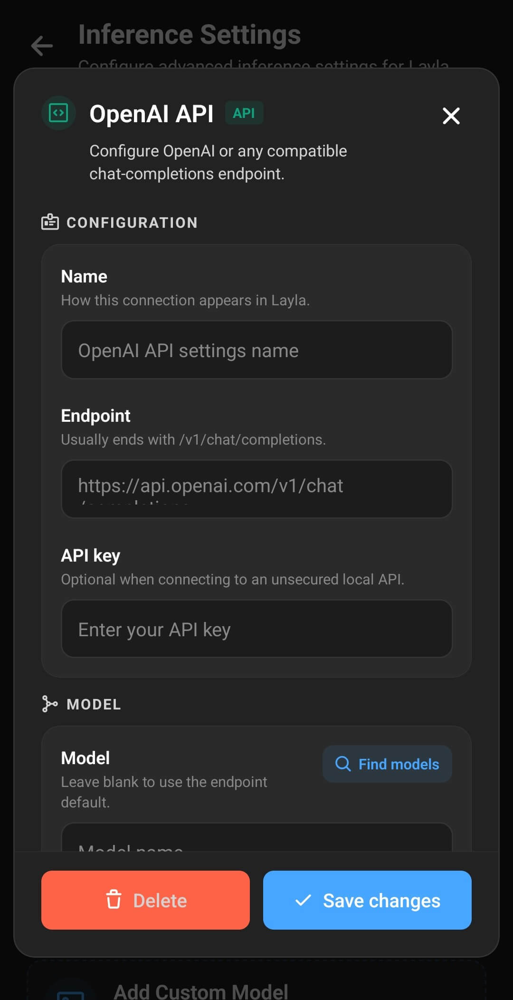

**Laylaは、OpenAI互換のChat Completionsエンドポイントを提供する任意のサービスに接続できます。** LM Studio、Ollama、llama.cppなどのローカルLLMサーバーを使って自分のPCでモデルを実行することも、同じAPI形式を採用するリモートサービスで実行することもできます。

このガイドでは、OpenAI互換APIへの接続に共通して必要な設定を説明した後、ローカルAIを使う3つの具体例を紹介します。例では同じプライベートネットワーク上のスマートフォンとWindows PCを使用しますが、同じLaylaの設定で、macOS、Linux、ホームサーバー、インターネット上の互換サーバーにも接続できます。

## OpenAI互換エンドポイントとは？

OpenAI互換エンドポイントとは、OpenAIのChat Completions APIと同じ基本形式のリクエストを受け付けるAPIアドレスです。OpenAI、ChatGPT、またはOpenAIがホストするモデルに接続する必要はありません。

多くのローカルLLM推論エンジンは、さまざまなモデルサーバーを同じアプリから利用できるよう、このAPI形式に対応しています。Laylaは会話、選択したモデル名、ストリーミング応答の要求をエンドポイントに送信します。サーバーは言語モデルを実行し、返信をLaylaに返します。

Laylaの**OpenAI API**接続で利用するサービスは、次の機能に対応している必要があります。

- OpenAI互換のChat Completionsルート（通常は`/v1/chat/completions`）
- チャットメッセージとモデル識別子
- ストリーミング応答
- APIキーが必要な場合のBearerトークン認証

LM Studio、Ollama、`llama-server.exe`はいずれも必要なChat Completionsルートを提供します。

## 始める前に必要なもの

PCでローカルLLMを実行する場合は、次のものを用意してください。

- AndroidまたはiOSデバイスにインストールしたLayla
- 選択した言語モデルを実行できるコンピューター
- 選択した推論エンジンでダウンロードしたモデル、またはllama.cpp用の互換GGUFモデル
- 同じ信頼できるWi-Fiまたはローカルネットワークに接続したスマートフォンとコンピューター
- プライベートネットワーク上でモデルサーバーをコンピューターのファイアウォールに許可する権限

モデルのサイズはメモリ使用量と応答速度に直接影響します。ローカルAIを初めて使う場合は、コンピューター向けに推奨された小さめの量子化モデルから始めてください。接続が機能することを確認してから、より大きなローカルモデルを試せます。

## LaylaにOpenAI互換接続を追加する

Laylaの**設定**を開き、**推論設定**に移動して、**マイモデル**の**カスタムモデルを追加**をタップします。次の画面では、スマートフォン上で実行するモデルと接続サービスが分かれています。**接続サービス**で**OpenAI API**を選択します。

この項目は、名前に「OpenAI」とありますが、OpenAIのモデルだけに限定されません。LM Studio、Ollama、llama.cpp、OpenRouter、および上記の互換Chat Completions形式を受け付けるその他のサービスに使用する接続方式です。

続いて、**OpenAI API**画面で接続情報とモデルを設定します。このガイドのすべての例で同じ4つの項目を使用し、入力する値だけが異なります。

| 設定               | 入力する内容                                                                                                                                   |
| ------------------ | ---------------------------------------------------------------------------------------------------------------------------------------------- |
| **名前**           | 「自分のPCのLM Studio」や「Ollama — Llama 3.2」など、接続を識別しやすい名前。                                                                  |
| **エンドポイント** | Chat Completionsの完全なURL。多くの互換サーバーでは`/v1/chat/completions`で終わります。                                                        |
| **APIキー**        | リモートプロバイダーから提供されたキー。認証なしのローカルサーバーでは空欄にし、認証を有効にした場合はローカルサーバーのトークンを入力します。 |
| **モデル**         | サーバーが要求する正確なモデル識別子。サーバーがモデル検索に対応している場合は**モデルを検索**をタップします。                                 |

後から接続を簡単に見分けられる名前を付けてください。エンドポイントには完全なルートが必要です。ポート番号または`/v1`だけで終わるベースアドレスでは不十分です。Laylaは、この欄に入力したアドレスへ各チャットリクエストを直接送信します。

エンドポイントと必要なAPIキーを入力したら、正確なモデル名が分からない場合は**モデルを検索**をタップします。Laylaは同じサーバーにOpenAI互換のモデル一覧を問い合わせ、返された識別子から選択できるようにします。モデル検索が利用できない場合は、サーバーまたはプロバイダーに表示されるモデル名を正確にコピーしてください。エンドポイントがデフォルトモデルに明示的に対応している場合に限り、モデル欄を空欄にできます。

モデル欄の下には**高度なリクエスト設定**があります。展開すると、リクエストの値を上書きするための**追加JSON**欄が表示されます。多くの利用者は空欄のままで問題ありません。プロバイダーから追加のリクエスト項目を指定された場合にだけ使います。画面に表示されているtemperatureの例は、LM Studio、Ollama、llama.cppを使うために入力する必要はありません。

接続情報とモデルを正しく設定したら、**変更を保存**をタップします。LaylaはAPI接続を**マイモデル**に保存し、現在のモデルソースとして選択します。

## スマートフォンからlocalhostに接続できない理由

サーバーに`http://localhost:1234`のようなアドレスが表示されていても、そのアドレスを使えるのはサーバーを実行しているコンピューターだけです。スマートフォン上の`localhost`は、そのスマートフォン自体を指します。

そのため、LaylaにはコンピューターのプライベートIPv4アドレスが必要です。通常は`192.168.`または`10.`で始まります。Windowsでは、**設定**を開き、**ネットワークとインターネット**を選択して、使用中のWi-FiまたはEthernet接続のプロパティから**IPv4アドレス**を確認します。LM Studioなど一部のサーバーアプリは、ネットワークアクセスを有効にすると正しいローカルネットワークアドレスを表示します。

コンピューターのアドレスが`192.168.1.50`の場合は、そのアドレスに選択したサーバーのポートと完全なAPIパスを追加します。この記事のサンプルIPアドレスはコピーせず、自分のコンピューターに割り当てられたアドレスを使用してください。

## クイックリファレンス：Layla用ローカルOpenAI互換エンドポイント

| 推論エンジン      | Laylaのデフォルトエンドポイント               | デフォルトのAPIキー                           | モデル欄                                                    |
| ----------------- | --------------------------------------------- | --------------------------------------------- | ----------------------------------------------------------- |
| LM Studio         | `http://YOUR-PC-IP:1234/v1/chat/completions`  | 認証を有効にしていなければ空欄                | **モデルを検索**を使うか、LM Studioに表示された識別子を入力 |
| Ollama            | `http://YOUR-PC-IP:11434/v1/chat/completions` | 空欄                                          | `llama3.2`など、インストール済みOllamaモデルの名前          |
| llama.cppサーバー | `http://YOUR-PC-IP:8080/v1/chat/completions`  | APIキー付きでサーバーを起動していなければ空欄 | **モデルを検索**で読み込まれたモデルを選択                  |

`YOUR-PC-IP`をコンピューターのプライベートIPv4アドレスに置き換えてください。

## 例1：LaylaをLM Studioに接続する

[LM Studio](https://lmstudio.ai/download)は、ローカル言語モデルの検索、ダウンロード、実行を行えるデスクトップアプリです。Developerページからモデルを[OpenAI互換エンドポイント](https://lmstudio.ai/docs/developer/openai-compat)として公開できます。画面操作でローカルLLMを設定したい場合に分かりやすい選択肢です。

### LM Studioにモデルをインストールする

1. 公式の[LM Studioダウンロードページ](https://lmstudio.ai/download)から現在のインストーラーをダウンロードします。
2. LM Studioをインストールして開きます。
3. **Discover**ページを開いてモデルを検索します。
4. コンピューターに適したモデルと量子化を選びます。迷う場合は、LM Studioの推奨モデルから始めるとよいでしょう。
5. モデルのダウンロードが完了するまで待ちます。

小さいモデルやビット数の低い量子化は、必要なRAMまたはVRAMが少なくなります。モデルがメモリに無理なく収まらない場合、読み込みや応答が遅くなったり、起動に失敗したりすることがあります。

### LM StudioのローカルAPIサーバーを起動する

1. LM Studioの**Developer**ページを開きます。
2. ダウンロードしたモデルを選択または読み込みます。
3. サーバー設定を開きます。
4. スマートフォンのLaylaからサーバーに接続できるよう、**Serve on Local Network**を有効にします。
5. 他のプログラムが使用していなければ、デフォルトポート`1234`をそのまま使います。
6. サーバーを起動します。
7. Windowsからファイアウォールの許可を求められた場合は、**プライベートネットワーク**だけを許可します。

LM Studioはデフォルトでは認証を必要としません。ただし、`localhost`以外で待ち受ける場合、公式ドキュメントでは認証の有効化が推奨されています。**Require Authentication**を有効にする場合は、LM StudioでAPIトークンを作成し、Laylaの**APIキー**欄に入力します。

### LaylaにLM Studioを追加する

Laylaの**OpenAI API**画面に次の値を入力します。

- **名前：** 自分のPCのLM Studio
- **エンドポイント：** `http://YOUR-PC-IP:1234/v1/chat/completions`
- **APIキー：** LM Studioの認証を有効にしていなければ空欄
- **モデル：** **モデルを検索**をタップし、ダウンロードしたモデルを選択

**変更を保存**をタップし、LM Studioのサーバーを起動したままLaylaでチャットを開きます。コンピューター上のモデルが会話を生成し、ローカルネットワーク経由でLaylaに返します。

Windows内で両方のアプリを使う方法については、[BlueStacksとLM Studioを使ってPCでLaylaを実行する方法](/ja/how-to-run-layla-on-your-pc-with-bluestacks-and-lm-studio/)を参照してください。

## 例2：LaylaをOllamaに接続する

[Ollama](https://ollama.com/download)は、Windows、macOS、Linuxで利用できるローカルモデルランナーです。[OpenAI互換API](https://docs.ollama.com/api/openai-compatibility)を備え、デフォルトではポート`11434`を使用します。

次の手順ではWindows版Ollamaを使用します。他のOSについては、Ollamaの公式ドキュメントに同等のインストール手順があります。

### Ollamaをインストールしてモデルをダウンロードする

1. 公式の[Ollamaダウンロードページ](https://ollama.com/download)からOllamaをダウンロードします。
2. インストーラーを実行し、Ollamaを開きます。
3. Windows TerminalまたはPowerShellを開きます。
4. **ollama run llama3.2**と入力し、この例で使用する`llama3.2`モデルをダウンロードして起動します。
5. ダウンロードが完了するまで待ち、短いテストメッセージを送信します。
6. ターミナルのチャットを終了するには**/bye**と入力します。Ollamaはバックグラウンドで動作し続けます。

Ollamaライブラリの別のモデルも使用できます。その場合は、この例の`llama3.2`を使用するモデルの正確なOllama名に置き換えてください。

### ローカルネットワークからOllamaへの接続を許可する

OllamaはデフォルトではPC自身の`127.0.0.1`だけで待ち受けます。Laylaを接続する前に待ち受けアドレスを変更します。

1. Windowsタスクバーの通知領域からOllamaを終了します。
2. Windowsの**設定**を開き、**環境変数**を検索します。
3. **アカウントの環境変数を編集**を選択します。
4. 名前が**OLLAMA_HOST**、値が**0.0.0.0:11434**のユーザー変数を作成します。
5. 変更を適用し、WindowsのスタートメニューからOllamaを再起動します。
6. 必要に応じて、Windowsファイアウォールでプライベートネットワーク上のOllamaを許可します。

`0.0.0.0`で待ち受けることで、ローカルネットワーク上のデバイスからOllamaに接続できるようになります。ただし、ポート`11434`を公開インターネットに開放しないでください。ルーターの内側に置き、信頼できるネットワークでのみ使用します。

### LaylaにOllamaを追加する

Laylaの**OpenAI API**画面に次の値を入力します。

- **名前：** 自分のPCのOllama
- **エンドポイント：** `http://YOUR-PC-IP:11434/v1/chat/completions`
- **APIキー：** 空欄
- **モデル：** `llama3.2`、または**モデルを検索**をタップしてインストール済みのOllamaモデルを選択

**変更を保存**をタップして会話を始めます。Ollamaはリクエストを受け取ると選択されたモデルを読み込むため、最初の返信は2回目以降より時間がかかる場合があります。

**モデルを検索**で何も表示されない場合は、モデルのダウンロードが完了していることと、`OLLAMA_HOST`の変更後にOllamaを再起動したことを確認してください。

## 例3：Laylaをllama-server.exeに接続する

[`llama-server.exe`](https://github.com/ggml-org/llama.cpp/releases/latest)は、llama.cppに含まれるWindows用サーバーです。別のデスクトップモデル管理アプリを使わずにGGUFモデルを実行できる軽量な選択肢です。公式の[llama.cppサーバードキュメント](https://github.com/ggml-org/llama.cpp/blob/master/tools/server/README.md)にOpenAI互換APIが説明されており、デフォルトではポート`8080`を使用します。

この方法ではターミナルコマンドを1つ使いますが、公式のビルド済みWindowsファイルを使えば、プログラミングやソースコードのコンパイルは必要ありません。

### llama.cppとGGUFモデルをダウンロードする

1. GitHubで公式の[最新llama.cppリリース](https://github.com/ggml-org/llama.cpp/releases/latest)を開きます。
2. **Assets**から現在のWindows x64 CPU用ZIPをダウンロードします。これは幅広い環境で使える開始点です。対応ハードウェアではCUDA、Vulkan、SYCL、HIP用ビルドの方が高速な場合があります。
3. ZIP全体を新しいフォルダーに展開します。付属するDLLファイルはすべて`llama-server.exe`と同じ場所に残します。
4. ChatまたはInstructモデルをGGUF形式でダウンロードします。ファイルや量子化の選び方については、[GGUFモデルとモデル量子化とは？](/ja/what-are-gguf-models-what-are-model-quants/)を参照してください。
5. GGUFファイルを展開したllama.cppフォルダーに移動し、必要であれば短く分かりやすいファイル名に変更します。

プロンプト方法を理解している場合を除き、Baseモデルは選ばないでください。通常のLaylaでの会話には、ChatまたはInstructモデルが適しています。

### Layla用にllama-server.exeを起動する

1. 展開したllama.cppフォルダーをエクスプローラーで開きます。
2. エクスプローラーのアドレスバーをクリックし、**cmd**と入力してEnterキーを押します。そのフォルダーでコマンドプロンプトが開きます。
3. **llama-server.exe -m "your-model.gguf" --host 0.0.0.0 --port 8080**と入力し、`your-model.gguf`を実際のファイル名に置き換えます。
4. Laylaの使用中はコマンドプロンプトのウィンドウを開いたままにします。
5. モデルの読み込みが完了し、HTTPサーバーが待ち受けを開始したという表示が出るまで待ちます。
6. 必要に応じて、Windowsファイアウォールでプライベートネットワーク上のサーバーを許可します。

ローカルネットワーク上のスマートフォンから接続するには、`--host 0.0.0.0`が必要です。この指定がない場合、llama.cppはPC上からの接続だけを受け付けます。サーバーにはPCのアドレスとポート`8080`で開けるWebインターフェースもあり、起動を確認できます。

### Laylaにllama.cppサーバーを追加する

Laylaの**OpenAI API**画面に次の値を入力します。

- **名前：** 自分のPCのllama.cpp
- **エンドポイント：** `http://YOUR-PC-IP:8080/v1/chat/completions`
- **APIキー：** 空欄
- **モデル：** **モデルを検索**をタップし、読み込まれたモデルを選択

**変更を保存**をタップしてLaylaのチャットを開始します。コマンドプロンプトのウィンドウを閉じるとサーバーが停止し、再度起動するまでLaylaは新しい返信を生成できません。

共有ネットワークでのプライバシーを高めるため、llama.cppはAPIキー保護付きで起動できます。その場合は、Laylaにも同じキーを入力します。

## Laylaを別のOpenAI互換APIプロバイダーに接続する

同じ手順は、ホスト型AI API、ホームサーバー、ネットワーク上のGPUマシン、その他のローカル推論エンジンにも使えます。

1. サービスがOpenAI互換のストリーミングChat Completionsに対応していることを確認します。
2. プロバイダーの完全なChat Completions URLを取得します。
3. サービスで必要な場合はAPIキーを取得します。
4. プロバイダーのダッシュボードまたはドキュメントで正確なモデル識別子を確認します。
5. Laylaで**推論設定** > **カスタムモデルを追加** > **OpenAI API**を開きます。
6. 名前、エンドポイント、キー、モデルを入力します。
7. サービスがOpenAI互換のモデル一覧を提供する場合は、**モデルを検索**をタップします。
8. 接続を保存し、新しいチャットでテストします。

インターネット上のエンドポイントには、プロバイダーが案内する安全な`https://` URLをそのまま使用してください。すでに完全なルートが提供されている場合は`/v1/chat/completions`を追加せず、プロバイダー固有のパス部分も削除しないでください。

**マイモデル**には複数のAPI接続を保存して切り替えられます。接続、プロンプト、ペルソナ、サンプラープリセットをまとめて管理する場合は、[Laylaの保存済み推論エンジンの仕組み](/ja/how-saved-inference-engines-work-in-layla/)を参照してください。

## プライバシーとセキュリティ

ローカルのOpenAI互換APIを使うと、言語モデルの推論を自分が管理するハードウェア上で行えます。Laylaがホームネットワーク経由でLM Studio、Ollama、llama.cppに接続する場合、チャット内容は商用モデルプロバイダーではなく、スマートフォンから自分のPCへ送信されます。

これはローカルネットワーク推論であり、スマートフォン上でのオンデバイス推論ではありません。モデルはコンピューター上で動作し、スマートフォンからそのコンピューターに接続できる必要があります。必要なアプリとモデルをダウンロードした後は、ルーター自体にインターネット接続がなくても利用できます。ただし、Laylaの一部機能やサードパーティ製ツールには別途オンライン接続が必要な場合があります。

認証されていないローカルLLMサーバーを公共Wi-Fiに公開したり、インターネットルーターでポート転送したりしないでください。保護されていないサーバーに接続できる人は、モデルを使用してコンピューターのリソースを消費できる可能性があります。利用可能な場合は認証を有効にし、ファイアウォールの許可を信頼できるプライベートネットワークに限定し、不要になったらサーバーを停止してください。

クラウド上のOpenAI互換エンドポイントを使用すると、会話はデバイス外に送信され、そのプロバイダーのプライバシーおよびデータ保持ポリシーに従って処理されます。プライベートなチャットや個人情報を送信する前に、これらのポリシーを確認してください。

## OpenAI互換接続のトラブルシューティング

### エンドポイントまたはモデルが見つからないと表示される

`404`エラーは、多くの場合、エンドポイントが不完全であるか、モデル識別子が一致していないことを示します。URLがサーバーで必要な完全なChat Completionsパス（通常は`/v1/chat/completions`）で終わっていることを確認し、**モデルを検索**を使うか正確なモデル名をもう一度コピーしてください。

### LaylaからPCに接続できない

次の項目を確認してください。

- ローカルLLMサーバーが起動しており、モデルの読み込みが完了している。
- スマートフォンとPCが同じWi-Fiまたはローカルネットワークに接続されている。
- エンドポイントに`localhost`や`127.0.0.1`ではなく、PCのプライベートIPv4アドレスを使用している。
- LM Studioで**Serve on Local Network**が有効、Ollamaで`OLLAMA_HOST`が設定済み、またはllama.cppを`--host 0.0.0.0`で起動している。
- Windowsファイアウォールがプライベートネットワーク上のサーバーを許可している。
- VPN、ゲストWi-Fi、ルーターのクライアント分離機能がデバイス間の通信を妨げていない。

### 認証エラーが発生する

`401`または`403`エラーは、通常、APIキーがないか正しくないことを示します。「Bearer」という語を追加せずにトークンをもう一度コピーしてください。LaylaがリクエストにBearer認証形式を追加します。認証なしのローカルサーバーを使う場合は、誤って有効にした認証要件を無効にするか、キー欄を空欄にします。

### モデル一覧が空になる

少なくとも1つのモデルがダウンロードされ、サーバーで利用できることを確認してください。LM Studioではサーバーから利用できるモデルが必要です。Ollamaではモデルのダウンロードが完了している必要があり、単一モデルのllama.cppサーバーではGGUFファイルの読み込みが完了している必要があります。正確なモデル識別子を手動で入力することもできます。

### PCでは動作するがLaylaから接続できない

PC上で`localhost`を開けても、サーバーがPC内で動作していることしか確認できません。ネットワークの待ち受け設定、PCのIPアドレス、ファイアウォールを再確認してください。ゲストWi-Fiや公共Wi-Fiでは、接続デバイス間の通信が意図的に遮断されている場合があります。

### 再起動後に接続できなくなった

LM Studioとllama.cppはサーバーを再度起動する必要がある場合があります。Ollamaは通常バックグラウンドで動作しますが、環境変数を変更した後は再起動が必要です。また、ルーターが再起動後にPCへ別のIPアドレスを割り当てる場合があります。その場合は、Laylaに保存したエンドポイントを更新してください。

### 応答が遅い

推論速度は、モデルサイズ、量子化、利用可能なRAMまたはVRAM、CPU、GPU、コンテキスト長、ネットワーク品質によって変わります。小さいモデルや圧縮率の高い量子化を試し、メモリを多く使うアプリを閉じ、スマートフォンを安定したローカルネットワークに接続してください。

## よくある質問

### LaylaでPC上のローカルLLMを使用できますか？

はい。LM Studio、Ollama、llama.cppなどのOpenAI互換ローカルサーバーでモデルを実行し、ローカルネットワークからのアクセスを有効にして、PCのChat CompletionsエンドポイントをLaylaに入力します。

### Android版LaylaをOllamaに接続できますか？

はい。Ollamaはコンピューター上で、LaylaはAndroid上で動作します。Ollamaをローカルネットワークで待ち受けるよう設定し、Laylaのエンドポイントに`http://YOUR-PC-IP:11434/v1/chat/completions`を使用します。

### ローカルLLMサーバーにAPIキーは必要ですか？

この記事の3つの例では、デフォルトでは必要ありません。LM Studioまたはllama.cppで認証を有効にした場合は、同じトークンをLaylaに入力します。リモートプロバイダーでは通常、専用のAPIキーが必要です。

### インターネットなしで使用できますか？

はい。モデルとサーバーが自分のPC上にあり、両方のデバイスが同じローカルネットワークに接続されていれば利用できます。アプリとモデルの初回ダウンロードにはインターネットが必要です。クラウドAPIには引き続きインターネット接続が必要です。

### モデルはスマートフォン上で動作しますか？

この3つの構成では動作しません。Laylaはチャット画面とAPIクライアントとして機能し、言語モデルはPC上で動作します。スマートフォン上で直接モデルを実行するには、互換ローカルモデルをインポートしてください。[LaylaにカスタムAIモデルを追加する方法](/ja/how-to-add-custom-models-to-layla/)を参照してください。

### OpenRouterや別のクラウドプロバイダーを使用できますか？

はい。サービスが互換性のあるストリーミングChat Completions APIを提供していれば使用できます。プロバイダーのドキュメントに記載された完全なエンドポイント、APIキー、モデル識別子を使用してください。

OpenAI互換APIにより、Laylaは共通の形式で多くのローカルおよびホスト型言語モデルと通信できます。信頼できるローカルネットワーク上でLM Studio、Ollama、llama.cppを使えば、PCがローカルLLM推論を担当し、LaylaをプライベートAIアシスタントのインターフェースとして利用できます。
