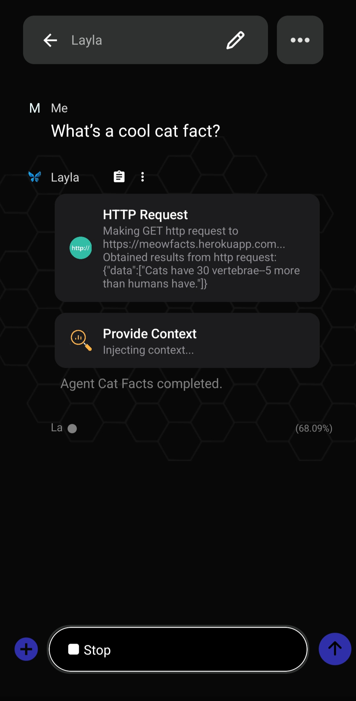
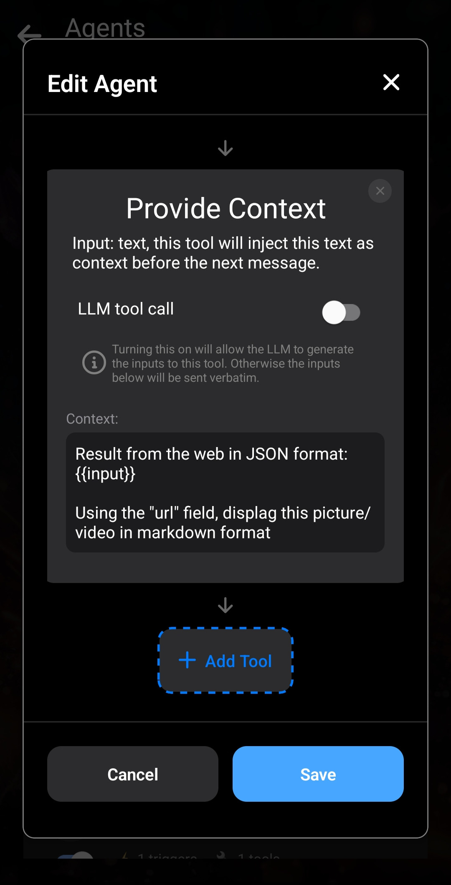

Laylaでは、自分のAgentを作成してカスタマイズし、独自の機能を追加できます。

この記事では、まず基本的なAgentの作成方法とLaylaでの仕組みを説明し、次に少し複雑なAgentを作成します。

最初に概要を知りたい場合は、[LaylaでAgents、Functions、ツール呼び出しを有効にする方法](/how-to-enable-agents-functions-and-tool-calling-in-layla/)をご覧ください。

**Agentを作成する**

仕組みの細部は後回しにして、すぐに始めましょう。

Laylaで _Agents_ ミニアプリを開きます。

Agentを作成する最も簡単な方法は、既存のAgentを複製することです。_今はまだ **Add New Agent** ボタンを気にする必要はありません。これは上級者向けです。_

既存のAgentを複製したら、_Edit_ ボタンで新しいコピーを編集します。

_Edit_ ボタンを押すとAgentの詳細を含むポップアップが開きます。ここでは、公開APIから猫に関する豆知識をランダムに取得する簡単なAgentを作ります。

手順1：Edit Agentポップアップを開きます。

手順2：既存のトリガーとツールを削除します。

手順3：名前と説明を編集します。

現時点では、名前と説明は自分で確認するためだけに使われます。_より複雑なAgentでは、名前と説明が重要になります。_

次に _トリガー_ を追加します。「Triggers」の横にあるプラス記号をタップし、「Phrase」トリガーを選びます。この簡単なトリガーは、チャットに特定の語句を入力したときにAgentを起動します。他の選択肢はまだ気にしなくて構いません。

「**cat fact**」という語句が送信されたときに、このAgentを起動するようにします。「send me a **cat fact**」や「what's a cool **cat fact**?」といったメッセージも対象です。

_トリガーフレーズ_ は「cat fact」です。大文字と小文字は区別されないため、「cat fact」でも「Cat fact」でも動作します。トリガーは1つだけなので _exclusivity_ は影響せず、_OR_ のままで構いません。

続いてAgentにツールを追加します。ここでは _HTTP Request_ を使用します。猫の豆知識を提供する公開APIの資料はこちらです：[GitHubのMeowFacts](https://github.com/wh-iterabb-it/meowfacts)。

_HTTP Request_ ツールを追加し、次のように設定します。

_URL_ フィールドには、APIの資料に記載されているURLをそのまま入力します。リクエストはGETです。他の2つのフィールドは空欄で構いません。

最初のツールが追加されました。

このツールは指定したAPIへGETリクエストを送信し、結果を取得します。次に、その結果をどう使うかLaylaに _伝える_ 必要があります。最も簡単な方法は _Provide Context_ ツールです。入力を受け取り、会話のコンテキストに追加します。Laylaはそのコンテキストを使って応答します。

ツールの一番下までスクロールし、もう一度 _Add Tool_ をタップします。今度は _Provide Context_ を選びます。先ほど追加した _HTTP Request_ の後ろにつながります。

この猫の豆知識がWeb検索から得られたものだとLLMに伝えます。

特別なテンプレート `{{input}}` を使用しています。これは前のツールの _出力_ に置き換えられます。つまり、前のツールの出力が現在のツールの入力になります。_LLM tool call_ など他の選択肢は、まだ気にしなくて構いません。

これでAgentは完成です。保存してLaylaとのチャットに戻ります。

新しいAgentが動作しています。指定したURLへHTTPリクエストを送り、その結果と指示をコンテキストに追加しています。

**まとめ**

LaylaのAgentは一般に、語句、正規表現、より複雑な条件など、特定の条件で _起動_ します。その後、設定された各ツールを順番に呼び出し、1つのツールの出力を次のツールの入力へ渡します。

_Provide Context_ はこの処理で非常に重要です。通常はAgentの最後に追加するツールで、実行結果をLLM（ここではLayla）に渡します。このツールがなければAgentは裏で実行されるだけで、Laylaは結果を把握できません。独自のAgentを作成する際は、ほとんどの場合に使用します。

**もう少し複雑なAgent**

次に、LLMの「頭脳」を利用する少し複雑なAgentの例を紹介します。

別のAPIへ簡単な _HTTP Request_ を送ります。このAPIは犬の画像をランダムに返します：[https://random.dog/woof.json](https://random.dog/woof.json)。

今回はAPIが画像のURLを返します。そのURLを正しく整形して表示するようLLMに依頼します。

手順1：HTTP Requestはこれまでと同じで、APIのURLだけを変更します。違いは _Provide Context_ に入れる指示です。結果が `url` フィールドを含むJSONであり、そのフィールドを使ってMarkdown形式で画像を表示するようLLMに伝えます。

手順2：Agentを実行した結果です。

この複雑なAgentは、約80億パラメーター以上の大きなモデルで最もよく動作します。それでも、LLMが画像を完全には正しく整形できない場合があります。

この例から、Layla Agentsで実現できる機能が分かります。

次の記事では、**実際に役立つ**Agentの作り方を学べます。

- [ロールプレイAgentを作成する](/how-to-create-a-roleplay-agent/)
- [画像生成Agentを作成する](/creating-an-image-generation-agent/)
