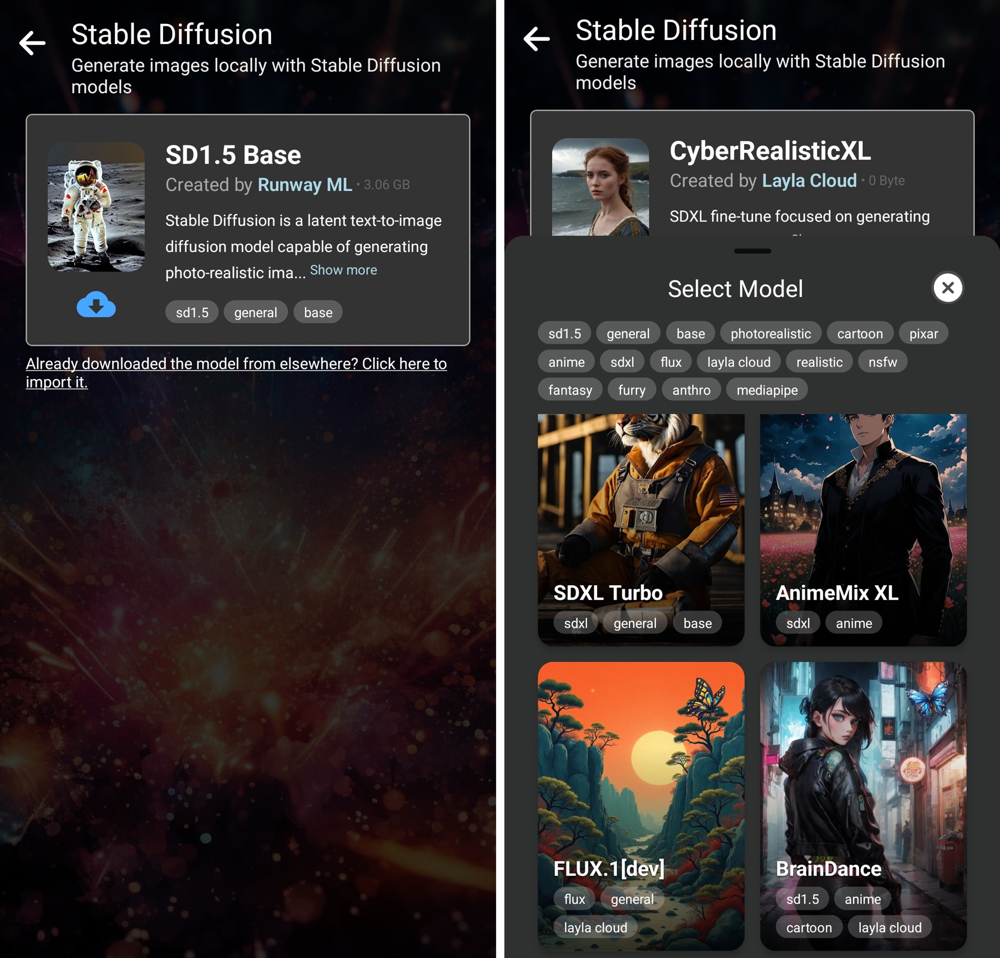
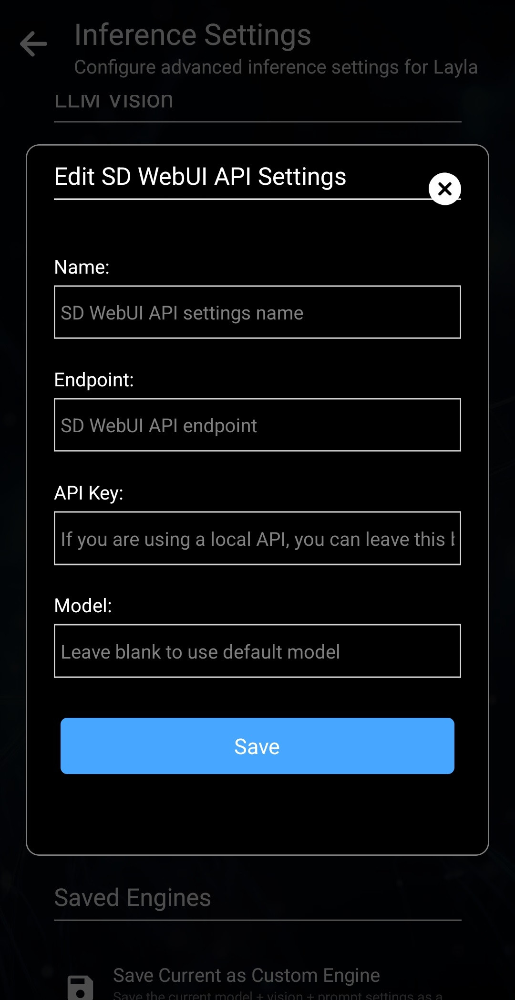
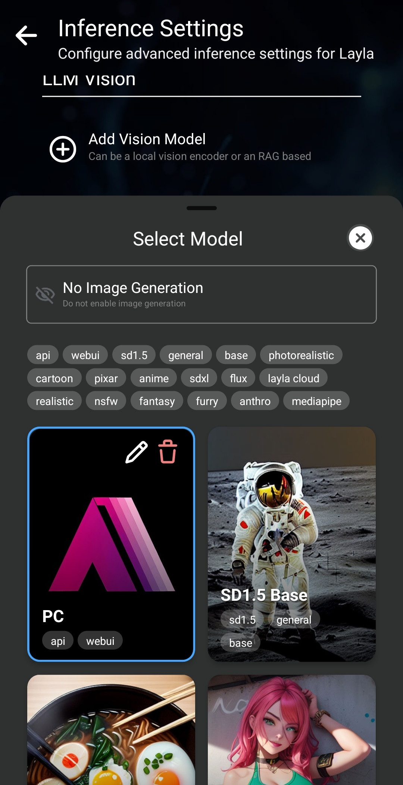
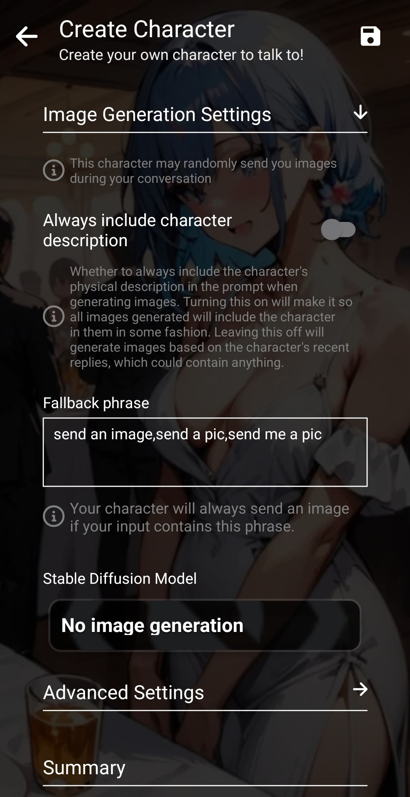

Layla v5は、Stable Diffusionモデルによる画像生成に対応しています。

Laylaでは次の方法で画像を生成できます。

1. 外部サービスに接続せず、デバイス自体を使用する
2. スマートフォンをPCに接続する
3. Layla Cloudを使用する

どの方法でも、LaylaでStable Diffusionミニアプリを有効にする必要があります。

**デバイス自体を使用する**

スマートフォンまたはタブレットのCPUで画像を生成します。Laylaには複数のStable Diffusionモデルが組み込まれており、Stable Diffusionミニアプリからダウンロードできます。

青い雲形のダウンロードボタンをタップしてモデルをダウンロードします。モデルは非常に大きいため、時間がかかる場合があります。上部のモデルタイルをタップすると、別のモデルを選択できます。

モデルを選択してファイルをダウンロードした後、プロンプトやその他の設定を入力して画像を生成します。

**PCに接続する**

PCをお持ちの場合は、広く利用されている[AUTOMATIC1111のStable Diffusion WebUI](https://github.com/AUTOMATIC1111/stable-diffusion-webui)をインストールできます。

AUTOMATIC1111のStable Diffusion WebUIの設定は、このチュートリアルでは扱いません。GitHubリポジトリのREADMEまたはYouTubeのチュートリアルを参照してください。

WebUIとAPIを設定したら、Laylaの推論設定アプリから接続します。画像生成の設定まで下にスクロールします。

*カスタムモデルを追加*をタップし、API設定を入力します。

PCのIPアドレスは、ルーターなどから確認できます。

PCを設定すると、画像生成時にStable Diffusionモデルとして選択できます。

**Layla Cloudを使用する**

右上に蝶のマークがあるモデルはLayla Cloudから提供され、Layla Cloudアプリで購入したサブスクリプションが必要です。その他のモデルは、スマートフォン上でローカルに画像を生成します。

Layla Cloudモデルは高速で滑らかな画像生成を提供し、対応するサブスクリプションが必要です。

**チャット中にキャラクターから画像を送信できるようにする**

カスタムキャラクターでは、チャット中に画像を生成させることもできます。

キャラクター作成画面で画像生成設定を構成します。

そのキャラクター専用のStable Diffusionモデルを選択できます。
