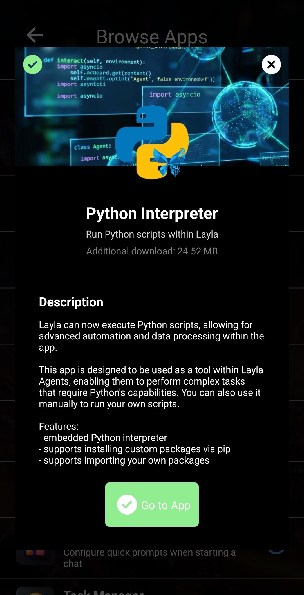
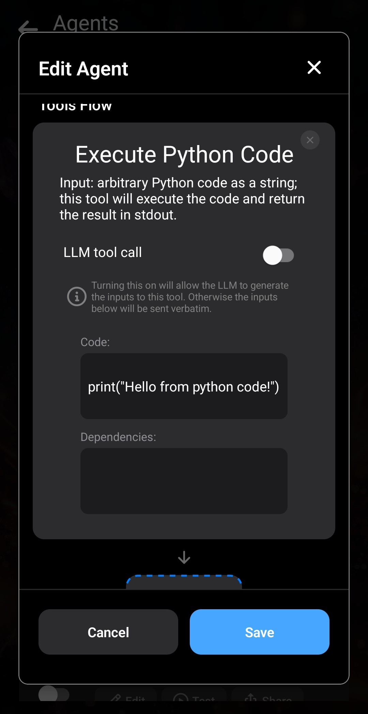
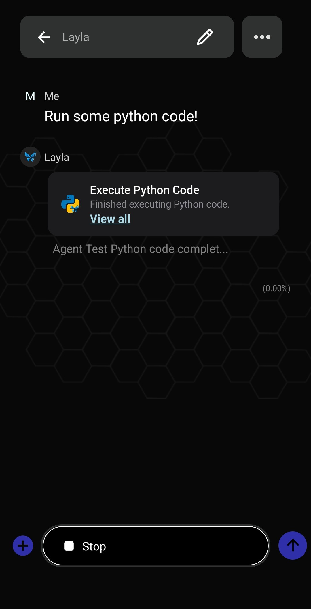

アップデートv6.7.0以降、Layla AgentでPythonを実行できます。[Layla v6.7.0が公開されました](https://www.layla-network.ai/post/layla-v6-7-0-has-been-published)。

Pythonコードの実行を有効にするには、複数のミニアプリをインストールします。必要に応じて、[Laylaに機能（ミニアプリ）を追加する方法](/how-to-add-features-mini-apps-in-layla/)をご覧ください。

**手順1：*Agent*と*Pythonインタープリター*ミニアプリをインストールする**

アプリ一覧でプラス記号をタップし、ミニアプリを参照します。*Agent*と*Pythonインタープリター*を探し、**ダウンロード**をタップしてLaylaに追加します。

**手順2：*Pythonインタープリター*をテストする**

2つのミニアプリをインストールしたら、Pythonインタープリターを開いてテストします。

右上の**実行**ボタンをタップし、簡単な「Hello Layla」スクリプトを実行します。

下のコンソール出力に緑色の「Hello Layla!」が表示されます。これでLaylaでPythonが動作していることを確認できます。

**手順3（任意）：依存関係をインストールする**

ライブラリや依存関係をインストールできると、Pythonスクリプトの用途が広がります。Laylaはこの操作に対応しています。

出力の下にある**パッケージマネージャー**では、PCと同じように`pip`でPythonパッケージをインストールできます。

ネットワークリクエストで広く使われる`requests`をインストールしてみましょう。

パッケージマネージャーの入力欄に`requests`と入力し、**追加**をタップします。

ヒント：この入力欄はコマンドラインと同じように機能します。`--upgrade`でインストール済みパッケージを置き換えたり、`[パッケージ名]==[バージョン]`でバージョンを固定したり、複数のパッケージ名を空白で区切って同時にインストールしたりできます。

その後、インストールの進行状況が緑色のテキストで表示されます。

**手順3：テストAgentを作成する**

Agentからスクリプトを実行できると、Pythonの活用範囲がさらに広がります。Laylaはこの機能に対応しています。

ここでは、LLMに送る内容を出力する簡単なテストAgentを作成します。今後の記事では、より複雑なAgentを扱います。

Agentミニアプリに戻り、既存のAgentを複製します。

覚えやすい名前と説明に変更します。

新しいAgentを編集します。

ここでは**Python**というフレーズだけを使用します。Laylaへのメッセージに「Python」と入力すると、このAgentが起動します。より複雑なAgentには、後でさらに高度なトリガーが必要になります。

**Pythonコードを実行**ツールを追加します。

Pythonコードツールでは、実行するスクリプトを編集し、必要な依存関係を追加できます。テストでは簡単な`print`文だけを使用します。

この`print`コードには依存関係がないため、そのセクションは空欄にします。

これでAgentは完成です。

戻ってLaylaとのチャットを開始します。Agent一覧でスイッチがオンになっていることを確認してください。

「Python」と入力するとコードが実行され、その出力がLLMに送信されます。

