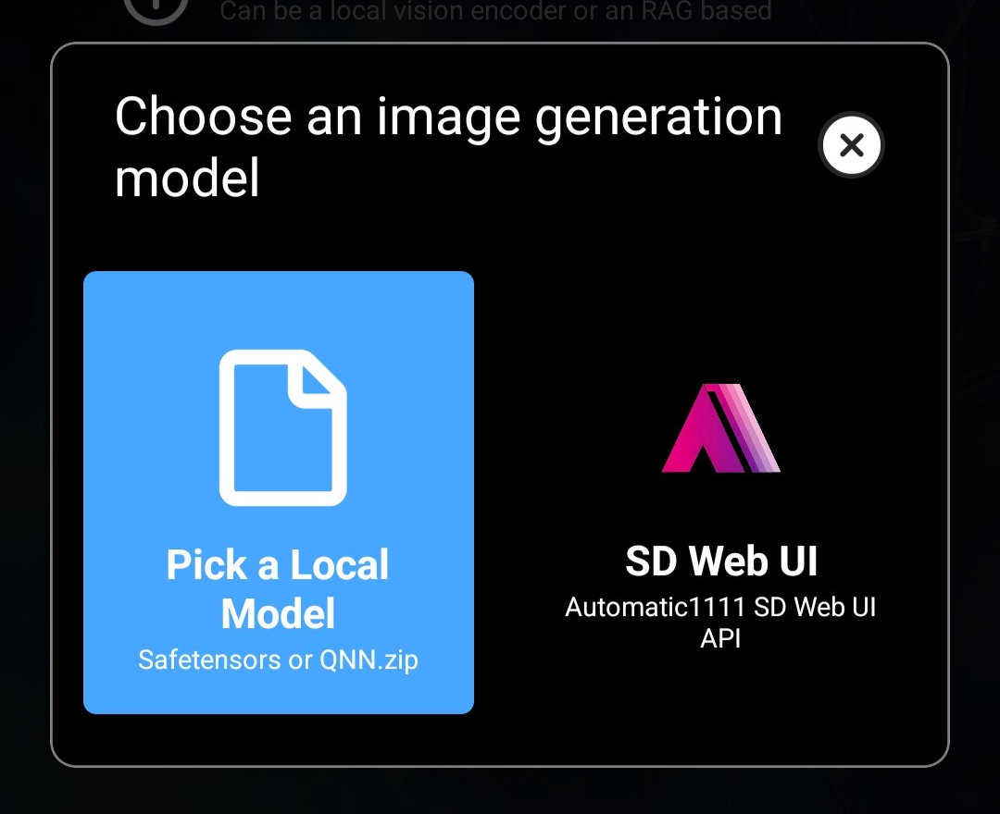

Laylaは、画像生成用のSafetensorモデルに対応しています。画像生成用Safetensorファイルの多くは、[Civitai](https://civitai.com/)で入手できます。

このチュートリアルでは、CivitaiからSafetensorファイルをLaylaにインポートする手順を説明します。

**手順1：[Civitai](https://civitai.com/)を開く**

**モデル**セクションを開きます。右上のフィルターで、**モデルタイプ**から**Checkpoint**を選択します。**ファイル形式**では**SafeTensor**、**ベースモデル**では**SD 1.5**を選択します。

Laylaが対応するすべての画像モデルが一覧表示されます。

**手順2：Safetensorファイルをダウンロードする**

ダウンロードページからSafetensorファイルをダウンロードします。_ファイルサイズが約2 GBであることを確認してください。正しくフォーマットされたファイルかどうかを判断する目安になります。_

**手順3：Laylaにインポートする**

**設定** → **推論設定**を開きます。

**画像生成**の設定まで下にスクロールし、**カスタムモデルを追加**をタップします。

先ほどダウンロードしたSafetensorファイルを選択します。Laylaがファイルのインポートを開始します。

**手順4：画像を生成する**

画像モデルのインポートが完了したら、Local Dreamミニアプリを開いて画像を生成します。

