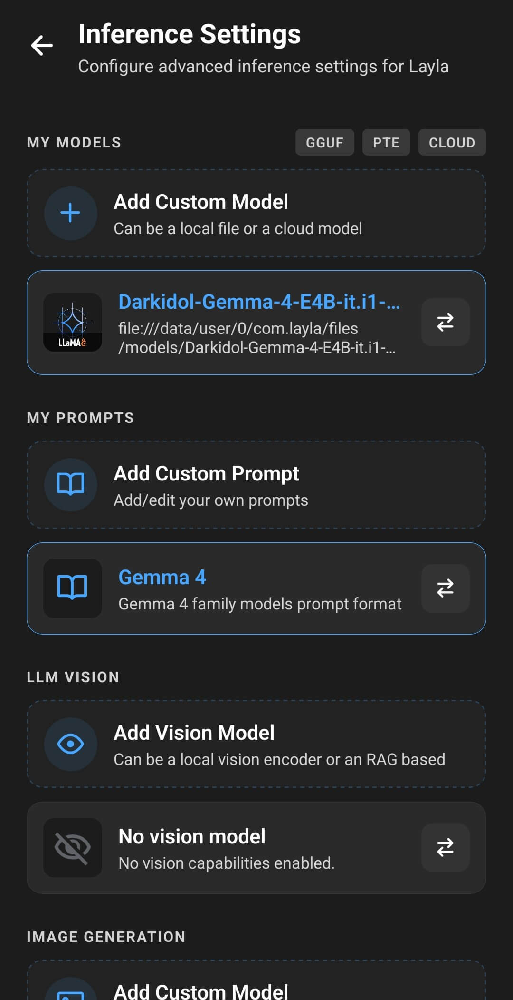
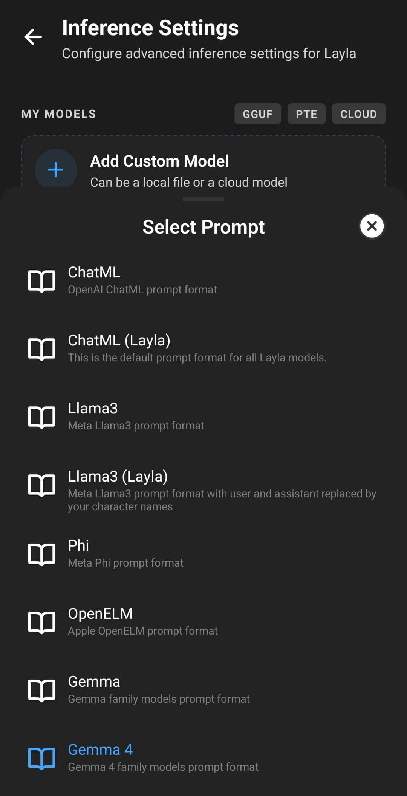

カスタムプロンプトテンプレートは、キャラクターの説明、命令、会話履歴、ユーザーメッセージ、モデルの応答を、AIモデルへ送信する前にLaylaがどのように並べるかを指定します。モデル自体を変更するものではありません。Laylaの会話を、モデルが学習時に習得した正確な構造へ変換するための設定です。

Laylaに含まれるモデルには、すでに適切なプロンプト設定が用意されています。通常、この設定を変更するのは、カスタムモデルを追加するとき、またはLaylaがモデルへ与える命令を意図的に変更するときです。まだモデルをインポートしていない場合は、先に[LaylaにカスタムAIモデルを追加する方法](/ja/how-to-add-custom-models-to-layla/)を参照してください。

## プロンプトテンプレートをモデルに合わせる必要がある理由

各チャットモデルは、特定のプロンプト形式を前提としています。ChatML、Llama、Gemma、Mistralなど、モデルファミリーごとに異なる形式が使われます。各形式では、システムメッセージ、ユーザー、アシスタント、ターンの終了を示すマーカーが異なります。

正しい形式は、GGUFというファイル形式だけではなく、モデルまたはそのファインチューニングによって決まります。2つのGGUFモデルが異なるテンプレートを必要とすることも、同じアーキテクチャを基にしたモデルが異なるチャット形式で学習されていることもあります。

ローカルモデルを選ぶと、Laylaはファイル名から適切と思われるプロンプトプリセットを選択する場合があります。これは出発点として扱ってください。モデルカードまたはダウンロードページで、**prompt format**、**chat template**、**instruct template**などの項目を探し、Laylaで選択されているプリセットと一致することを確認します。

誤ったテンプレートを使うと、次のような問題が発生することがあります。

- キャラクターの説明やシステム命令が無視される
- 応答に特殊なマーカーがそのまま表示される
- 停止せず、ユーザーの発言までモデルが続けて書く
- ユーザーとアシスタントのメッセージを混同する
- 応答が短い、反復する、または不自然な構造になる

モデル、量子化、モデルカードについて詳しくは、[GGUFとは？GGUFモデルをわかりやすく解説](/ja/what-are-gguf-models-what-are-model-quants/)を参照してください。

## マイプロンプトを開いて選択中の形式を確認する

Laylaの**設定**ページから**推論設定**を開くか、**推論設定**ミニアプリを直接開きます。選択中のモデルは**マイモデル**に表示され、その下の**マイプロンプト**に有効なプロンプト形式が表示されます。

下の例ではGemma 4モデルが選択され、**Gemma 4**が有効なプロンプトになっています。**カスタムプロンプトを追加**カードでは新しい形式を作成でき、有効なプロンプトの切り替えボタンでは既存の形式一覧を開けます。

有効なプロンプトの切り替えボタンをタップして、**プロンプトを選択**を開きます。ChatML、Llama 3、Phi、OpenELM、Gemmaなどの組み込み形式と、保存したカスタムプロンプトが一覧に表示されます。有効な形式は青色で示されます。

モデルの資料にこの一覧内の形式が指定されている場合は、その形式をタップするだけでプリセットを使用できます。一覧にない派生形式が必要な場合や、モデルに必要な形式を維持しながら独自の命令を追加したい場合は、カスタムプロンプトを作成します。

## カスタムプロンプトを作成する

**マイプロンプト**の**カスタムプロンプトを追加**をタップすると、エディターが開きます。上部には横にスクロールできる**プリセット**の一覧があります。プリセットをタップすると、その形式が下の各フィールドにコピーされます。すべての区切り文字を手動で入力するより、安全な出発点になります。

1. **プリセット**から、モデルが必要とする形式に最も近いものを選びます。
2. わかりやすい**プロンプト名**と**プロンプトの説明**を入力します。後で**プロンプトを選択**を開いたときに、似たカスタム形式を区別しやすくなります。
3. **システムプロンプト**と**書式**までスクロールし、次のセクションで説明するフィールドを調整します。モデルが必要とする特殊マーカー、改行、空白はそのまま維持してください。
4. **利用可能なテンプレート**と**ライブプレビュー**まで進み、完成した形式がどのように組み立てられるか確認します。
5. **プロンプトを保存**をタップします。保存したプロンプトは現在の推論設定ですぐに有効になり、後から再利用することもできます。

## システムと書式のフィールドを設定する

**システムプロンプトの開始**と**システムプロンプトの終了**の下には、赤色の**システムプロンプトを無効化**スイッチがあり、その後に**停止フレーズ**、**入力の接頭辞**、**入力の接尾辞**、**コンテキストの接頭辞**が並びます。通常のチャットモデルを設定するときは、**システムプロンプトを無効化**をオフのままにします。

Laylaはこれらのフィールドを使い、会話を複数のセクションに分けて組み立てます。簡略化すると、システムブロック内のキャラクター情報から始まり、挨拶、会話履歴、アプリが追加するコンテキスト、最新のユーザーメッセージ、モデルに応答開始を指示するマーカーの順に追加されます。

| 設定                         | 役割                                                                                                                                                      |
| ---------------------------- | --------------------------------------------------------------------------------------------------------------------------------------------------------- |
| **システムプロンプトの開始** | Laylaのキャラクター説明、性格、シナリオ、その他のシステムレベルの情報の直前で、システムセクションを開始します。                                           |
| **システムプロンプトの終了** | 会話が始まる前にシステムセクションを終了します。多くのプリセットでは、ここに`{{instruction}}`も含まれます。                                               |
| **停止フレーズ**             | アシスタントのターン終了を示します。Laylaはこれを使って生成を停止し、完了したメッセージを区切ります。アンチプロンプトやリバースプロンプトとも呼ばれます。 |
| **入力の接頭辞**             | 各ユーザーメッセージの前に置かれ、ユーザーターンの開始を示します。                                                                                        |
| **入力の接尾辞**             | ユーザーメッセージの後に置かれます。通常はユーザーターンを閉じてアシスタントターンを開き、モデルに応答を開始するよう伝えます。                            |
| **コンテキストの接頭辞**     | 呼び出された情報やAgentの結果など、Laylaの機能が追加したコンテキストを導入し、ユーザーメッセージと区別できるようにします。                                |

開始と終了のフィールドは、Laylaが提供する内容を囲むためのものです。キャラクターの説明全文を貼り付けないでください。キャラクターの詳細はキャラクターエディターで設定し、プロンプトのフィールドではその情報をモデルへどのように提示するかを定義します。キャラクターの設定については、[カスタムキャラクターを作成する方法](/ja/how-do-i-create-custom-characters/)を参照してください。

**停止フレーズ**と**入力の接尾辞**は関連していますが、同じものではありません。停止フレーズは、アシスタントの応答が終了する位置をLaylaに伝えます。入力の接尾辞は、ユーザーの入力が終了し、アシスタントの応答を開始する位置をモデルに伝えます。形式によっては同じ区切り文字の一部を共有しますが、各フィールドはモデルに記載されたテンプレートに従う必要があります。

### システムプロンプトを無効にする場合

**システムプロンプトを無効化**をオンにすると、Laylaはキャラクター説明やその他のシステムプロンプト内容を送信しません。これは高度な互換性オプションであり、プロンプトを短くするための一般的な設定ではありません。

モデルやサービスがシステムプロンプトに対応していない場合、または資料で命令を別の場所に置くよう明示されている場合にのみ有効にしてください。無効にするとキャラクターのアイデンティティが失われ、システムレベルの命令に依存するアプリが正しく動作しないことがあります。

クラウドモデルやAPIモデルでは、プロバイダーが別の要件を示していない限り、Laylaの**Cloud**プロンプトから始めます。クラウドサービスは通常、サーバー側でロール形式を処理するため、ローカルモデル用の区切り文字をAPI接続に追加する必要はありません。

## プレースホルダーを使いライブプレビューを確認する

さらにスクロールすると、**利用可能なテンプレート**が表示されます。ここには、実行時にLaylaが置換できるプレースホルダーが一覧表示されます。その直下の**ライブプレビュー**では、キャラクター、ユーザー、応答、区切り文字の例が組み合わされ、各部分が意図した順序に並んでいるか確認できます。

プレビューでは、キャラクター情報が青、ユーザーメッセージが白、応答が緑、モデルの区切り文字が灰色で表示されます。ロールマーカーの不足や、接頭辞と接尾辞の位置の誤りを見つけるために使用できます。Laylaが各セクションをどう組み立てるかは確認できますが、必要な形式はモデルカードとも照合してください。

### `{{instruction}}`の仕組み

推論前に、`{{instruction}}`は現在のタスクに適した命令へ置き換えられます。通常のキャラクターチャットでは、選択したユーザーペルソナとキャラクターを識別し、そのキャラクターになりきるようモデルへ指示します。Laylaの別の機能が、タスク固有の命令を提供することもあります。長期記憶、Dreams、Lorebooksなどのアプリは、プロンプトの作成時にこれらの命令を利用する場合があります。

`{{instruction}}`には3つの使い方があります。

- **Laylaの命令をそのまま使う：** テンプレート内に`{{instruction}}`を残します。独自の命令を提供する機能との互換性を維持できる、最も安全な方法です。
- **Laylaの命令に追加する：** `{{instruction}}`の前後に独自の自然言語の指示を記述します。Laylaのタスク固有の命令と追加ルールの両方が挿入されます。
- **完全に置き換える：** `{{instruction}}`を削除し、その場所に独自の命令を記述します。Laylaはそのテキストを使用しますが、通常このプレースホルダーへ挿入される機能固有の命令は含まれなくなります。

たとえば、`{{instruction}}`の後に短い文体ルールを追加すれば、Laylaのキャラクターおよびアプリの命令を維持できます。プレースホルダーを完全に削除した場合は、通常のチャットだけでなく、使用するすべての機能をテストしてください。

`{{instruction}}`はユーザーが入力したテキストではありません。Laylaがプロンプトを構築するときに置換され、独立したチャットメッセージとして表示されることはありません。

### その他のプレースホルダー

同じ**利用可能なテンプレート**欄には、次の3つのプレースホルダーも表示されます。

- `{{user}}`は選択中のペルソナ名になります。
- `{{char}}`はキャラクター名になります。
- `{{time}}`は端末の現在の日付と時刻になります。

プレースホルダーはモデルの制御トークンではありません。Laylaはプレースホルダーを現在の情報に置き換えます。一方、モデルの制御トークンは、そのモデルのチャット形式で必要とされる正確な特殊マーカーです。プレースホルダー名では大文字と小文字が区別されませんが、モデルの制御トークンでは区別される場合があります。

`{{user}}`と`{{char}}`は、話者名を使って学習されたロールプレイ向けのファインチューニングで役立つことがあります。一般的なInstructモデルでは、「user」や「assistant」のような固定ロールの方が学習形式に合う場合があります。好みだけでロール名を変えず、モデルカードの指示に従ってください。

## プロンプトテンプレートをテストする

プロンプトを保存したら、新しいチャットを開始して次の簡単な確認を行います。

1. キャラクターに自己紹介を求めます。システム情報とキャラクター情報が理解されているか確認できます。
2. 2、3件のメッセージを送り、モデルがユーザーとアシスタントのロールを分けて維持することを確認します。
3. 応答が正常に終了し、未処理の制御トークンが含まれていないことを確認します。
4. 記憶、Lorebooks、Dreams、ロールプレイ、Agentなど、普段使用するLaylaの機能を実行します。

モデルの動作に問題がある場合は、各フィールドをそのモデル向けに公開されているテンプレートと比較してください。特に制御トークンの前後にある改行に注意します。見えない書式の違いでも、モデルによるプロンプトの解釈が変わることがあります。

## よくある問題

### モデルがユーザーの代わりに話す

停止フレーズ、入力の接頭辞、または入力の接尾辞がモデルと一致していない可能性があります。正しいプリセットを選び直し、モデルカードと比較してください。

### 応答にロール名や山括弧で囲まれたトークンが表示される

モデルが認識できない形式を受け取っているか、停止フレーズが不完全です。そのファインチューニングで使われた正確なチャットテンプレートを確認してください。

### キャラクターの性格が無視される

**システムプロンプトを無効化**がオフになっていること、システムプロンプトの開始と終了のマーカーが正しいことを確認します。また、モデルがシステム命令に対応していることも確認してください。

### 記憶、Lorebooks、その他のアプリが応答に反映されなくなった

`{{instruction}}`を元に戻すか、独自の命令と一緒に追加してください。コンテキストの接頭辞が選択中のモデルに適しているかも確認します。

### あるモデルでは動作するプロンプトが、別のモデルでは動作しない

モデルが異なるチャットテンプレートを使っている場合は正常です。形式ごとに名前を付けた別のプロンプトを保存し、モデルを切り替えるときにプロンプトも変更してください。
