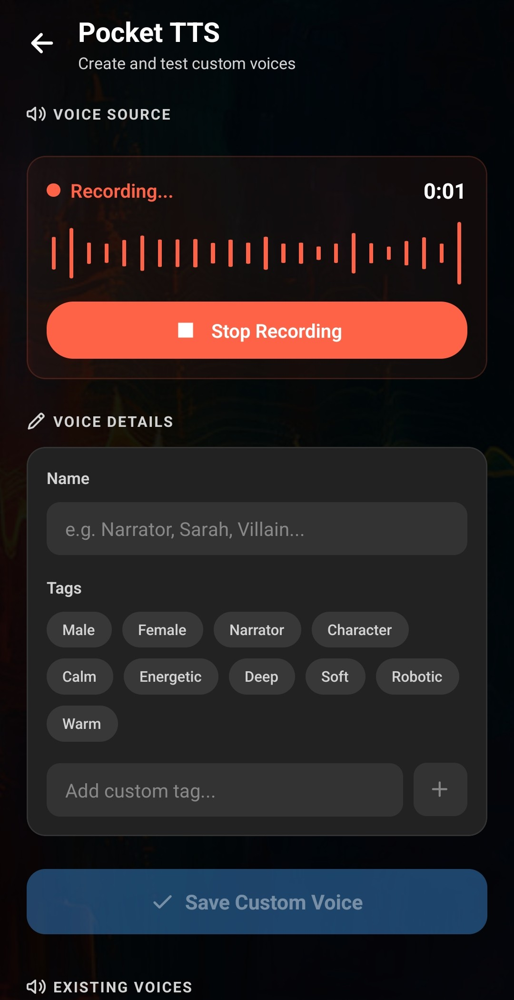
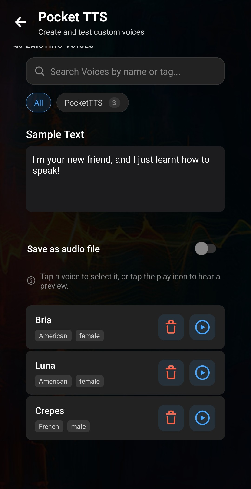

**PocketTTSはLaylaの端末内音声クローン用ミニアプリです。Laylaで録音した短い音声またはWAVファイルから、再利用できるテキスト読み上げ音声を作成します。** 結果をテストしてライブラリに保存し、Laylaの標準音声または特定のAIキャラクターに設定できます。

インストール後の音声生成はAndroid端末上で実行されます。参照録音とテキストをWebサービスへ送る必要がなく、非公開のオフラインAI会話に利用できます。

## LaylaでのPocketTTSの機能

PocketTTSはワンショット音声クローンを使います。多数の録音で学習する代わりに、1つの適切なサンプルを使って新しいテキストを読み上げます。

マイク録音、16ビットPCM WAVの読み込み、元音声の再生、任意テキストでのテスト、名前とタグの設定、複数音声の保存、全体または個別キャラクターへの適用ができます。

PocketTTSは音声合成機能です。テキストから音声を作りますが、キャラクターの返信を書く言語モデルは変更しません。

## PocketTTSをインストールして開く

1. Laylaで **My Apps** を開きます。
2. プラス記号をタップします。
3. **Pocket TTS (Voice Cloning)** を探してインストールします。
4. **My Apps** から **Pocket TTS** を開きます。

インストール時はローカル音声合成用ファイルのダウンロードにインターネットが必要です。その後のクローンと生成は端末上で実行できます。詳しくは[ミニアプリを有効または無効にする方法](/how-to-enable-disable-mini-apps-within-layla/)をご覧ください。

## 手順1：音声サンプルを用意する

PocketTTS上部の **Voice Source** で2つの方法から選びます。

### WAVファイルを読み込む

**Upload .wav File**をタップしてサンプルを選びます。Laylaがファイル名と長さを表示し、音声名が未入力なら拡張子を除くファイル名を初期値にします。

PocketTTSには**16ビットPCM WAV**が必要です。MP3、AACなどは読み込み前に変換してください。拡張子を `.wav` に変えるだけでは変換されません。

### Laylaで録音する

**Record Voice**をタップし、マイクを許可して自然に話し、**Stop Recording**をタップします。LaylaがWAVを準備します。別の名前が未入力なら **My Recording** になります。

**Play Sample**で確認し、雑音、長い無音、音割れ、誤った音声があればゴミ箱で削除してやり直します。

## よりよいサンプルを録音する方法

参照音声は結果へ直接影響し、PocketTTSは望ましくない特徴も学習します。長さより明瞭さが重要です。

- 静かな部屋でマイクとの距離を一定にします。
- 音楽、他の声、反響、扇風機、交通音、マイクを触る音を避けます。
- 長い無音を削除します。生成音声の不要な間につながります。
- 歪みや音割れのない明瞭で安定した音声を使います。
- 特徴的なキャラクター音声では、その特徴を明確にします。誇張した声の方が微妙な声より再現されやすい傾向があります。
- テスト前に全体を聞きます。

本人の許可がある声だけを使用してください。生成音声を共有する場合、聞き手がどう受け取るかも考慮してください。

## 手順2：カスタム音声をテストする

1. **Test Text**を編集し、さまざまな音を含む通常の会話に近い文にします。
2. **Test Custom Voice**をタップします。
3. 初期化とローカル生成を待ちます。
4. 結果を聞きます。**Stop Test**で途中停止できます。

テストでは保存されません。テキストを変更して繰り返すか、雑音、長い間、弱い声の特徴があれば参照音声を交換します。テスト文は元録音と同じ言葉でなくて構いません。

## 手順3：名前とタグを設定する

**Voice Details**に名前を入力します。**Save Custom Voice**を有効にするには名前と音声サンプルの両方が必要です。複数作成する場合は「Voice 1」より人物名、話者名、役割名が便利です。

タグは任意です。**Male**、**Female**、**Narrator**、**Character**、**Calm**、**Energetic**、**Deep**、**Soft**、**Robotic**、**Warm**などがあり、独自タグも追加できます。

## 手順4：PocketTTS音声を保存する

1. **Save Custom Voice**をタップします。
2. **Save Voice**で名前、参照元、長さ、タグを確認します。
3. **Confirm & Save**をタップします。
4. 処理完了を待ちます。

音声は **Existing Voices** とLaylaの音声選択画面に表示されます。後で生成できるよう、参照WAVのコピーがアプリデータに保存されます。

## 保存済み音声を使う

### 標準音声に設定する

**Settings** → **Text-to-speech Settings** → **Default Voice**でPocketTTS音声を選びます。個別音声のないキャラクターに使われます。

### 1人のAIキャラクターに設定する

キャラクター編集画面で **Voice** をタップし、名前またはタグで選びます。[カスタムAIキャラクターの作成](/how-do-i-create-custom-characters/)と[音声チャットの開始](/how-to-start-a-voice-chat-with-your-characters/)も参照してください。

## 音声を管理または削除する

保存済み音声は **Existing Voices** と音声選択画面にあります。削除は確認が必要で、元に戻せません。

PocketTTSをアンインストールするとカスタム音声も削除されます。再作成する可能性がある場合は元のWAVをLayla外に保管してください。

## トラブルシューティング

### Save Custom Voiceが無効なのはなぜ？

音声サンプルを読み込むか録音し、**Voice Details**に名前を入力してください。

### 音声ファイルが動作しないのはなぜ？

本物の16ビットPCM WAVへ変換してください。MP3の拡張子を変えるだけでは動作しません。

### 長い間が入るのはなぜ？

参照音声の無音を削除し、きれいにしたWAVを読み込んで再テストします。

### 雑音が多い、または不明瞭なのはなぜ？

より静かな場所で録音し、反響と他の声を避け、音割れを防いでください。

### 録音できないのはなぜ？

マイク権限を許可するか、Androidのアプリ設定でLaylaのマイクアクセスを有効にします。

### インターネットなしで音声をクローンできますか？

最初にミニアプリと必要ファイルをインストールしてください。その後はサンプルや会話をオンラインTTS APIへ送らず、端末上でクローンと音声合成を行えます。

PocketTTSでは、オフラインAndroid AIアシスタントの利点を保ちながらカスタム音声を追加できます。言語モデル、参照音声、生成音声を端末内に維持できます。
