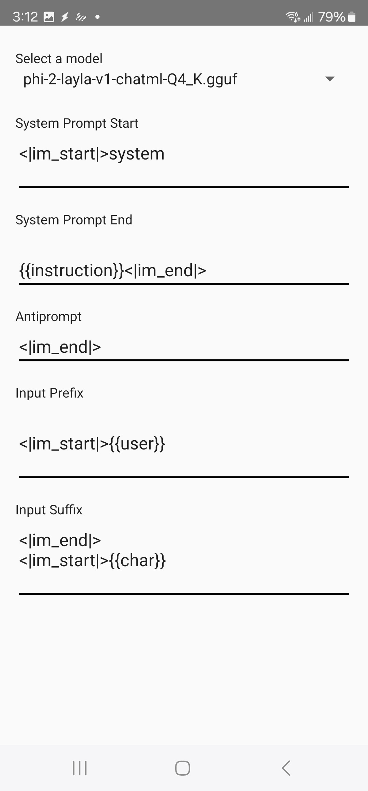

LaylaはTaskerと連携できます。LLMを使ってタスクを自動化できます。

**Taskerとは？**

Taskerでは、デバイス上のトリガー条件に基づいて自動タスクを作成できます。たとえば、新しいメールを受信したときに、その内容をLLMに要約させることができます。

_注意：この機能を利用するには、[Google PlayでTaskerを購入](https://play.google.com/store/apps/details?id=net.dinglisch.android.taskerm&hl=en)する必要があります。_

LaylaはTaskerと提携していません。TaskerはAndroidの自動化に広く利用されているアプリです。

**LaylaのTaskerタスクを作成する方法**

Laylaは主に次の2つのタスクを提供します。

1. **Infer:** プロンプトと入力をLaylaに送信します。Laylaは推論タスクを作成し、後で入力をLLMで処理して出力を返します。
2. **Infer in Background:** 同じ処理を行いますが、バックグラウンドでLLMによる推論をすぐに実行します。

どちらのタスクも、LLMモデル、システムプロンプト、生の入力などを設定できます。これらはTasker変数として提供されるため、ほかのタスクと簡単に連結できます。

上の画像はタスクの設定例です。

1. *Variable Set*アクションは、ほかのタスクから得られた出力に置き換えることができます。たとえば、TaskerでAutoNotificationを使用すると、通知から入力を取得してLLMに渡せます。
2. *Create Infer Task*は、Laylaが公開する主要なタスクです。事前に設定された変数をLLMで処理します。たとえば、先ほど取得した通知内容を要約するよう指示できます。

Laylaは*Task Completed*イベントも公開します。

このイベントは、Laylaのバックグラウンド処理で推論タスクが完了するたびに発生します。イベントを利用し、タスクの出力に基づいて後続のアクションを実行できます。
