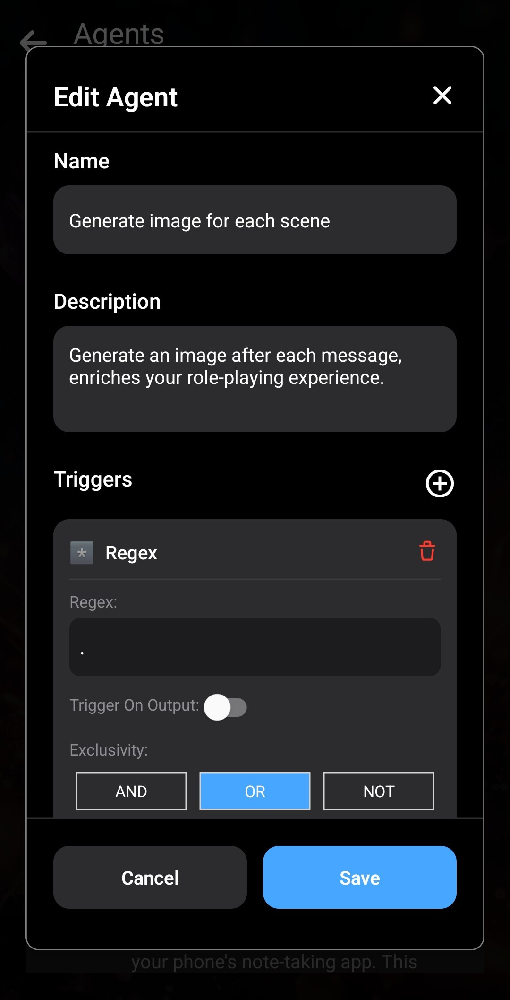

이 글에서는 이미지 생성 Agent를 만드는 방법을 설명합니다. 이 Agent는 각 메시지 후에 이미지를 자동으로 생성하여 채팅에 몰입감을 더합니다.

Agent는 대화 컨텍스트를 사용하여 이미지를 생성합니다.

Agent가 작동하는 모습은 다음과 같습니다.

각 메시지 후에 LLM이 *Stable Diffusion 프롬프트*를 추가하도록 하는 방식입니다. 캐릭터 카드에 지시를 추가하여 LLM이 장면에 관한 짧은 설명을 `<stable_diffusion_prompt></stable_diffusion_prompt>` 태그 안에 추가하도록 합니다.

먼저 Agent를 만듭니다. 이 Agent는 [역할극 Agent](/how-to-create-a-roleplay-agent/)와 매우 비슷합니다.

여기서는 출력이 `<stable_diffusion_prompt></stable_diffusion_prompt>` 태그로 끝나도록 간단한 문법을 사용하여 출력 구조를 지정합니다.

다음 단계는 자신의 캐릭터를 만들거나 복사하는 것입니다. 여기서 두 가지 작업이 필요합니다. 먼저 _시나리오_ 섹션에 커스텀 지시를 추가하여 LLM이 장면을 설명하는 키워드를 Stable Diffusion 프롬프트 태그에 넣도록 합니다. 지시는 자유롭게 조정할 수 있습니다. 예를 들어 장면 대신 캐릭터 이미지 생성에 집중하도록 LLM에 캐릭터 설명을 포함하라고 지시할 수 있습니다.

그런 다음 이전과 같은 방법으로 _고급_ 탭에서 Agent를 캐릭터에 연결합니다.

마지막으로 *추론 설정*에서 이미지 생성을 활성화해야 합니다. 자세한 내용은 [Layla에서 이미지 생성을 활성화하는 방법](/how-to-enable-image-generation-in-layla/)을 참고하세요.

Snapdragon CPU가 탑재된 휴대전화를 사용한다면 NPU로 이미지를 생성하는 것을 강력히 권장합니다. 자세한 내용은 [Layla는 NPU를 사용한 로컬 이미지 생성을 지원합니다](https://www.layla-network.ai/post/layla-supports-generating-images-locally-using-the-npu)를 참고하세요. 각 메시지 후 몇 초 만에 이미지가 생성되므로 대화 흐름이 끊기지 않습니다.

가져올 수 있는 Agent는 다음과 같습니다.

[generate-image-agent.json 다운로드](/assets/articles/creating-an-image-generation-agent/generate-image-agent.json)
