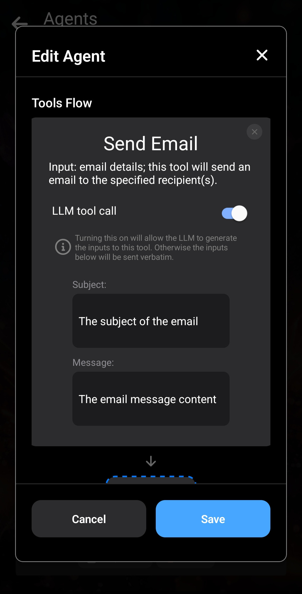

_아직 읽지 않았다면 먼저 [Layla에서 Agents가 작동하는 방식에 대한 간단한 개요](/how-to-enable-agents-functions-and-tool-calling-in-layla/)를 확인하세요._

이 문서에서는 Layla의 Agent 기능을 더 자세히 살펴봅니다.

**Agent 내부 구조**

Agents는 LLM과 채팅하는 동안 필요할 때 실행되는 독립적인 워크플로입니다. 각 Agent에는 설정 가능한 특정 조건에서 활성화되는 _트리거_ 와 연속으로 실행되는 도구 목록이 있습니다.

Agent 결과는 컨텍스트로 대화에 삽입되고 LLM은 이를 사용해 맥락에 맞는 응답을 제공합니다.

**트리거**

Layla에는 여러 종류의 트리거가 있습니다. 다음 이미지는 그중 일부를 보여줍니다.

- **Intent** — Layla가 입력의 의도를 분류하고 감지된 의도에 따라 Agent를 실행합니다. 분류기에는 “search news”, “query weather”, “set alarm”, “set calendar” 등 많은 의도가 포함되어 있습니다. _Intent Trigger_를 추가한 뒤 드롭다운에서 전체 목록을 확인할 수 있습니다.
- **Regex** — 입력한 정규식이 채팅 메시지에서 일치하면 Agent가 실행됩니다. 일치한 문자열이 첫 번째 도구의 입력이 됩니다.
- **Phrase** — 입력한 문구가 대소문자 구분 없이 메시지에서 감지되면 Agent가 실행됩니다. 일치한 문구가 첫 번째 도구의 입력이 됩니다.
- **Date/Time Detected** — 메시지에서 날짜 또는 시간이 감지되면 Agent가 실행됩니다. 감지된 값이 첫 번째 도구의 입력이 됩니다.
- **MCP/Layla Tool Trigger** — 이 고급 기능은 [Layla의 완전한 MCP 지원](/full-mcp-support-in-layla/) 문서에서 설명합니다.
- **Is Voice Mode** — Voice Mode가 켜졌을 때 활성화되는 간단한 트리거입니다.

이 트리거들은 채팅의 모든 입력 및 출력 메시지에서 실행됩니다. 트리거가 활성화되면 Agent가 시작되고 트리거 조건이 첫 번째 도구의 입력으로 사용됩니다.

**도구**

_도구_ 는 Layla Agents의 핵심입니다.

외부 서비스 호출, 휴대전화 조작 등 다양한 기능을 수행합니다. Layla에는 여러 기본 도구가 있으며 새 도구도 계속 추가됩니다.

모든 도구를 이 문서에서 다룰 수는 없으므로 자주 사용하는 몇 가지를 살펴보겠습니다.

_Agents_ 미니 앱에서 아래로 스크롤하면 Layla가 사용할 수 있는 도구 목록이 나타납니다. 도구를 누르면 자세한 정보가 있는 팝업이 열립니다. _HTTP Request_ 도구를 예로 들어 보겠습니다.

_HTTP Request_ 도구에는 설정할 수 있는 매개변수가 여러 개 있습니다. 특정 URL처럼 고정된 값을 입력하거나 아래 설명처럼 LLM이 생성하도록 할 수 있습니다.

도구를 추가한 후 Edit Agent 팝업에서 매개변수를 설정할 수 있습니다. 이전 문서에서 보여준 것처럼 입력란에 URL을 직접 지정할 수 있습니다.

각 도구의 출력은 다음 도구의 입력으로 사용됩니다. 이 방식으로 하나의 Agent에 여러 도구를 연결할 수 있습니다. 위 예에서 _HTTP Request_의 출력은 설정된 매개변수로 URL을 호출한 후 반환된 원시 문자열입니다.

_Provide Context_는 Agent의 최종 출력을 LLM 컨텍스트에 넣는 중요한 도구입니다. Agent 실행 후 LLM에 근거가 되는 결과를 제공합니다.

**Agents 테스트하기**

Agent를 만든 후에는 Agents 목록의 _Test Agent_ 버튼으로 시험할 수 있습니다. 각 단계의 입력과 출력도 표시되므로 Agents의 작동 방식을 더 잘 이해할 수 있습니다.

“What's My IP?” Agent를 예로 들어 보겠습니다.

먼저 [https://api.ipify.org](https://api.ipify.org)로 HTTP 요청을 보냅니다.

HTTP Request의 출력인 IP 주소가 일반 텍스트로 표시됩니다.

그 출력은 _Provide Context_ 도구로 전달되어 LLM을 위한 컨텍스트 메시지로 형식화됩니다.

컨텍스트 메시지는 도구 자체에서 설정할 수 있습니다. 이 예에서는 다음과 같습니다.

`{{input}}` 같은 이중 중괄호 템플릿을 확인하세요. `{{input}}`은 이 도구에 들어오는 입력으로 대체됩니다.

위 예에서는 HTTP 요청의 출력이 _Provide Context_ 도구의 입력이므로 대체 후 출력은 `{{user}}'s current IP address is xx.xx.xx.xx`가 됩니다.

대화에 삽입될 때 `{{user}}` 템플릿은 선택한 페르소나로 다시 대체됩니다. 사용자 지정 프롬프트와 같은 방식으로 작동합니다.

**LLM이 생성하는 매개변수**

지금까지는 각 도구의 매개변수를 항상 고정된 값으로 입력했고 일치한 입력을 매개변수로 사용한 정도였습니다.

LLM 통합형 Agents에서는 ***LLM에 도구 입력을 생성하도록 요청***할 수 있습니다. LLM의 자연어 기능을 활용하면서 유연성을 얻을 수 있습니다.

일반적인 예는 LLM에 웹 검색을 요청하는 경우입니다. 전체 메시지를 그대로 검색어로 사용하지 않고, LLM이 메시지와 대화의 맥락을 바탕으로 적절한 검색어를 만들 수 있습니다.

또 다른 예는 이메일 초안입니다. “draft an email to my co-worker reminding him of our meeting”이라고 말하면 LLM이 본문을 생성하고 내용이 미리 입력된 상태로 이메일 앱을 열 수 있습니다.

Layla에서는 다음과 같이 구현합니다.

“Send Email” Agent를 예로 들면 도구에 “Subject”와 “Message”라는 두 매개변수가 있고 **LLM tool call**이 **ON**으로 설정되어 있습니다.

이 설정은 매개변수 내용을 생성하도록 LLM에 지시합니다. Agent가 실행되면 LLM이 이메일 제목과 본문을 생성하고 도구를 실행하여 필요한 정보가 입력된 이메일 클라이언트를 엽니다.

**LLM tool call**이 **ON**이면 매개변수 필드에 자연어 지시를 입력할 수 있습니다. LLM은 각 필드의 용도를 이해하고 대화 컨텍스트를 바탕으로 적절한 입력을 생성합니다.

더 복잡한 예는 _Schedule Event_ Agent입니다. 여러 매개변수가 있으며 각 매개변수의 용도가 LLM에 자세히 설명됩니다.
