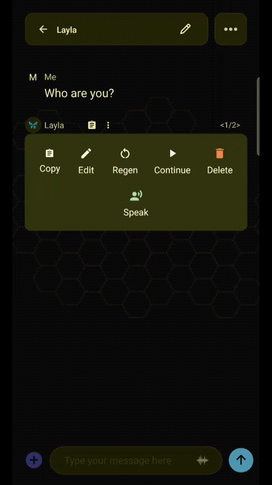

**예. Layla 채팅의 각 메시지는 개별적으로 편집, 재생성, 복사, 삭제, 번역, 읽어주기 등의 작업을 할 수 있습니다. 메시지를 길게 누르거나 오버플로 메뉴를 눌러 메시지 작업 메뉴를 여세요.** 모든 작업이 모든 메시지에 적용되지는 않습니다. 일부는 내 메시지에만, 다른 일부는 Layla의 답변에만 사용할 수 있습니다.

이 가이드에서는 각 작업의 기능과 적용되는 메시지를 설명합니다. Layla는 기기에서 완전히 실행되므로 메시지 편집과 재생성을 포함한 모든 작업이 로컬에서 이루어지며 다른 곳으로 전송되지 않습니다.

## 메시지 작업 메뉴를 여는 방법

개별 메시지의 작업을 여는 방법은 두 가지입니다.

- **메시지 말풍선을 길게 누르세요.** 내 메시지 또는 Layla의 메시지를 작업 메뉴가 나타날 때까지 길게 누릅니다. 채팅 화면 전체에서 사용할 수 있는 기본 동작입니다.
- **오버플로 메뉴를 누르세요.** 일부 메시지의 말풍선 근처에는 작은 점 3개 아이콘이 있습니다. 길게 누르지 않고 같은 작업을 열 수 있어 작업할 메시지를 정확히 선택할 때 유용합니다.

메뉴는 메시지에 따라 달라집니다. 내 메시지를 길게 누르면 편집, 복사, 삭제, 인용, 고정, 분기 등 입력에 적합한 작업이 표시됩니다. Layla의 답변에서는 재생성 및 재시도 같은 생성 작업이 추가됩니다. 특정 메시지에 작업이 보이지 않으면 해당 메시지 유형에서는 사용할 수 없습니다.

| 작업       | 기능                                                   | 적용 대상                 |
| ---------- | ------------------------------------------------------ | ------------------------- |
| Edit       | 메시지 텍스트를 그 자리에서 변경                       | 내 메시지 및 Layla의 답변 |
| Regenerate | 답변의 새 버전 생성                                    | Layla의 답변              |
| Continue   | 중간에 잘렸을 수 있는 메시지를 계속 생성               | Layla의 답변              |
| Copy       | 메시지 텍스트를 클립보드에 복사                        | 모든 메시지               |
| Delete     | 대화에서 메시지 제거                                   | 모든 메시지               |
| Speak      | 현재 텍스트 음성 변환 음성으로 메시지를 소리 내어 읽기 | 모든 메시지               |

## 메시지 편집하기

편집하면 처음부터 다시 시작하지 않고 메시지의 텍스트를 변경할 수 있습니다. 메시지를 길게 누르고 **Edit**를 누른 다음 텍스트를 바꾸고 확인하세요.

대화의 양쪽 모두 편집할 수 있습니다. 가장 일반적인 경우는 오타 수정, 프롬프트 정리 또는 질문 변경을 위해 **내 메시지**를 편집하고 다시 보내 Layla가 수정된 버전에 답하도록 하는 것입니다. **Layla의 답변** 편집은 롤플레이와 글쓰기에서 유용합니다. 마음에 드는 부분을 유지하고 전체를 재생성하는 대신 나머지를 직접 조정할 수 있습니다.

이전의 내 메시지를 편집하고 다시 보내도 그 뒤의 답변은 원래 문구를 바탕으로 생성된 것입니다. 편집한 위치에 따라 대화의 일관성을 유지하려면 뒤따르는 Layla의 답변을 재생성하세요.

## 응답 재생성 및 재시도하기

**Regenerate**는 Layla에 답변의 새 버전을 생성하도록 요청합니다. 응답이 만족스럽지 않으면 길게 누르고 **Regenerate**를 누르세요. 프롬프트를 다시 쓰지 않고 출력 품질을 개선하는 주요 방법입니다.

재생성된 답변은 일반적으로 이동할 수 있는 대안으로 보관됩니다. 원래 답변을 잃지 않고 새 버전과 비교해 원하는 것을 선택할 수 있습니다.

생성은 기기에서 실행되므로 재생성 또는 재시도 속도는 네트워크 연결이 아니라 휴대전화 하드웨어와 불러온 모델 크기에 따라 달라집니다.

## 메시지 삭제하기

삭제는 대화에서 하나의 메시지를 제거합니다. 메시지를 길게 누르고 **Delete**를 누른 다음 확인하세요. 전체 대화 또는 전체 기록을 지우는 것과 달리 선택한 메시지 하나만 대상으로 합니다.

잘못 시작한 내용, 중복된 답변 또는 컨텍스트에 남기고 싶지 않은 메시지를 정리할 때 유용합니다. 모델은 다음 답변을 결정할 때 대화 기록을 읽으므로 불필요한 메시지를 제거하면 Layla가 사용하는 컨텍스트도 정리됩니다. 삭제는 로컬에서 영구적으로 이루어지며 복구할 수 없습니다.

> **참고:** 대화 앞부분의 메시지를 삭제하면 채팅이 다시 로드되고 모델은 삭제된 메시지 위치부터 처리를 다시 시작합니다. 삭제한 위치에 따라 시간이 걸릴 수 있습니다.

## 대화 분기하기

**Branch**는 현재 메시지부터 대화를 분기하여 원본을 잃지 않고 별도의 흐름을 탐색할 수 있게 합니다. 분기한 지점부터 새 경로가 만들어지므로 원래 대화를 그대로 두면서 다른 방향, 문구 또는 결과를 시도할 수 있습니다.

분기는 한 장면이 두 가지 방식으로 전개되는 것을 보고 싶은 롤플레이와 글쓰기에 특히 적합합니다. 첫 번째 방법을 버리지 않고 대안을 시험하려는 생산성 작업에도 사용할 수 있습니다. 한 경로를 덮어쓰는 대신 두 경로를 모두 유지합니다.

## 자주 묻는 질문

### 내 메시지뿐 아니라 Layla의 답변도 편집할 수 있나요?

둘 다 가능합니다. 내 메시지를 편집하는 경우가 일반적이지만 Layla의 답변도 그 자리에서 편집하여 대부분을 유지하고 일부만 직접 조정할 수 있습니다.

### 재생성하면 이전 응답이 삭제되나요?

아니요. 재생성된 답변은 이동 가능한 대안으로 유지되므로 이전 답변을 잃지 않고 버전을 비교해 선택할 수 있습니다.

### 삭제한 메시지를 복구할 수 있나요?

아니요. 삭제는 로컬에서 영구적으로 이루어집니다. 나중에 필요할 수 있는 메시지는 삭제하지 마세요.

### 원본을 잃지 않고 대화를 분기할 수 있나요?

예. 선택한 메시지부터 별도의 경로를 만들고 원래 대화는 나중에 돌아갈 수 있도록 그대로 유지합니다.

### 메시지 작업은 오프라인에서 작동하나요?

예. Layla는 기기에서 실행되므로 편집, 재생성, 복사, 삭제 등 모든 메시지 작업이 인터넷 연결 없이 로컬에서 수행됩니다.

메시지 작업은 온디바이스 어시스턴트를 일상적으로 실용성 있게 사용할 수 있도록 해줍니다. 프롬프트 편집, 답변 재생성, 대화 분기는 모두 기기의 하드웨어에서 로컬로 실행되며 아무것도 기기 밖으로 나가지 않습니다.
