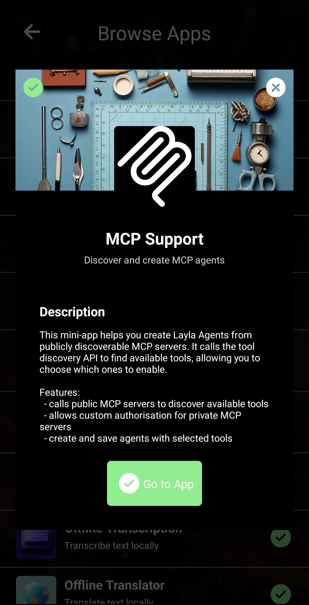
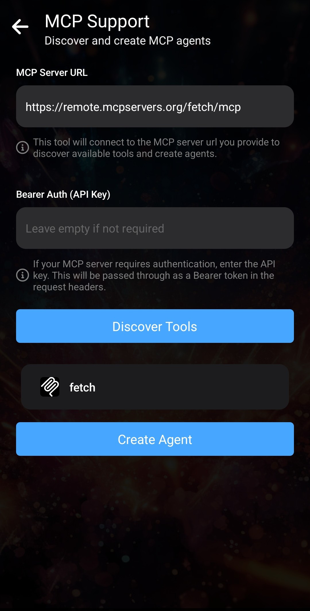
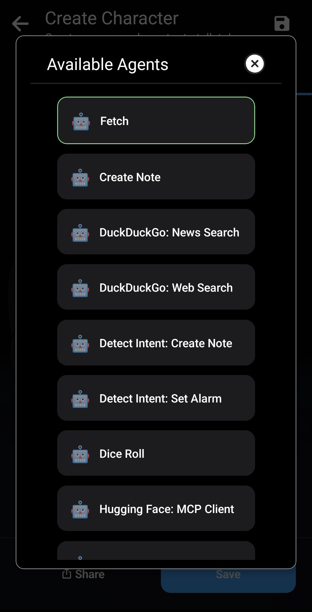
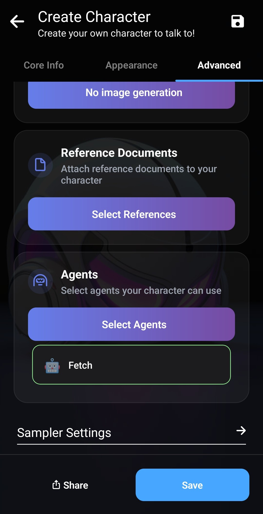

_이전 두 문서에서는 [Layla의 Agents를 소개](/how-to-enable-agents-functions-and-tool-calling-in-layla/)한 다음 [작동 방식을 자세히 살펴보았습니다](/deep-dive-into-layla-agents/)._

이 문서에서는 Layla Agents의 마지막 계층인 완전한 MCP 지원을 살펴봅니다.

**MCP**

MCP는 Model Context Protocol의 약자입니다. 자연어와 구조화된 출력을 조합하는 사전 정의된 프로토콜을 통해 LLM이 외부 서비스와 상호작용하도록 해줍니다. 자세한 내용은 [Model Context Protocol 소개](https://modelcontextprotocol.io/docs/getting-started/intro)를 참조하세요.

일반적으로 MCP는 LLM이 사용할 수 있는 모든 도구의 시그니처를 시스템 프롬프트에 넣습니다. LLM은 대화 중 어떤 도구를 호출할지 지능적으로 판단한 다음, 그 호출 결과를 사용해 대화를 계속해야 합니다.

**Layla Agents 및 MCP**

기본적으로 Layla의 Agents는 키워드와 의도 감지 같은 전통적인 머신 러닝 기법을 함께 사용해 실행됩니다. 모바일에서는 컨텍스트가 제한되며 모든 도구를 시스템 프롬프트에 삽입하면 귀중한 공간을 많이 소비하기 때문입니다. 모바일에서 실행되는 소형 모델은 최적의 도구를 항상 선택하지 못할 수도 있으므로 이런 경우 전통적인 기법이 유리합니다.

Layla는 호출할 도구를 LLM이 완전히 선택하도록 할 수도 있습니다. 작동 방식을 살펴보겠습니다.

_Layla: Introspection_ Agent는 Layla에서 MCP 도구 호출을 사용하는 예입니다. Agents 미니 앱에서 도구 이름을 검색한 다음 편집하세요. 편집 팝업이 열리고 내부 작동 방식을 확인할 수 있습니다.

모든 트리거가 이전 문서에서 언급한 특별한 “Layla Tool Trigger”를 사용한다는 점이 핵심입니다. 이 트리거는 가능한 모든 도구의 시그니처를 시스템 프롬프트에 삽입하도록 Agent에 지시합니다. 이 예에서는 _Layla Apps Info_, _Layla: Clear Caches_, _Layla: Operating Stats_의 시그니처가 삽입됩니다.

_Tools Flow_ 섹션에는 입력값이 `{{match$1}}`인 _Layla Tool Call_ 도구 하나가 있습니다. 도구 호출에 이 형식이 필요하므로 그대로 두세요. Triggers 섹션에 나열된 각 도구를 언제 호출할지는 LLM이 결정하므로 다른 도구를 추가할 필요가 없습니다. 각 도구의 출력은 LLM 컨텍스트에 자동으로 삽입되고, LLM은 필요에 따라 다른 도구 호출을 이어서 실행할 수 있습니다.

도구 목록을 변경하려면 _Introspection_ Agent를 편집하고 트리거를 제거한 다음 새 트리거를 추가하세요. 드롭다운 목록에서 Layla가 제공하는 모든 도구를 선택할 수 있습니다.

_참고: 도구 선택에는 균형이 필요합니다. 너무 많은 도구를 제공하면 LLM이 어떤 도구를 호출해야 할지 혼동할 수 있습니다._

자주 사용하는 도구를 하나의 Agent로 묶은 다음 새로 만든 캐릭터에 연결하는 방식을 권장합니다. 그러면 캐릭터에 명확하고 구체적인 목표가 생겨 환각을 크게 줄일 수 있습니다.

**외부 MCP 서버에 연결하기**

Layla는 잘 알려진 조직에서 제공하거나 직접 PC에서 실행하는 외부 MCP 서버에 연결할 수 있습니다.

_MCP Support_ 미니 앱을 사용하면 외부 MCP 서버를 자동으로 검색하고 설정할 수 있습니다.

일반적으로 사용하는 MCP 서버 목록은 [Model Context Protocol 서버 저장소](https://github.com/modelcontextprotocol/servers/tree/main)에서 확인할 수 있습니다.

이 목록에는 여러 유명 조직의 MCP 서버와 직접 서버를 호스팅하는 데 사용할 수 있는 코드가 포함되어 있습니다.

잘 구현된 MCP 서버에는 도구 검색 엔드포인트가 있습니다. 공개 _Fetch_ MCP 서버를 예로 들어 보겠습니다. 이 서버는 LLM이 웹페이지 내용을 읽을 수 있도록 웹페이지를 가져오는 기능을 제공합니다.

Layla에서 _MCP Support_ 미니 앱을 열고 원격 MCP 서버 URL을 입력하세요.

_Discover Tools_를 누르세요. MCP 서버에 연결하고 사용 가능한 도구 목록을 요청합니다. 이 예에서는 “fetch”라는 도구 하나만 반환되어 표시됩니다.

도구를 선택해 초록색으로 강조한 다음 _Create Agent_를 누르세요. 선택한 도구가 포함된 새 Layla Agent가 생성됩니다.

Agents 미니 앱으로 이동하며 “New Agent”라는 새 Agent가 표시됩니다. 이름과 설명은 자유롭게 편집할 수 있습니다.

Triggers, Tool Flow 등 다른 매개변수는 변경하지 마세요. 올바르게 구성되어 있습니다.

새 캐릭터를 만들고 Agent를 연결하면 활성화할 수 있습니다. Layla의 기존 Agent와 충돌하지 않도록 여기서는 새 캐릭터를 만듭니다. 대신 기존 Web Search Agent를 비활성화해도 됩니다.

캐릭터 생성기의 _Advanced_ 탭으로 이동하세요.

_Select Agents_를 눌러 팝업을 여세요.

_Fetch_ Agent를 선택하세요. 목록에 표시됩니다.

그런 다음 캐릭터를 저장하세요. 이 예에서는 _Kip_의 복제본을 사용합니다.

요청하면 Kip이 MCP 도구 호출을 시작합니다.

MCP 도구 호출 후 _Kip_은 자신의 성격을 유지하며 요청에 응답합니다. 이것이 **개인화**의 의미입니다. 직접 만든 캐릭터는 도구 호출이 포함된 요청에도 설정된 성격으로 응답합니다.

다음 MCP Agent JSON을 다운로드하여 Layla로 가져올 수 있습니다.

[fetch.json 다운로드](/assets/articles/full-mcp-support-in-layla/fetch.json)
