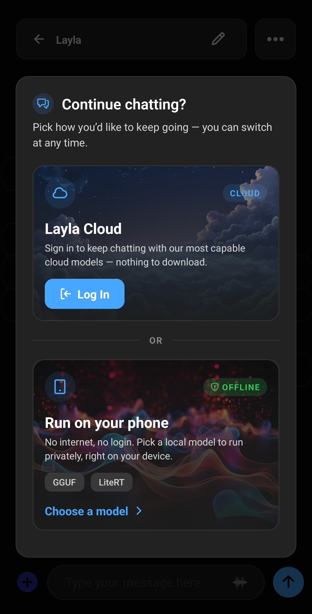

**Layla는 클라우드 AI 모델을 사용하거나 휴대전화에서 로컬 LLM을 직접 실행할 수 있는 Android 및 iOS용 AI 어시스턴트입니다.** 이 가이드에서는 초기 설정, 첫 채팅, 클라우드 AI와 오프라인 AI 중 선택하는 방법을 설명합니다. 모든 항목을 한 번에 설정할 필요가 없으며 온보딩 과정에서 선택한 내용은 나중에 변경할 수 있습니다.

## Layla 사용 방식 선택하기

Layla를 처음 열면 앱을 어떤 용도로 사용할지 묻습니다. 각 옵션은 서로 다른 시작 구성을 준비합니다.

- **Basic:** 빠르고 집중적인 오프라인 챗봇과 가벼운 로컬 모델로 시작합니다. 추가 기능은 꺼진 상태로 유지되므로 간단한 AI 채팅을 먼저 사용하고 나중에 기능을 추가하려는 경우에 적합합니다.
- **Assistant:** 채팅, 계획, 일상 작업을 위한 비공개 개인 AI 어시스턴트로 Layla를 설정합니다. 이 모드에는 대화 응답만 생성하는 대신 도구를 사용하고 여러 단계의 지시를 따를 수 있는 온디바이스 Agents가 포함됩니다.
- **Friend:** 가벼운 대화, 성찰 또는 말벗을 위한 개인 AI 동반자를 만듭니다. 권장 설정은 메모리, 음성, Dreams 같은 동반자 기능에 집중하여 대화를 더 연속적이고 개인적으로 만듭니다.
- **Roleplay:** 캐릭터와 시나리오를 만들고 이야기 중심의 대화를 진행하는 데 필요한 기능으로 시작합니다. 직접 참여하거나 여러 AI 캐릭터가 상호작용하도록 할 수 있으며 메모리가 장면의 맥락을 유지해 줍니다.
- **Image generation:** Layla가 기기에서 프롬프트를 이미지로 만들도록 준비합니다. 독립된 이미지를 생성하거나 독창적인 캐릭터, 장면, 이야기를 만들 때 사용할 수 있습니다.
- **Cloud:** 휴대전화 하드웨어에 의존하지 않고 더 큰 규모와 기능이 필요할 때 호스팅된 AI 모델을 사용합니다. 클라우드 요청은 선택한 제공자에게 전송되므로 로컬 모델과는 개인정보 보호 및 연결 조건이 다릅니다.
- **Expert:** 직접 준비한 GGUF 모델을 사용하고 활성화할 기능, 도구, 프롬프트 및 고급 설정을 정확히 선택합니다. 원하는 추론 환경의 구성 방법을 이미 알고 있는 로컬 LLM 사용자를 위한 옵션입니다.

가장 먼저 해보고 싶은 작업에 가까운 옵션을 선택하세요. Layla가 해당 용도에 권장되는 기능과 미니 앱을 설정합니다. 시작 전에 모든 설정을 이해하지 않아도 유용한 구성으로 시작할 수 있습니다.

선택한 용도에 고정되지는 않습니다. 나중에 언제든 기능을 켜거나 끄고, 미니 앱을 변경하고, Layla의 작동 방식을 조정할 수 있습니다.

<video controls playsinline src="/assets/articles/getting-started/use-cases.mp4"></video>

## 첫 채팅 시작하기

다음에 표시되는 화면은 선택한 용도에 따라 다릅니다. Layla가 시작 화면 또는 캐릭터 선택 화면을 표시합니다.

### 시작 화면에서

Layla의 시작 화면이 보이면 **Tap to chat** 아래의 큰 나비를 누르세요. Layla와의 대화가 열리고 첫 메시지를 보낼 수 있습니다.

### 캐릭터 선택 화면에서

일부 용도에서는 캐릭터 선택 화면이 대신 열립니다. 대화하고 싶은 캐릭터 또는 성격을 선택한 다음 채팅을 시작하세요.

Character.AI 같은 캐릭터 채팅 앱을 사용해 본 적이 있다면 기본 채팅과 캐릭터 경험이 익숙할 것입니다. 대화 상대를 선택하고 메시지를 입력한 다음 대화를 계속하세요. Layla는 훨씬 더 많은 제어 기능도 제공하지만 살펴볼 준비가 될 때까지 그대로 두어도 됩니다.

## Layla Cloud와 로컬 LLM 중에서 선택하기

메시지를 몇 번 주고받으면 Layla가 계속 사용할 방법을 묻습니다. 두 가지 옵션이 있습니다.

- **Layla Cloud:** 로그인하고 클라우드 모델로 계속합니다. 휴대전화에 모델을 다운로드할 필요가 없습니다.
- **Run on your phone:** 로컬 모델을 선택하고 기기에서 비공개로 실행합니다. 설정 후에는 로그인이나 인터넷 연결이 필요하지 않지만, 로컬 AI는 성능이 충분하고 모델을 위한 여유 저장 공간이 있는 휴대전화에서 가장 잘 작동합니다.

이 선택 역시 영구적이지 않습니다. 빠른 설정을 위해 클라우드 모델로 시작하고, 비공개 오프라인 AI를 위해 로컬 LLM으로 전환하거나, 필요가 달라질 때 사용 가능한 모델 사이를 오갈 수 있습니다.

## 나중에 모델 변경하기

Layla가 응답을 생성하는 방식은 언제든 **Inference Settings**에서 변경할 수 있습니다. 로컬 GGUF 모델, 지원되는 온디바이스 모델, 클라우드 모델, 프롬프트, 비전 모델, 이미지 생성 설정을 관리하는 곳입니다.

로컬 모델이 느리거나 기기에 무리 없이 맞지 않으면 클라우드 모델로 돌아갈 수 있습니다. 나중에 적합한 로컬 모델을 구하면 나머지 온보딩을 반복하지 않고 선택할 수 있습니다.

## 원하는 속도로 기능과 미니 앱 살펴보기

Layla는 기본 AI 채팅보다 훨씬 많은 기능을 제공하므로 처음 열었을 때 복잡하게 느껴질 수 있습니다. 모든 것을 즉시 배울 필요는 없습니다. 채팅이나 캐릭터로 시작한 다음 필요할 때 기능과 미니 앱을 하나씩 활성화하세요.

**Apps** 화면에서 캐릭터, 추론 엔진, Agents, Layla Cloud 등의 기능을 위한 미니 앱을 찾아보고 관리할 수 있습니다. 단계별 설명은 [Layla에서 미니 앱을 활성화하거나 비활성화하는 방법](/how-to-enable-disable-mini-apps-within-layla/)을 참조하세요.

처음 선택한 용도는 시작 구성일 뿐입니다. Layla를 간단한 AI 어시스턴트, 캐릭터 채팅 앱, 이미지 생성 도구, 휴대전화에서 실행되는 비공개 AI 챗봇 또는 원하는 조합으로 사용할 수 있습니다.

Layla가 제공하는 다양한 기능을 살펴보세요.
