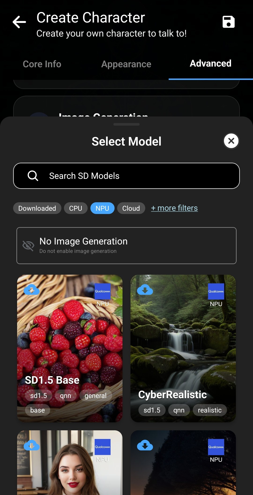

다른 사람이 만든 캐릭터로 시작하려면 [Personalities Hub에서 캐릭터 가져오기](/personality-hub-ai-characters/)를 참조하세요.

Layla의 캐릭터 제작기에서는 기기 내 비공개 대화를 위한 사용자 지정 AI 캐릭터를 만들 수 있습니다. 캐릭터의 정체성, 말투, 대화 주제, 외모 및 선택 기능을 정의할 수 있습니다.

이 가이드는 기본 정보부터 음성, 이미지 생성, 공유까지 편집기의 각 탭을 설명합니다.

## 캐릭터 제작기 열기

캐릭터 선택 화면에서 목록 아래의 큰 **+** 버튼을 누르세요. 또는 **Apps**에서 **Create Character** 미니 앱을 선택하세요. 두 방법 모두 같은 편집기를 엽니다.

## 기본 정보 추가하기

**Core Info** 탭에는 캐릭터의 정체성과 행동을 결정하는 정보가 있습니다.

각 입력 항목은 다음과 같습니다.

- **Character picture:** 캐릭터를 식별하는 프로필 이미지로, 메시지 옆에 작은 원으로 표시됩니다.
- **Character name:** Layla에서 사용할 캐릭터 이름입니다.
- **Description:** 배경, 역할, 지식, 관계 등 캐릭터가 자신에 대해 기억해야 할 사실을 설명합니다.
- **Personality:** 특성, 가치관, 습관, 감정적 기질, 유머, 어휘 및 말투를 설명합니다.
- **Scenario:** 대화의 상황, 장소, 사용자와의 관계, 채팅 시작 시의 사건을 설정합니다.
- **Impression:** 캐릭터가 사용자에게 가진 인상입니다. Dream 미니 앱은 이전 채팅에서 공유 기록과 캐릭터의 관점을 요약해 생성할 수 있으며 직접 편집도 가능합니다.
- **Greetings:** 새 대화의 첫 메시지입니다. 여러 개를 추가하면 새 채팅마다 무작위로 선택합니다. 내가 먼저 말하려면 빈 인사말을 추가하세요.
- **Tags:** 캐릭터 정리를 위한 쉼표 구분 라벨이며 공유 후 다른 사람이 찾는 데도 도움이 됩니다.

설명, 성격, 시나리오에서 `{{char}}`와 `{{user}}` 자리표시자를 사용할 수 있습니다. Layla가 대화를 준비할 때 현재 이름으로 대체합니다.

필드는 작성 편의를 위해 분리되어 있을 뿐 AI의 서로 다른 부분으로 전송되는 독립 지시가 아닙니다. Layla는 설명, 성격, 시나리오를 시스템 프롬프트용 긴 텍스트로 결합하고 새 채팅에는 선택된 인사말을 추가합니다.

아래의 **Summary**에서 결합된 내용을 미리 보고 자세한 캐릭터의 예상 로딩 시간도 확인할 수 있습니다.

## 외모 설정하기

**Appearance** 탭에서 캐릭터와 채팅 이미지를 설정하세요.

**Core Info**의 프로필 사진은 메시지 옆의 작은 원입니다. **Character Background**는 정적 메인 이미지이고 **Chat Background**는 대화 배경 전체를 채웁니다.

애니메이션 배경도 선택할 수 있습니다.

- **Rive:** 2D 애니메이션 배경.
- **Live2D:** Live2D 캐릭터 모델.
- **Mini-app:** 배경을 제공하는 사용자 지정 Layla 미니 앱.

이 옵션은 별도 설정이 필요하며 첫 캐릭터에서는 비워 두어도 됩니다.

### 표정별 이미지 추가하기

Layla는 답변의 감정에 따라 다른 이미지를 표시할 수 있습니다. 표정 설정에서 감탄, 재미, 분노, 짜증 등에 이미지를 지정하세요.

대화 중 표정을 감지해 이미지를 바꾸며 전용 이미지가 없으면 기본 채팅 배경을 사용합니다. 이미지를 개별 추가하거나 준비된 ZIP을 가져올 수 있습니다.

## 음성, 이미지 생성, 참조 자료 및 Agents 선택하기

**Advanced** 탭에는 선택적 통합 기능과 TavernPNG 가져오기가 있습니다.

### TavernPNG 캐릭터 가져오기

TavernPNG는 캐릭터 카드 데이터가 포함된 이미지 파일입니다. 가져오면 호환 필드와 이미지가 자동으로 채워집니다. [TavernPNG 캐릭터 가져오기](/how-to-import-tavernpng-characters-in-layla/)를 참조하세요.

### 고유한 음성 지정하기

**Voice**를 눌러 휴대전화와 설치된 TTS 미니 앱의 음성을 찾아보세요. 이름 또는 태그로 검색하고 미리 듣고 선택할 수 있습니다.

선택 후 음성 채팅에서 해당 목소리를 들을 수 있습니다. [다국어 TTS 음성 추가](/how-to-add-multilingual-text-to-speech-for-your-characters-in-layla/) 또는 [캐릭터와 음성 채팅 시작](/how-to-start-a-voice-chat-with-your-characters/)을 참조하세요.

### 캐릭터가 이미지를 생성하도록 하기

채팅 중 요청할 때 생성 이미지를 보내게 하려면 이미지 생성 모델을 선택하세요. 기기 또는 설정한 서비스에서 사용할 수 있는 옵션이 표시됩니다.

필요하지 않으면 **No Image Generation**을 유지하세요. 설정 방법은 [Layla에서 이미지 생성 활성화](/how-to-enable-image-generation-in-layla/)를 참조하세요.

### 참조 자료 및 Agents

참조 문서는 선택한 배경 자료에 접근하게 하고 Agents는 설정된 도구와 워크플로를 사용하게 합니다. 처음에는 둘 다 비워 두어도 됩니다.

나중에 [Agents, Functions 및 도구 호출 활성화](/how-to-enable-agents-functions-and-tool-calling-in-layla/)부터 살펴보세요.

## 캐릭터 공유 또는 내보내기

**Share**를 눌러 Personalities Hub에 업로드하거나 TavernPNG로 다운로드하세요.

Personalities Hub 공유는 익명입니다. 표시할 제작자 이름을 자유롭게 정하고 TV, 영화, 애니메이션, 책 등에서 가져온 캐릭터라면 출처를 추가할 수 있습니다. 오리지널 캐릭터는 비워 두세요.

**Download as TavernPNG**를 선택하면 친구에게 보내거나 호환 앱으로 가져올 휴대 가능한 캐릭터 카드를 만들 수 있습니다.

## 저장하고 채팅 시작하기

완료하면 **Save**를 누르세요. 새 캐릭터가 선택 화면에 표시되며 눌러서 채팅을 시작할 수 있습니다. 나중에 편집기로 돌아와 조정할 수 있습니다. Layla의 오프라인 AI 모델을 사용하면 대화는 기기에서 로컬로 실행됩니다.

## 자주 묻는 질문

### 모든 필드를 입력해야 하나요?

아니요. 이름과 캐릭터를 정립할 충분한 설명, 성격, 시나리오, 인사말로 시작하세요. 이미지, 표정, 음성, 이미지 생성, 참조 문서, Agents는 선택 사항입니다.

### 프로필 사진과 채팅 배경의 차이는 무엇인가요?

프로필 사진은 메시지 옆의 작은 원이고 채팅 배경은 대화 뒤의 메인 이미지입니다.

### 애니메이션 배경을 사용할 수 있나요?

예. Rive 애니메이션, Live2D 모델 또는 사용자 지정 Layla 미니 앱을 사용할 수 있습니다.

### 캐릭터를 비공개로 공유할 수 있나요?

예. TavernPNG로 다운로드해 친구에게 직접 보내거나 Personalities Hub에 익명으로 공유할 수 있습니다.
