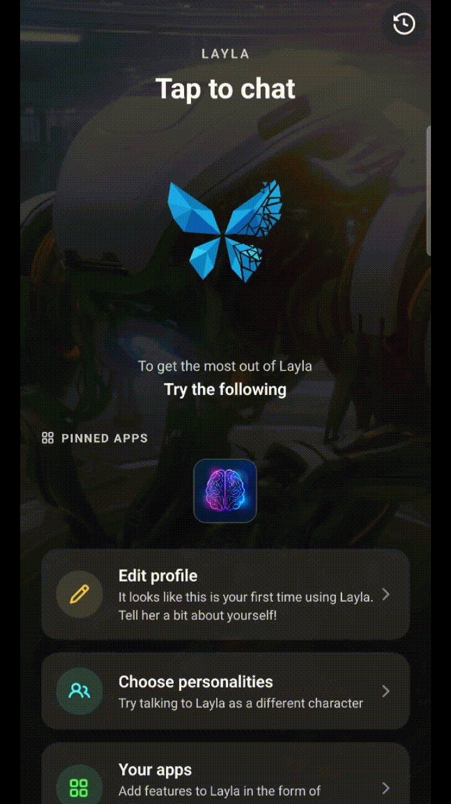

Layla는 대화를 **기록** 화면에 자동으로 보관하므로 처음부터 다시 시작하지 않고 이전 채팅으로 쉽게 돌아갈 수 있습니다. 기록 화면에서는 대화를 검색하거나 사본을 내보내고 영구적으로 제거할 수 있습니다.

이 가이드에서는 Layla 대화 기록을 관리하는 방법과 채팅을 삭제할 때 데이터가 어떻게 처리되는지 설명합니다.

> **참고:** 메뉴 이름과 버튼 위치는 Layla 버전 및 기기에 따라 약간 다를 수 있습니다.

## 대화 기록 열기

이전 대화를 보는 방법은 다음과 같습니다.

1. **Layla**를 엽니다.
2. 왼쪽에서 스와이프하거나 시계 아이콘을 사용하여 기본 탐색 메뉴를 엽니다.
3. **기록**을 선택합니다.
4. 대화를 눌러 다시 엽니다.

활성 대화에는 제목, 캐릭터 또는 어시스턴트, 최근 메시지 미리보기 및 가장 최근 활동 날짜가 표시됩니다.

기존 대화를 열면 이전 메시지와 설정을 그대로 유지하면서 채팅을 계속할 수 있습니다.

## Layla 대화 기록 검색

특정 대화를 찾으려면 기록 화면 상단의 검색창을 사용하세요.

Layla는 다음과 같은 정보를 검색할 수 있습니다.

- 대화 제목
- 캐릭터 또는 어시스턴트 이름
- 메시지의 단어나 문구
- 대화 태그 또는 카테고리

채팅 검색 방법은 다음과 같습니다.

1. **기록**을 엽니다.
2. **검색** 필드를 누릅니다.
3. 제목, 캐릭터 이름, 키워드 또는 문구를 입력합니다.
4. 결과를 선택하여 대화를 엽니다.

입력하는 동안 검색 결과가 업데이트되므로 일반적으로 단어나 제목의 일부만 입력하면 됩니다.

## 대화 삭제

대화를 삭제하면 활성 또는 보관된 기록에서 제거되고 **최근 삭제됨**으로 이동합니다.

대화를 삭제하는 방법은 다음과 같습니다.

1. **기록**을 엽니다.
2. 대화의 **휴지통** 아이콘을 누릅니다.
3. 삭제를 확인합니다.

## Layla는 대화 기록을 얼마나 오래 보관하나요?

보관 방식은 대화 상태에 따라 달라집니다.

| 대화 상태   | 보관 방식                                          |
| ----------- | -------------------------------------------------- |
| 활성        | 보관하거나 삭제할 때까지 기록 화면에 남아 있습니다 |
| 영구 삭제됨 | 즉시 제거되며 복원할 수 없습니다                   |

## Layla를 제거하거나 데이터를 지우면 어떻게 되나요?

다음 작업을 수행하면 기기에 로컬로 저장된 대화 기록이 제거될 수 있습니다.

- Layla 제거
- 앱 저장소 또는 애플리케이션 데이터 지우기
- 기기 초기화
- 운영체제를 통해 Layla 데이터 삭제
- 데이터를 전송하거나 복원하지 않고 다른 기기로 이동

앱을 제거하거나 데이터를 지우거나 새 기기로 이동하기 전에 중요한 대화를 내보내거나 백업하세요.

데이터를 백업한 경우 사용 가능한 대화를 백업에서 복원할 수 있습니다. 백업을 만들기 전에 영구 삭제된 채팅은 복구할 수 없습니다.

## 자주 묻는 질문

### Layla가 대화를 자동으로 저장하나요?

예. 채팅하는 동안 대화가 기록 화면에 자동으로 추가됩니다. 각 대화를 수동으로 저장할 필요가 없습니다.

### 이전 대화를 계속할 수 있나요?

예. 기록에서 대화를 열고 새 메시지를 보내세요. Layla는 사용 가능한 대화 기록과 설정을 계속 사용합니다.

### 이전 채팅 안에서 검색할 수 있나요?

예. 기록 검색 필드를 사용하여 제목, 캐릭터, 어시스턴트, 키워드 또는 메시지 내용으로 대화를 찾을 수 있습니다.

### 영구 삭제한 채팅을 복구할 수 있나요?

아니요. 영구 삭제는 되돌릴 수 없습니다. 별도로 저장한 내보내기 사본이나 백업이 남아 있을 수 있지만 Layla는 대화 기록에서 영구 삭제된 사본을 복원할 수 없습니다.

### 대화를 내보내면 Layla에서 제거되나요?

아니요. 내보내기는 별도의 사본을 만들며 원본 대화는 변경하지 않습니다.

### 캐릭터를 삭제하면 해당 캐릭터와의 모든 대화도 삭제되나요?

예. 캐릭터를 삭제하면 해당 캐릭터와 연결된 모든 대화 기록과 기억이 삭제됩니다.

## 중요한 대화 보호

나중에 필요할 수 있는 채팅에는 다음 두 가지 방법을 사용해 보세요.

- 대화에 명확하고 검색하기 쉬운 제목을 지정합니다.
- 원본을 삭제하기 전에 별도의 사본을 내보냅니다.

독립된 백업이 필요할 때는 내보내기가 적합합니다. 영구 삭제는 더 이상 필요하지 않다고 확신하는 대화에만 사용하세요.
