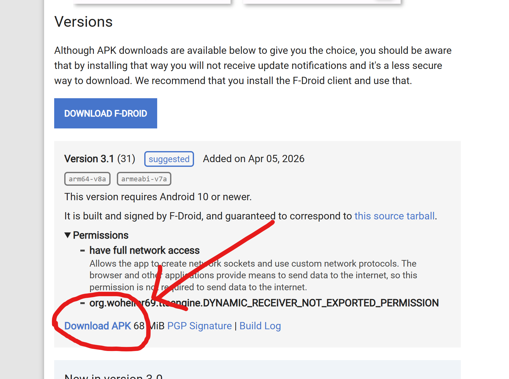

Layla의 기본 TTS 미니 앱은 모두 영어로 작동합니다. 하지만 Android에서는 다국어 텍스트 음성 변환을 매우 쉽게 추가할 수 있습니다.

Layla는 인터넷에 연결하는 로컬 텍스트 음성 변환 앱인 SherpaTTS를 지원합니다.

**1단계: SherpaTTS 다운로드**

[F-Droid](https://f-droid.org/en/packages/org.woheller69.ttsengine/)에서 앱을 다운로드합니다.

**버전** 섹션까지 아래로 스크롤하여 최신 APK를 다운로드합니다.

_F-Droid는 **자유 오픈 소스 소프트웨어(FOSS)** 앱을 게시하는 Google Play의 대안입니다._

**2단계: SherpaTTS 설정**

SherpaTTS 앱을 다운로드한 후 앱을 열어 설정합니다.

더하기 기호를 눌러 새 모델을 추가합니다.

모델 목록이 표시됩니다.

원하는 언어를 다운로드합니다. 언어는 두 글자 국가 코드로 표시됩니다. 예를 들어 독일어는 'de', 프랑스어는 'fr'입니다.

다운로드가 끝나면 **시작**을 눌러 모델을 로드합니다.

**3단계: SherpaTTS를 휴대전화의 기본 TTS 모델로 설정**

SherpaTTS 메인 화면에서 설정 아이콘을 누릅니다.

Android 시스템 설정이 열립니다. **기본 텍스트 음성 변환** 설정을 누릅니다.

기본 엔진을 SherpaTTS로 변경합니다.

이제 기본 음성이 Sherpa를 사용합니다.

**4단계: Layla 설정**

Layla는 이 설정을 자동으로 읽고 선택한 음성을 사용할 수 있도록 합니다. _(변경 사항을 적용하려면 Layla를 다시 시작하세요.)_

캐릭터 설정(**캐릭터 편집** → **고급** 탭)으로 이동합니다.

**네이티브** 섹션에서 새 음성을 선택합니다.

Sherpa에서 설치한 모든 음성이 여기에 표시됩니다.

이제 캐릭터가 여러 언어로 말할 수 있습니다.
