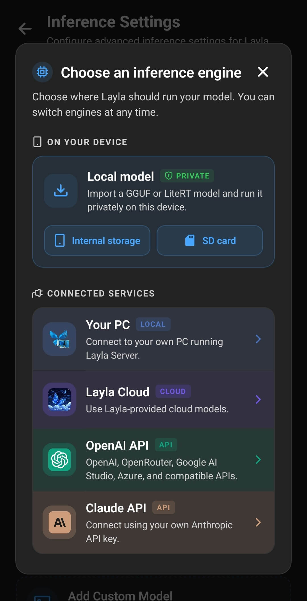

**Layla는 OpenAI 호환 Chat Completions 엔드포인트를 제공하는 모든 서비스에 연결할 수 있습니다.** LM Studio, Ollama, llama.cpp 같은 로컬 LLM 서버를 통해 내 컴퓨터에서 모델을 실행하거나, 같은 API 형식을 사용하는 원격 서비스에서 실행할 수 있습니다.

이 가이드는 먼저 모든 OpenAI 호환 API 연결에 필요한 설정을 설명한 다음, 세 가지 구체적인 로컬 AI 구성을 단계별로 안내합니다. 예시에서는 같은 비공개 네트워크에 연결된 휴대전화와 Windows PC를 사용하지만, 동일한 Layla 설정으로 macOS, Linux, 홈 서버 또는 인터넷의 호환 서버에도 연결할 수 있습니다.

## OpenAI 호환 엔드포인트란 무엇인가요?

OpenAI 호환 엔드포인트는 OpenAI의 Chat Completions API와 같은 일반 형식으로 요청을 받는 API 주소입니다. OpenAI, ChatGPT 또는 OpenAI에서 호스팅하는 모델에 연결할 필요는 없습니다.

많은 로컬 LLM 추론 엔진은 하나의 앱이 서로 다른 모델 서버와 작동할 수 있도록 이 API 형식을 지원합니다. Layla는 대화, 선택한 모델 이름, 스트리밍 응답 요청을 엔드포인트로 보냅니다. 서버는 언어 모델을 실행한 뒤 답변을 Layla로 반환합니다.

서비스가 Layla의 **OpenAI API** 연결과 작동하려면 다음 기능을 지원해야 합니다.

- OpenAI 호환 Chat Completions 경로(일반적으로 `/v1/chat/completions`)
- 채팅 메시지와 모델 식별자
- 스트리밍 응답
- API 키가 필요할 때 Bearer 토큰 인증

LM Studio, Ollama, `llama-server.exe`는 모두 필요한 Chat Completions 경로를 제공합니다.

## 시작하기 전에 필요한 항목

PC에서 로컬 LLM을 실행하려면 다음을 준비하세요.

- Android 또는 iOS 기기에 설치된 Layla
- 선택한 언어 모델을 실행할 수 있는 컴퓨터
- 선택한 추론 엔진을 통해 다운로드한 모델 또는 llama.cpp용 호환 GGUF 모델
- 같은 신뢰할 수 있는 Wi-Fi 또는 로컬 네트워크에 연결된 휴대전화와 컴퓨터
- 비공개 네트워크에서 모델 서버를 컴퓨터 방화벽에 허용할 권한

모델 크기는 메모리 사용량과 응답 속도에 직접적인 영향을 줍니다. 로컬 AI를 처음 사용한다면 컴퓨터에 권장되는 더 작은 양자화 모델부터 시작하세요. 연결이 제대로 작동하는 것을 확인한 후 더 큰 로컬 모델을 사용할 수 있습니다.

## Layla에 OpenAI 호환 연결 추가하기

Layla의 **설정**을 열고 **추론 설정**으로 이동한 다음, **내 모델**에서 **사용자 지정 모델 추가**를 탭합니다. 다음 창은 휴대전화에서 실행되는 모델과 연결된 서비스를 구분하여 보여 줍니다. **연결된 서비스**에서 **OpenAI API**를 선택하세요.

이름과 달리 이 옵션은 OpenAI 자체 모델에만 한정되지 않습니다. LM Studio, Ollama, llama.cpp, OpenRouter와 위에서 설명한 호환 Chat Completions 형식을 받는 모든 서비스에 사용하는 연결 방식입니다.

이어서 **OpenAI API** 창에서 연결 정보와 모델을 입력합니다. 이 가이드의 모든 예시는 같은 네 가지 필드를 사용하며 값만 달라집니다.

| 설정           | 입력할 내용                                                                                                          |
| -------------- | -------------------------------------------------------------------------------------------------------------------- |
| **이름**       | “내 PC의 LM Studio” 또는 “Ollama — Llama 3.2”처럼 연결을 쉽게 알아볼 수 있는 이름.                                   |
| **엔드포인트** | 완전한 Chat Completions URL. 대부분의 호환 서버에서는 `/v1/chat/completions`로 끝납니다.                             |
| **API 키**     | 원격 제공업체가 발급한 키. 인증이 없는 로컬 서버에서는 비워 두고, 인증을 활성화했다면 로컬 서버의 토큰을 입력합니다. |
| **모델**       | 서버가 요구하는 정확한 모델 식별자. 서버가 모델 검색을 지원하면 **모델 찾기**를 탭합니다.                            |

나중에 연결을 쉽게 구분할 수 있는 이름을 입력하세요. 엔드포인트는 완전한 경로여야 합니다. 포트 번호나 `/v1`까지만 있는 기본 주소로는 충분하지 않습니다. Layla는 이 필드에 입력된 주소로 각 채팅 요청을 직접 보냅니다.

엔드포인트와 필요한 API 키를 입력한 후 정확한 모델 이름을 모른다면 **모델 찾기**를 탭하세요. Layla는 같은 서버에 OpenAI 호환 모델 목록을 요청하고 반환된 식별자 중 하나를 선택할 수 있게 합니다. 모델 검색을 사용할 수 없다면 서버나 제공업체에 표시된 모델 이름을 정확히 복사하세요. 엔드포인트가 기본 모델을 명시적으로 지원하는 경우에만 모델 필드를 비워 두세요.

모델 필드 아래에는 **고급 요청 설정**이 있습니다. 펼치면 요청 값을 재정의하는 **추가 JSON** 영역이 표시됩니다. 대부분의 사용자는 비워 두면 됩니다. 제공업체가 특정 요청 필드를 추가하라고 안내할 때만 사용하세요. 화면에 표시된 temperature 예시는 LM Studio, Ollama 또는 llama.cpp를 사용하는 데 필요하지 않습니다.

연결 정보와 모델이 올바르면 **변경 사항 저장**을 탭하세요. Layla는 API 연결을 **내 모델**에 저장하고 현재 모델 소스로 선택합니다.

## 휴대전화에서 localhost가 작동하지 않는 이유

서버에 `http://localhost:1234` 같은 주소가 표시되더라도 이 주소는 서버가 실행 중인 컴퓨터에서만 작동합니다. 휴대전화에서 `localhost`는 휴대전화 자체를 뜻합니다.

따라서 Layla에는 일반적으로 `192.168.` 또는 `10.`으로 시작하는 컴퓨터의 비공개 IPv4 주소가 필요합니다. Windows에서 **설정**을 열고 **네트워크 및 인터넷**을 선택한 다음, 현재 사용 중인 Wi-Fi 또는 Ethernet 연결의 속성을 열어 **IPv4 주소**를 찾으세요. LM Studio를 비롯한 일부 서버 앱은 네트워크 액세스를 활성화하면 올바른 로컬 네트워크 주소를 표시합니다.

컴퓨터 주소가 `192.168.1.50`이라면 이 주소에 선택한 서버의 포트와 전체 API 경로를 추가합니다. 이 문서의 예시 IP 주소를 그대로 복사하지 말고 내 컴퓨터에 할당된 주소를 사용하세요.

## 빠른 참조: Layla용 로컬 OpenAI 호환 엔드포인트

| 추론 엔진      | Layla 기본 엔드포인트                         | 기본 API 키                                      | 모델 필드                                                 |
| -------------- | --------------------------------------------- | ------------------------------------------------ | --------------------------------------------------------- |
| LM Studio      | `http://YOUR-PC-IP:1234/v1/chat/completions`  | 인증을 활성화하지 않았다면 비워 둠               | **모델 찾기**를 사용하거나 LM Studio에 표시된 식별자 입력 |
| Ollama         | `http://YOUR-PC-IP:11434/v1/chat/completions` | 비워 둠                                          | `llama3.2` 같은 설치된 Ollama 모델 이름                   |
| llama.cpp 서버 | `http://YOUR-PC-IP:8080/v1/chat/completions`  | API 키를 지정해 서버를 시작하지 않았다면 비워 둠 | **모델 찾기**로 로드된 모델 선택                          |

`YOUR-PC-IP`를 컴퓨터의 비공개 IPv4 주소로 바꾸세요.

## 예시 1: Layla를 LM Studio에 연결하기

[LM Studio](https://lmstudio.ai/download)는 로컬 언어 모델을 찾고 다운로드하고 실행할 수 있는 데스크톱 인터페이스를 제공합니다. Developer 페이지에서 모델을 [OpenAI 호환 엔드포인트](https://lmstudio.ai/docs/developer/openai-compat)로 공개할 수 있습니다. 그래픽 화면으로 로컬 LLM을 설정하려는 경우 이해하기 쉬운 선택입니다.

### LM Studio에 모델 설치하기

1. 공식 [LM Studio 다운로드 페이지](https://lmstudio.ai/download)에서 현재 설치 프로그램을 다운로드합니다.
2. LM Studio를 설치하고 엽니다.
3. **Discover** 페이지를 열고 모델을 검색합니다.
4. 컴퓨터에 맞는 모델과 양자화를 선택합니다. 잘 모르겠다면 LM Studio의 권장 모델부터 시작하는 것이 좋습니다.
5. 모델 다운로드가 끝날 때까지 기다립니다.

더 작은 모델과 비트 수가 낮은 양자화는 RAM 또는 VRAM을 적게 사용합니다. 사용 가능한 메모리에 모델이 여유 있게 들어가지 않으면 로딩이나 응답이 느려지거나 시작하지 못할 수 있습니다.

### LM Studio 로컬 API 서버 시작하기

1. LM Studio의 **Developer** 페이지를 엽니다.
2. 다운로드한 모델을 선택하거나 로드합니다.
3. 서버 설정을 엽니다.
4. 휴대전화의 Layla가 서버에 접근할 수 있도록 **Serve on Local Network**를 활성화합니다.
5. 다른 프로그램에서 사용 중이 아니라면 기본 포트 `1234`를 유지합니다.
6. 서버를 시작합니다.
7. Windows에서 방화벽 허용 여부를 묻는다면 **비공개 네트워크**에서만 LM Studio를 허용합니다.

LM Studio는 기본적으로 인증을 요구하지 않습니다. 공식 문서는 서버가 `localhost` 이외의 주소에서 수신할 때 인증을 활성화하도록 권장합니다. **Require Authentication**을 활성화했다면 LM Studio에서 API 토큰을 만들고 Layla의 **API 키** 필드에 입력하세요.

### Layla에 LM Studio 추가하기

Layla의 **OpenAI API** 창에 다음 값을 입력합니다.

- **이름:** 내 PC의 LM Studio
- **엔드포인트:** `http://YOUR-PC-IP:1234/v1/chat/completions`
- **API 키:** LM Studio 인증을 활성화하지 않았다면 비워 둠
- **모델:** **모델 찾기**를 탭하고 다운로드한 모델 선택

**변경 사항 저장**을 탭하고 LM Studio 서버를 계속 실행한 상태에서 Layla 채팅을 여세요. 컴퓨터의 모델이 대화를 생성하고 로컬 네트워크를 통해 Layla로 반환합니다.

Windows 안에서 두 앱을 함께 사용하는 방법은 [BlueStacks와 LM Studio로 PC에서 Layla를 실행하는 방법](/ko/how-to-run-layla-on-your-pc-with-bluestacks-and-lm-studio/)을 참조하세요.

## 예시 2: Layla를 Ollama에 연결하기

[Ollama](https://ollama.com/download)는 Windows, macOS 및 Linux에서 사용할 수 있는 로컬 모델 실행 프로그램입니다. [OpenAI 호환 API](https://docs.ollama.com/api/openai-compatibility)를 포함하며 기본적으로 포트 `11434`를 사용합니다.

다음 단계는 Windows용 Ollama를 기준으로 합니다. 다른 운영체제의 설치 방법은 Ollama 공식 문서에서 확인할 수 있습니다.

### Ollama 설치 및 모델 다운로드

1. 공식 [Ollama 다운로드 페이지](https://ollama.com/download)에서 Ollama를 다운로드합니다.
2. 설치 프로그램을 실행하고 Ollama를 엽니다.
3. Windows Terminal 또는 PowerShell을 엽니다.
4. **ollama run llama3.2**를 입력하여 이 예시에서 사용할 `llama3.2` 모델을 다운로드하고 시작합니다.
5. 다운로드가 끝날 때까지 기다린 다음 짧은 테스트 메시지를 보냅니다.
6. 터미널 채팅을 종료하려면 **/bye**를 입력합니다. Ollama는 백그라운드에서 계속 실행됩니다.

Ollama 라이브러리의 다른 모델을 사용할 수도 있습니다. 이 경우 예시의 `llama3.2`를 해당 모델의 정확한 Ollama 이름으로 바꾸세요.

### 로컬 네트워크에서 Ollama 연결 허용하기

Ollama는 기본적으로 PC 자체의 `127.0.0.1` 주소에서만 수신합니다. Layla를 연결하기 전에 수신 주소를 변경하세요.

1. Windows 작업 표시줄 알림 영역에서 Ollama를 종료합니다.
2. Windows **설정**을 열고 **환경 변수**를 검색합니다.
3. **계정의 환경 변수 편집**을 선택합니다.
4. 이름이 **OLLAMA_HOST**이고 값이 **0.0.0.0:11434**인 사용자 변수를 만듭니다.
5. 변경 사항을 적용하고 Windows 시작 메뉴에서 Ollama를 다시 시작합니다.
6. 필요한 경우 Windows 방화벽에서 비공개 네트워크의 Ollama를 허용합니다.

`0.0.0.0`에서 수신하도록 설정하면 로컬 네트워크의 기기가 Ollama에 접근할 수 있습니다. 그렇다고 포트 `11434`를 공개 인터넷에 노출해서는 안 됩니다. 라우터 뒤에 두고 신뢰할 수 있는 네트워크에서만 사용하세요.

### Layla에 Ollama 추가하기

Layla의 **OpenAI API** 창에 다음 값을 입력합니다.

- **이름:** 내 PC의 Ollama
- **엔드포인트:** `http://YOUR-PC-IP:11434/v1/chat/completions`
- **API 키:** 비워 둠
- **모델:** `llama3.2` 또는 **모델 찾기**를 탭해 설치된 Ollama 모델 선택

**변경 사항 저장**을 탭하고 대화를 시작하세요. Ollama는 요청을 받으면 선택된 모델을 로드하므로 첫 번째 답변이 이후 답변보다 오래 걸릴 수 있습니다.

**모델 찾기**에 항목이 표시되지 않으면 모델 다운로드가 완료되었는지, `OLLAMA_HOST` 변경 후 Ollama를 다시 시작했는지 확인하세요.

## 예시 3: Layla를 llama-server.exe에 연결하기

[`llama-server.exe`](https://github.com/ggml-org/llama.cpp/releases/latest)는 llama.cpp에 포함된 Windows 서버입니다. 별도의 데스크톱 모델 관리자 없이 GGUF 모델을 실행할 수 있는 가벼운 옵션입니다. 공식 [llama.cpp 서버 문서](https://github.com/ggml-org/llama.cpp/blob/master/tools/server/README.md)는 기본 포트 `8080`을 사용하는 OpenAI 호환 API를 설명합니다.

이 방법은 터미널 명령 하나를 사용하지만, 공식 사전 빌드 Windows 파일을 사용하면 프로그래밍이나 소스 코드 컴파일이 필요하지 않습니다.

### llama.cpp와 GGUF 모델 다운로드하기

1. GitHub에서 공식 [최신 llama.cpp 릴리스](https://github.com/ggml-org/llama.cpp/releases/latest)를 엽니다.
2. **Assets**에서 현재 Windows x64 CPU ZIP을 다운로드합니다. 가장 폭넓게 호환되는 시작점입니다. 지원되는 하드웨어에서는 CUDA, Vulkan, SYCL, HIP 빌드가 더 나은 가속 성능을 제공할 수 있습니다.
3. ZIP 전체를 새 폴더에 압축 해제합니다. 포함된 모든 DLL 파일을 `llama-server.exe` 옆에 유지하세요.
4. Chat 또는 Instruct 모델을 GGUF 형식으로 다운로드합니다. 파일과 양자화 선택에 도움이 필요하다면 [GGUF 모델과 모델 양자화란 무엇인가요?](/ko/what-are-gguf-models-what-are-model-quants/)를 참조하세요.
5. GGUF 파일을 압축 해제한 llama.cpp 폴더로 옮기고 필요한 경우 짧고 알아보기 쉬운 파일 이름으로 변경합니다.

프롬프트 방식을 정확히 이해하고 있지 않다면 Base 모델을 다운로드하지 마세요. 일반적인 Layla 대화에는 Chat 또는 Instruct 모델이 적합합니다.

### Layla용 llama-server.exe 시작하기

1. 파일 탐색기에서 압축 해제한 llama.cpp 폴더를 엽니다.
2. 파일 탐색기의 주소 표시줄을 클릭하고 **cmd**를 입력한 뒤 Enter를 누릅니다. 해당 폴더에서 명령 프롬프트가 열립니다.
3. **llama-server.exe -m "your-model.gguf" --host 0.0.0.0 --port 8080**을 입력하고 `your-model.gguf`를 실제 파일 이름으로 바꿉니다.
4. Layla를 사용하는 동안 명령 프롬프트 창을 열어 둡니다.
5. 서버에서 모델 로드가 끝나고 HTTP 서버가 수신 중이라고 표시할 때까지 기다립니다.
6. 필요한 경우 Windows 방화벽에서 비공개 네트워크의 서버를 허용합니다.

로컬 네트워크의 휴대전화에서 연결하려면 `--host 0.0.0.0` 부분이 필요합니다. 이 옵션이 없으면 llama.cpp는 PC 자체에서만 연결을 받습니다. 서버에는 컴퓨터 주소의 포트 `8080`에서 열 수 있는 웹 인터페이스도 있어 정상적으로 시작되었는지 확인할 수 있습니다.

### Layla에 llama.cpp 서버 추가하기

Layla의 **OpenAI API** 창에 다음 값을 입력합니다.

- **이름:** 내 PC의 llama.cpp
- **엔드포인트:** `http://YOUR-PC-IP:8080/v1/chat/completions`
- **API 키:** 비워 둠
- **모델:** **모델 찾기**를 탭하고 로드된 모델 선택

**변경 사항 저장**을 탭하고 Layla 채팅을 시작하세요. 명령 프롬프트 창을 닫으면 서버가 중지되며 다시 시작하기 전까지 Layla가 새 답변을 생성할 수 없습니다.

공유 네트워크에서 개인정보 보호를 강화하려면 API 키 보호를 사용해 llama.cpp를 시작할 수 있습니다. 이 옵션을 활성화했다면 Layla에도 같은 키를 입력하세요.

## Layla를 다른 OpenAI 호환 API 제공업체에 연결하기

같은 과정으로 호스팅된 AI API, 홈 서버, 네트워크에 연결된 GPU 컴퓨터 또는 다른 로컬 추론 엔진을 사용할 수 있습니다.

1. 서비스가 OpenAI 호환 스트리밍 Chat Completions를 지원하는지 확인합니다.
2. 제공업체의 완전한 Chat Completions URL을 확인합니다.
3. 서비스에서 요구하는 경우 API 키를 발급받습니다.
4. 제공업체의 대시보드 또는 문서에서 정확한 모델 식별자를 찾습니다.
5. Layla에서 **추론 설정** > **사용자 지정 모델 추가** > **OpenAI API**를 엽니다.
6. 이름, 엔드포인트, 키 및 모델을 입력합니다.
7. 서비스가 OpenAI 호환 모델 목록을 제공한다면 **모델 찾기**를 탭합니다.
8. 연결을 저장하고 새 채팅에서 테스트합니다.

인터넷에 호스팅된 엔드포인트에는 제공업체가 안내하는 안전한 `https://` URL을 그대로 사용하세요. 제공업체가 이미 완전한 경로를 제공했다면 `/v1/chat/completions`를 추가하지 말고, 제공업체 고유의 경로 부분을 삭제하지 마세요.

**내 모델**에 여러 API 연결을 저장하고 나중에 전환할 수 있습니다. 연결, 프롬프트, 페르소나 및 샘플러 프리셋을 함께 유지하려면 [Layla의 저장된 추론 엔진 작동 방식](/ko/how-saved-inference-engines-work-in-layla/)을 참조하세요.

## 개인정보 보호 및 보안 고려사항

로컬 OpenAI 호환 API를 사용하면 언어 모델 추론을 내가 관리하는 하드웨어에서 처리할 수 있습니다. Layla가 홈 네트워크를 통해 LM Studio, Ollama 또는 llama.cpp에 연결할 때 채팅 내용은 상용 모델 제공업체가 아니라 휴대전화에서 내 PC로 전송됩니다.

이는 로컬 네트워크 추론이며 휴대전화 자체에서 실행되는 온디바이스 추론은 아닙니다. 모델은 컴퓨터에서 실행되고 휴대전화에서 해당 컴퓨터에 접근할 수 있어야 합니다. 필요한 앱과 모델을 다운로드한 뒤에는 라우터에 인터넷 연결이 없어도 사용할 수 있습니다. 다만 일부 Layla 기능이나 타사 모델 도구에는 별도의 온라인 요구사항이 있을 수 있습니다.

인증되지 않은 로컬 LLM 서버를 공용 Wi-Fi에 노출하거나 인터넷 라우터에서 포트 포워딩하지 마세요. 보호되지 않은 서버에 접근할 수 있는 사람은 모델을 사용하고 컴퓨터 자원을 소비할 수 있습니다. 가능한 경우 인증을 사용하고 방화벽 접근은 신뢰할 수 있는 비공개 네트워크로 제한하며, 더 이상 필요하지 않을 때는 서버를 중지하세요.

클라우드 OpenAI 호환 엔드포인트를 사용하면 대화가 기기를 벗어나며 해당 제공업체의 개인정보 보호 및 데이터 보관 정책에 따라 처리됩니다. 비공개 채팅이나 개인정보를 보내기 전에 정책을 확인하세요.

## OpenAI 호환 연결 문제 해결

### Layla에서 엔드포인트 또는 모델을 찾을 수 없다고 표시됩니다

`404` 오류는 일반적으로 엔드포인트가 불완전하거나 모델 식별자가 일치하지 않음을 뜻합니다. URL이 서버에서 요구하는 전체 Chat Completions 경로(일반적으로 `/v1/chat/completions`)로 끝나는지 확인한 다음 **모델 찾기**를 사용하거나 정확한 모델 이름을 다시 복사하세요.

### Layla가 PC에 연결되지 않습니다

다음 항목을 확인하세요.

- 로컬 LLM 서버가 실행 중이고 모델 로드가 완료되었는지 확인합니다.
- 휴대전화와 PC가 같은 Wi-Fi 또는 로컬 네트워크에 연결되어 있어야 합니다.
- 엔드포인트에 `localhost`나 `127.0.0.1` 대신 PC의 비공개 IPv4 주소를 사용해야 합니다.
- LM Studio에서 **Serve on Local Network**가 활성화되어 있거나, Ollama에 `OLLAMA_HOST`가 설정되어 있거나, llama.cpp가 `--host 0.0.0.0`으로 시작되어 있어야 합니다.
- Windows 방화벽에서 비공개 네트워크의 서버를 허용해야 합니다.
- VPN, 게스트 Wi-Fi 설정 또는 라우터의 클라이언트 격리 기능이 기기 간 통신을 막고 있지 않아야 합니다.

### Layla에서 인증 오류가 발생합니다

`401` 또는 `403` 오류는 일반적으로 API 키가 없거나 올바르지 않음을 뜻합니다. “Bearer”라는 단어를 추가하지 말고 토큰만 다시 복사하세요. Layla가 요청에 Bearer 인증 형식을 추가합니다. 인증이 없는 로컬 서버를 사용하는 경우 실수로 활성화한 인증 요구사항을 끄거나 키 필드를 비워 두세요.

### 모델 목록이 비어 있습니다

최소 하나의 모델이 다운로드되어 서버에서 사용할 수 있는지 확인하세요. LM Studio는 서버에서 사용할 수 있는 모델이 있어야 하고, Ollama는 모델 다운로드가 완료되어야 하며, 단일 모델 llama.cpp 서버는 GGUF 파일 로드를 완료해야 합니다. 정확한 모델 식별자를 직접 입력할 수도 있습니다.

### PC에서는 서버가 작동하지만 Layla에서는 작동하지 않습니다

PC에서 `localhost`를 열 수 있다는 것은 서버가 PC 내부에서 작동한다는 것만 확인합니다. 네트워크 수신 설정, PC IP 주소 및 방화벽을 다시 확인하세요. 일부 게스트 또는 공용 Wi-Fi 네트워크는 연결된 기기 간 통신을 의도적으로 차단합니다.

### 재시작 후 연결이 작동하지 않습니다

LM Studio와 llama.cpp는 서버를 다시 시작해야 할 수 있습니다. Ollama는 일반적으로 백그라운드에서 실행되지만 환경 변수를 변경한 뒤에는 다시 시작해야 합니다. 라우터가 재시작 후 PC에 다른 IP 주소를 할당할 수도 있습니다. 주소가 바뀌었다면 Layla에 저장된 엔드포인트를 업데이트하세요.

### 응답이 느립니다

추론 속도는 모델 크기, 양자화, 사용 가능한 RAM 또는 VRAM, CPU, GPU, 컨텍스트 길이 및 네트워크 품질에 따라 달라집니다. 더 작은 모델이나 더 압축된 양자화를 사용하고, 메모리를 많이 사용하는 앱을 닫고, 휴대전화를 안정적인 로컬 네트워크에 연결하세요.

## 자주 묻는 질문

### Layla에서 PC의 로컬 LLM을 사용할 수 있나요?

예. LM Studio, Ollama 또는 llama.cpp 같은 OpenAI 호환 로컬 서버에서 모델을 실행하고 로컬 네트워크 접근을 활성화한 다음 PC의 Chat Completions 엔드포인트를 Layla에 입력하세요.

### Android의 Layla를 Ollama에 연결할 수 있나요?

예. Ollama는 컴퓨터에서 실행되고 Layla는 Android에서 실행됩니다. Ollama가 로컬 네트워크에서 수신하도록 설정한 다음 `http://YOUR-PC-IP:11434/v1/chat/completions`를 Layla 엔드포인트로 사용하세요.

### 로컬 LLM 서버에 API 키가 필요한가요?

이 문서의 세 가지 예시에서는 기본적으로 필요하지 않습니다. LM Studio 또는 llama.cpp에서 인증을 활성화했다면 같은 토큰을 Layla에 입력하세요. 원격 제공업체는 일반적으로 별도의 API 키가 필요합니다.

### 인터넷 없이 사용할 수 있나요?

예. 모델과 서버가 내 PC에 있고 두 기기가 같은 로컬 네트워크에 연결되어 있으면 사용할 수 있습니다. 앱과 모델을 처음 다운로드할 때는 인터넷 연결이 필요합니다. 클라우드 API는 계속 인터넷 연결이 필요합니다.

### 모델이 휴대전화에서 실행되나요?

이 세 가지 구성에서는 그렇지 않습니다. Layla는 채팅 인터페이스와 API 클라이언트 역할을 하고 언어 모델은 PC에서 실행됩니다. 휴대전화에서 모델을 직접 실행하려면 호환 로컬 모델을 가져오세요. [Layla에 사용자 지정 AI 모델을 추가하는 방법](/ko/how-to-add-custom-models-to-layla/)을 참조하세요.

### OpenRouter나 다른 클라우드 제공업체를 사용할 수 있나요?

예. 서비스에서 호환 스트리밍 Chat Completions API를 제공해야 합니다. 제공업체 문서에 있는 전체 엔드포인트, API 키 및 모델 식별자를 사용하세요.

OpenAI 호환 API는 Layla가 공통 형식을 통해 다양한 로컬 및 호스팅 언어 모델과 통신할 수 있게 합니다. 신뢰할 수 있는 로컬 네트워크에서 LM Studio, Ollama 또는 llama.cpp를 사용하면 PC가 로컬 LLM 추론을 처리하고 Layla를 비공개 AI 어시스턴트 인터페이스로 활용할 수 있습니다.
