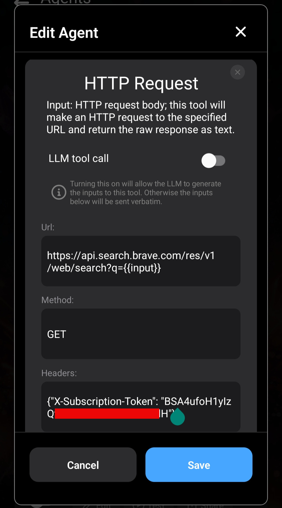

Brave는 Google보다 개인 정보 보호에 더 중점을 둔 검색 대안을 제공합니다.

Brave는 API도 제공합니다. [Brave Search API](https://brave.com/search/api/)

Layla에서 DuckDuckGo 대신 Brave Search를 사용하려면 자신의 API 키로 Brave Search Agent를 만들어 DuckDuckGo Agent를 대체할 수 있습니다.

_이 튜토리얼은 고급 사용자용입니다. HTTP 요청에서 결과를 얻고 분석하는 여러 방법을 배우며 향후 Agent에도 활용할 수 있습니다._

**API 키 등록**

먼저 [Brave](https://brave.com/)에 등록하고 웹사이트의 안내에 따라 API 키를 받습니다. 이후에는 API 키를 받아 저장한 것으로 가정합니다.

[Brave Search API 문서](https://api-dashboard.search.brave.com/app/documentation/web-search/get-started)를 살펴보세요. 이 문서를 사용하여 Agent를 만듭니다.

**Layla에서 DuckDuckGo Agent 복제**

가장 쉬운 시작 방법은 Layla의 DuckDuckGo Agent를 복제하는 것입니다. 필요한 설정 대부분이 이미 구성되어 있습니다.


Agent를 복제한 후 트리거는 유지하고 모든 도구를 제거합니다. 새 Agent도 웹 검색 쿼리로 실행되어야 하며 기본 DuckDuckGo Agent에는 이미 해당 설정이 있습니다.

다음 순서로 네 가지 도구를 추가합니다.

1. Eval
2. HTTP Request
3. Eval
4. Provide Context

각 도구의 역할과 연결 방식을 살펴보겠습니다.

**Eval (1)**


첫 번째 도구에서는 API로 보내기 전에 모든 입력을 URI 구성 요소로 인코딩합니다. 다음 JavaScript 함수를 사용합니다.

```js
encodeURIComponent;
```

도구 입력이 Eval로 처리되고 결과가 도구의 출력이 됩니다. `{{input}}`은 입력 메시지의 원시 텍스트를 나타냅니다.

**HTTP Request (2)**

두 번째 HTTP Request 도구에서 Brave Search API를 호출합니다. [Brave Search API 문서](https://api-dashboard.search.brave.com/app/documentation/web-search/get-started)를 참고하세요.



URL과 헤더를 확인하세요. `X-Subscription-Token` 헤더에는 API 키가 들어 있습니다.

URL 쿼리 문자열의 `{{input}}`이 API로 전송됩니다.

**Eval (3)**

지금까지 나온 도구 호출 중 가장 복잡합니다.

이 도구는 이전 HTTP Request 도구의 출력을 받습니다. Brave API 문서에 따르면 출력은 JSON 형식입니다. JSON을 분석하고 LLM에 보낼 수 있는 일반 텍스트로 변환합니다.


이 도구는 `{{input}}`을 원시 문자열로 받아 `i` 변수에 할당합니다. `JSON.parse`를 호출하고 결과를 표준 글머리 기호 목록으로 변환하여 도구 출력으로 사용합니다.

모두 일반적인 JavaScript이므로 프로그래밍에 익숙하다면 쉽게 이해할 수 있습니다.

**Provide Context (4)**

마지막 단계에서는 출력을 LLM에 컨텍스트로 제공합니다.


이 도구는 결과가 Brave API에서 왔다는 점을 설명하고 캐릭터가 결과를 알려 주도록 지시합니다.

이 네 가지 도구를 설정하면 Agent가 완성됩니다.

두 Agent가 충돌하지 않도록 기존 DuckDuckGo Agent를 비활성화하는 것을 권장합니다.

직접 가져올 수 있는 Agent JSON은 다음과 같습니다.

[brave-search.json 다운로드](/assets/articles/how-to-create-a-brave-search-agent/brave-search.json)
