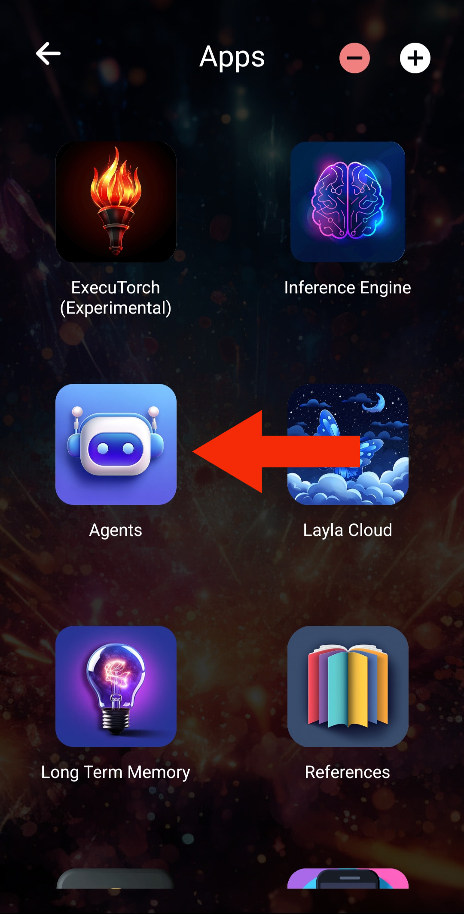
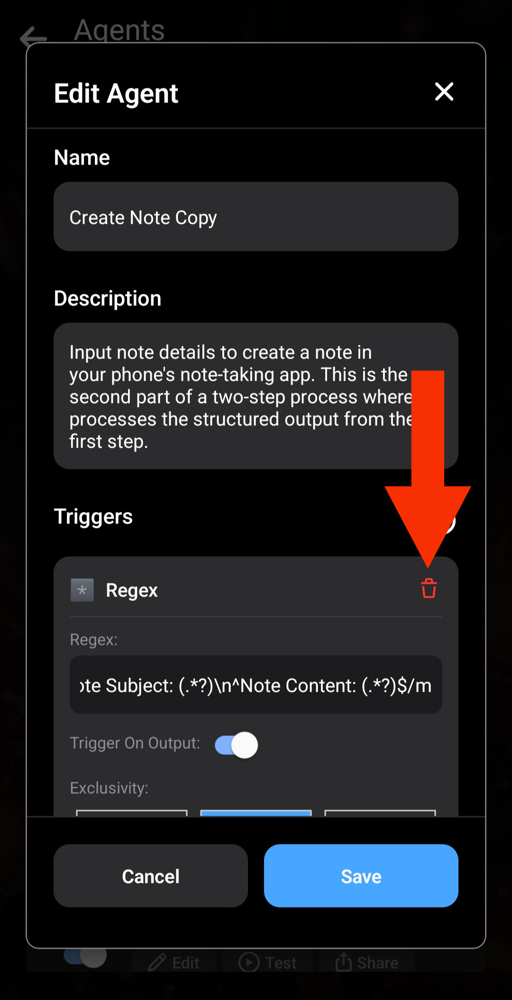
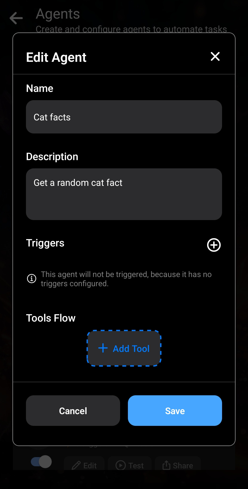
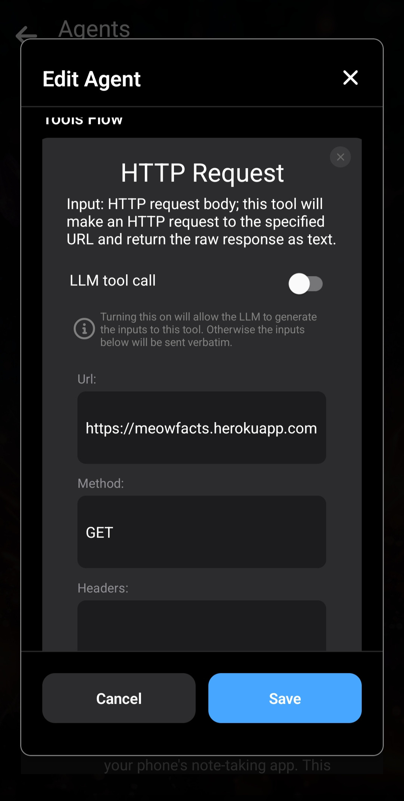
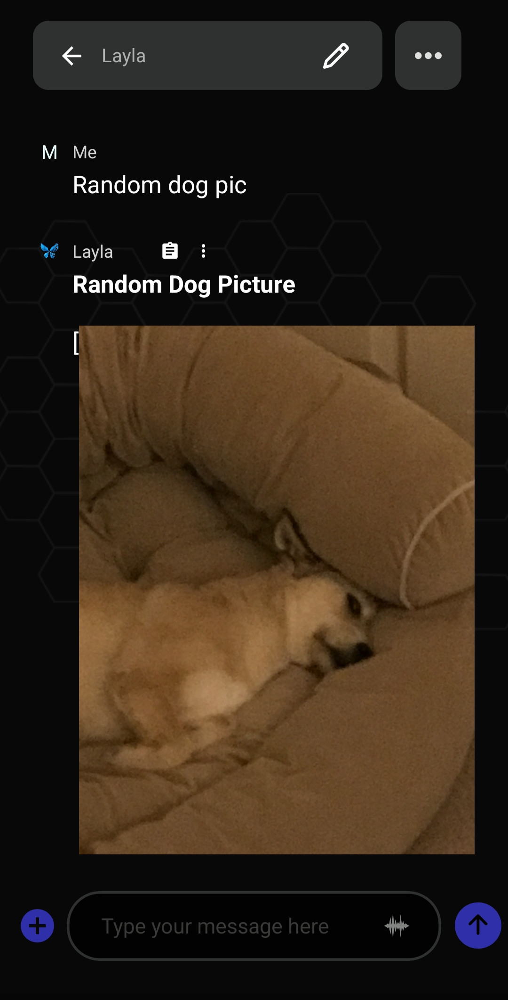

Layla에서는 나만의 Agent를 만들고 사용자 지정하여 원하는 기능을 추가할 수 있습니다.

이 문서에서는 먼저 기본 Agent를 만드는 방법과 Layla에서 Agent가 작동하는 방식을 설명한 다음, 조금 더 복잡한 Agent를 만듭니다.

먼저 일반적인 소개를 읽으려면 [Layla에서 Agents, Functions 및 도구 호출을 활성화하는 방법](/how-to-enable-agents-functions-and-tool-calling-in-layla/)을 참조하세요.

**Agent 만들기**

Agent가 작동하는 세부 원리는 잠시 미루고 바로 시작하겠습니다.

Layla에서 _Agents_ 미니 앱을 여세요.

Agent를 만드는 가장 쉬운 방법은 기존 Agent를 복제하는 것입니다. _아직 **Add New Agent** 버튼은 신경 쓰지 마세요. 고급 사용자를 위한 기능입니다._

기존 Agent를 복제한 후 _Edit_ 버튼으로 새 복사본을 편집하세요.

_Edit_ 버튼을 누르면 Agent 세부 정보가 있는 팝업이 열립니다. 공개 API에서 임의의 고양이 상식을 가져오는 간단한 Agent를 만들어 보겠습니다.

1단계: Edit Agent 팝업을 여세요.

2단계: 기존 트리거와 도구를 삭제하세요.

3단계: 이름과 설명을 편집하세요.

이름과 설명은 현재 참고용으로만 사용됩니다. _더 복잡한 Agent에서는 이름과 설명이 중요합니다._

다음으로 _트리거_ 를 추가하세요. “Triggers” 옆의 더하기 기호를 누르고 “Phrase” 트리거를 선택합니다. 이 간단한 트리거는 채팅에 특정 문구를 입력하면 Agent를 실행합니다. 다른 옵션은 아직 신경 쓰지 않아도 됩니다.

“**cat fact**”라는 단어가 전송될 때마다 이 Agent를 실행하겠습니다. “send me a **cat fact**”와 “what's a cool **cat fact**?” 같은 메시지도 포함됩니다.

_트리거 문구_ 는 “cat fact”입니다. 대소문자를 구분하지 않으므로 “cat fact”와 “Cat fact” 모두 작동합니다. 트리거가 하나뿐이므로 _exclusivity_ 옵션은 영향을 주지 않습니다. _OR_로 두세요.

이제 Agent에 도구를 추가하세요. _HTTP Request_ 도구를 사용하겠습니다. 고양이 상식 공개 API의 문서는 다음에서 확인할 수 있습니다: [GitHub의 MeowFacts](https://github.com/wh-iterabb-it/meowfacts).

_HTTP Request_ 도구를 추가하고 아래와 같이 설정하세요.

_URL_ 필드에는 API 문서에 나온 URL을 그대로 입력합니다. 요청 방식은 GET입니다. 나머지 두 필드는 비워 두어도 됩니다.

첫 번째 도구가 추가되었습니다.

이 도구는 지정한 API로 GET 요청을 보내고 결과를 가져옵니다. 다음으로 Layla에 결과를 사용하는 방법을 _알려줘야_ 합니다. 가장 간단한 방법은 _Provide Context_ 도구입니다. 이 도구는 입력값을 받아 대화 컨텍스트에 삽입합니다. Layla는 그 컨텍스트를 바탕으로 응답합니다.

도구 맨 아래로 스크롤하고 _Add Tool_을 다시 누르세요. 이번에는 _Provide Context_를 선택합니다. 방금 추가한 _HTTP Request_ 도구 뒤에 연결됩니다.

이 고양이 상식이 웹 검색 후에 나온 것이라고 LLM에 알려줍니다.

특수 템플릿 `{{input}}`을 사용합니다. 이전 도구의 _출력_ 으로 바뀌며, 이전 도구의 출력이 현재 도구의 입력이 됩니다. _LLM tool call_ 같은 다른 옵션은 아직 신경 쓰지 않아도 됩니다.

이제 Agent가 완성되었습니다. 저장한 다음 Layla와의 채팅으로 돌아가세요.

새 Agent가 작동하는 모습을 확인할 수 있습니다. 지정한 URL로 HTTP 요청을 보내고 결과와 지시를 컨텍스트에 삽입합니다.

**결론**

Layla의 Agent는 일반적으로 문구, 정규식 또는 더 복잡한 조건 등 특정 조건에서 _실행_ 됩니다. 그런 다음 설정된 각 도구를 순서대로 호출하고, 한 도구의 출력을 다음 도구의 입력으로 연결합니다.

_Provide Context_ 도구는 이 과정에서 매우 중요합니다. 일반적으로 Agent에 마지막으로 추가하는 도구이며, 실행 결과를 LLM(여기서는 Layla)에 전달합니다. 이 도구가 없으면 Agent가 조용히 실행되고 Layla는 결과를 알지 못합니다. 직접 Agent를 만들 때 거의 항상 사용하게 됩니다.

**조금 더 복잡한 Agent**

LLM의 “두뇌”를 사용하는 조금 더 복잡한 Agent의 예를 살펴보겠습니다.

다른 API로 간단한 _HTTP Request_를 보냅니다. 이 API는 임의의 강아지 사진을 반환합니다: [https://random.dog/woof.json](https://random.dog/woof.json).

이번에는 API가 이미지 URL을 반환합니다. 그러면 LLM에 URL을 올바른 형식으로 만들고 표시하도록 요청합니다.

1단계: HTTP Request 도구는 이전과 같은 방식으로 작동하지만 API URL을 변경합니다. 차이점은 _Provide Context_ 도구에 넣는 지시입니다. 결과가 `url` 필드를 포함하는 JSON이며, 이 필드로 이미지를 Markdown 형식으로 표시하라고 LLM에 알려줍니다.

2단계: Agent를 실행한 결과입니다.

이 복잡한 Agent는 약 80억 개 이상의 매개변수를 가진 더 큰 모델에서 가장 잘 작동합니다. 그래도 LLM이 이미지 형식을 완전히 올바르게 만들지 못하는 문제가 나타날 수 있습니다.

이 예는 Layla Agents로 구현할 수 있는 기능을 보여줍니다.

이제 다음 문서에서 **실제로 유용한** Agent를 만드는 방법을 배울 수 있습니다.

- [롤플레이 Agent 만들기](/how-to-create-a-roleplay-agent/)
- [이미지 생성 Agent 만들기](/creating-an-image-generation-agent/)
