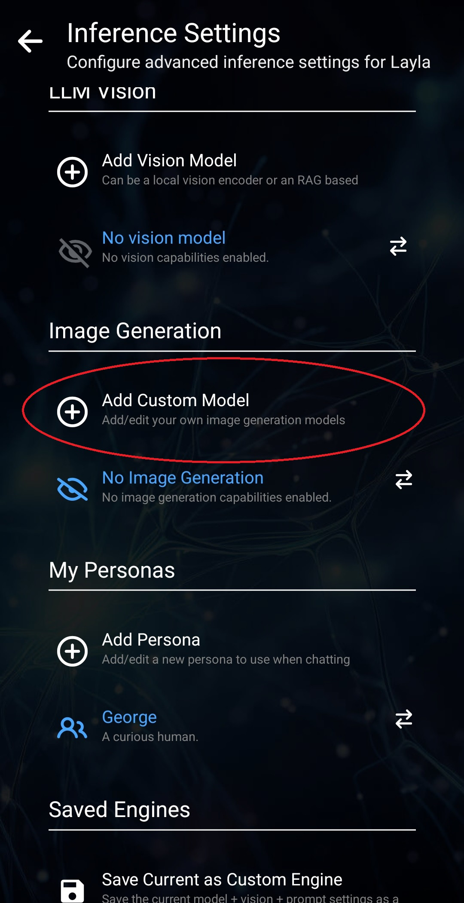

Layla v5는 Stable Diffusion 모델을 사용한 이미지 생성을 지원합니다.

Layla에서는 다음과 같은 방법으로 이미지를 생성할 수 있습니다.

1. 외부 제공업체에 연결하지 않고 기기 자체 사용
2. 휴대전화를 PC에 연결
3. Layla Cloud 사용

어떤 방법을 선택하든 Layla에서 Stable Diffusion 미니 앱을 활성화해야 합니다.

**기기 자체 사용**

휴대전화나 태블릿의 CPU에서 이미지를 생성합니다. Layla에는 여러 Stable Diffusion 모델이 내장되어 있습니다. Stable Diffusion 미니 앱에서 모델을 다운로드할 수 있습니다.

파란색 구름 다운로드 버튼을 눌러 모델을 다운로드합니다. 모델 크기가 상당히 커서 시간이 걸릴 수 있습니다. 다른 모델을 선택하려면 상단의 모델 타일을 누릅니다.

모델을 선택하고 파일을 다운로드한 후 프롬프트와 기타 설정을 입력하여 이미지를 생성할 수 있습니다.

**PC에 연결**

PC가 있다면 널리 사용되는 [AUTOMATIC1111 Stable Diffusion WebUI](https://github.com/AUTOMATIC1111/stable-diffusion-webui)를 설치할 수 있습니다.

AUTOMATIC1111 Stable Diffusion WebUI 설정은 이 튜토리얼의 범위를 벗어납니다. GitHub 저장소의 README나 YouTube의 튜토리얼을 참고하세요.

WebUI와 API를 설정한 후 Layla의 추론 설정 앱에서 연결합니다. 이미지 생성 설정까지 아래로 스크롤합니다.

*커스텀 모델 추가*를 누르면 API 설정을 입력할 수 있습니다.

라우터 등의 방법으로 PC의 IP 주소를 확인할 수 있습니다.

PC 설정을 마치면 이미지를 생성할 때 Stable Diffusion 모델로 사용할 수 있습니다.

**Layla Cloud 사용**

오른쪽 위에 나비 기호가 있는 모델은 Layla Cloud에서 제공되며 Layla Cloud 앱에서 구매한 구독이 필요합니다. 그 외 모델은 모두 휴대전화에서 로컬로 이미지를 생성합니다.

Layla Cloud 모델은 빠르고 원활한 이미지 생성을 제공하며 해당 구독이 필요합니다.

**채팅 중 캐릭터가 이미지를 보내도록 허용**

마지막으로 커스텀 캐릭터가 채팅 중에 이미지를 생성하도록 허용할 수 있습니다.

캐릭터 만들기 화면에서 이미지 생성 설정을 구성합니다.

해당 캐릭터에 사용할 Stable Diffusion 모델을 선택할 수 있습니다.
