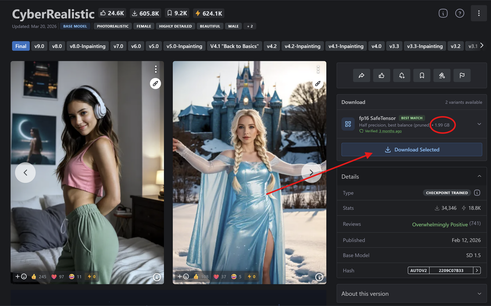
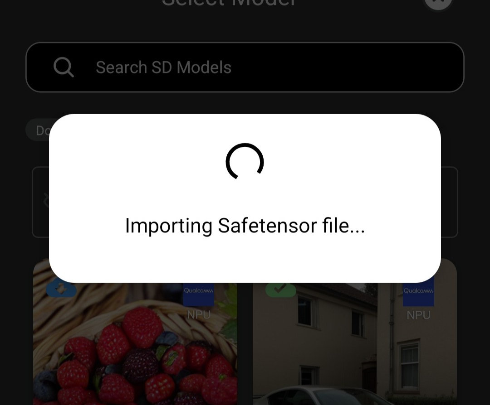
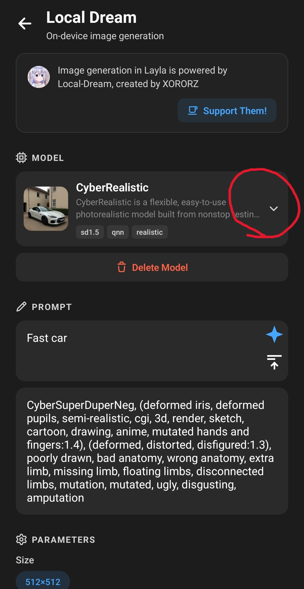

Layla는 이미지 생성용 Safetensor 모델을 지원합니다. 대부분의 이미지 생성 Safetensor 파일은 [Civitai](https://civitai.com/)에서 찾을 수 있습니다.

이 튜토리얼에서는 Civitai의 Safetensor 파일을 Layla로 가져오는 방법을 설명합니다.

**1단계: [Civitai](https://civitai.com/)로 이동**

**모델** 섹션으로 이동합니다. 오른쪽 위 필터의 **모델 유형**에서 **Checkpoint**를 선택합니다. **파일 형식**에서 **SafeTensor**를 선택하고 **기본 모델**에서 **SD 1.5**를 선택합니다.

Layla가 지원하는 모든 이미지 모델 목록이 표시됩니다.

**2단계: Safetensor 파일 다운로드**

다운로드 페이지에서 Safetensor 파일을 다운로드합니다. _파일 크기가 약 2GB인지 확인하세요. 파일 형식이 올바른지 판단하는 기준이 됩니다._

**3단계: Layla로 가져오기**

**설정** → **추론 설정**으로 이동합니다.

**이미지 생성** 설정까지 아래로 스크롤하고 **커스텀 모델 추가**를 누릅니다.

방금 다운로드한 Safetensor 파일을 선택합니다. Layla가 파일 가져오기를 시작합니다.

**4단계: 이미지 생성**

이미지 모델 가져오기가 끝나면 Local Dream 미니 앱으로 이동하여 이미지를 생성합니다.

