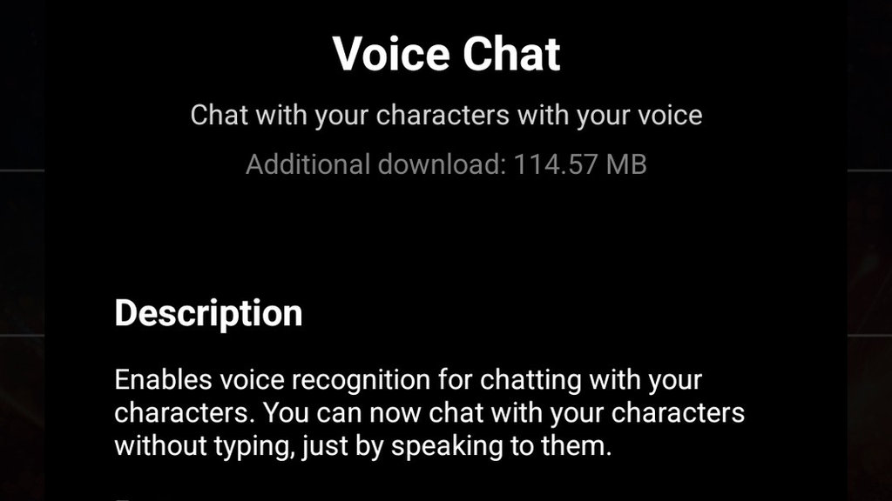

Layla는 음성 인식과 텍스트 음성 변환을 결합하여 캐릭터와 음성 채팅을 할 수 있게 합니다. 애니메이션 캐릭터와 함께 사용하면 영상 통화를 하는 듯한 느낌을 받을 수 있습니다.

## Layla 음성 채팅의 작동 방식

음성 채팅은 먼저 사용자의 목소리를 듣고 음성 인식 기술을 사용하여 텍스트로 변환합니다. 이 텍스트는 LLM으로 전달되며 LLM은 입력을 바탕으로 응답을 생성합니다. LLM이 답변을 만들면 텍스트 음성 변환 기술이 응답을 소리 내어 읽습니다. 캐릭터의 애니메이션 배경이 화면에 표시되는 동안 이 모든 과정이 백그라운드에서 자동으로 실행됩니다.

## Layla에서 음성 채팅을 활성화하는 방법

이 기능을 사용하려면 Layla에서 _음성 채팅_ 앱을 활성화하세요. 도움이 필요하면 [Layla에서 미니 앱을 활성화하거나 비활성화하는 방법](/how-to-enable-disable-mini-apps-within-layla/)을 참고하세요.

### 대화 시작

음성 채팅 앱을 활성화하면 어떤 캐릭터와도 대화를 시작할 수 있습니다. 아래 동영상에서는 애니메이션 캐릭터 Eleonora와 대화를 시작하는 방법을 보여 줍니다.

<video controls playsinline src="/assets/articles/how-to-start-a-voice-chat-with-your-characters/start-voice-chat.mp4"></video>

### 음성 채팅을 시작하는 단계

동영상은 다음 단계를 보여 줍니다.

1. 화면 오른쪽 위 메뉴에서 *음성 채팅*을 선택하여 시작합니다.
2. 인터페이스가 사라지고 캐릭터만 표시됩니다.
3. 텍스트 음성 변환 모듈이 초기화될 때까지 잠시 기다립니다.
4. 기본 버튼이 초록색으로 바뀌면 말하기 시작합니다.
5. 말을 마친 뒤 AI가 입력을 처리할 때까지 잠시 기다립니다.
6. 곧 캐릭터의 음성으로 응답합니다. 캐릭터의 입술이 음성과 동기화되어 움직이는 것을 볼 수 있습니다.

### 더 나은 사용을 위한 팁

- **명확하게 말하기:** 음성 인식 기술이 잘 인식할 수 있도록 또렷하게 말하세요.
- **조용한 환경 사용:** 주변 소음은 음성 인식을 방해할 수 있습니다. 조용한 장소에서 음성 채팅을 사용하세요.
- **처리 시간 기다리기:** 말을 마친 후 AI가 처리할 시간을 준 다음 다시 말하세요.

이러한 팁을 따르면 캐릭터와 더 자연스럽고 원활하게 대화할 수 있습니다.

### 결론

음성 채팅은 Layla의 애니메이션 캐릭터와 상호작용하는 또 다른 방법입니다. 음성 인식과 텍스트 음성 변환을 결합하여 영상 통화와 비슷한 경험을 만들고 캐릭터 대화에 새로운 가능성을 더합니다.
